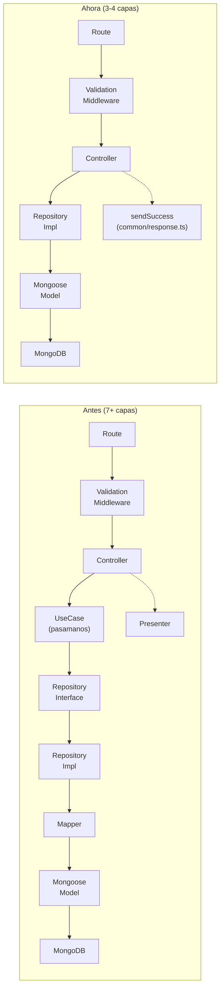
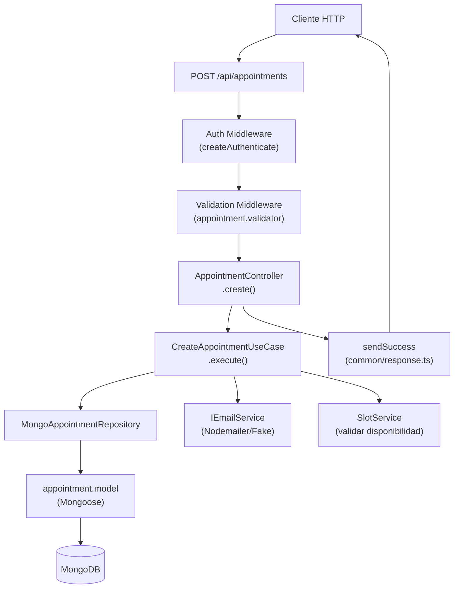
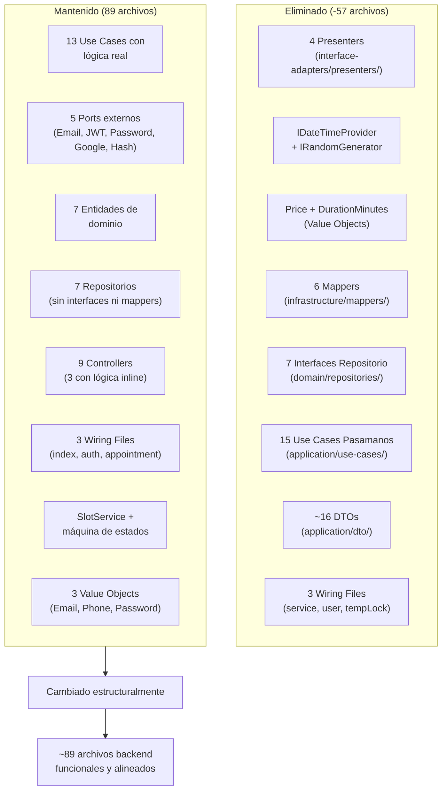
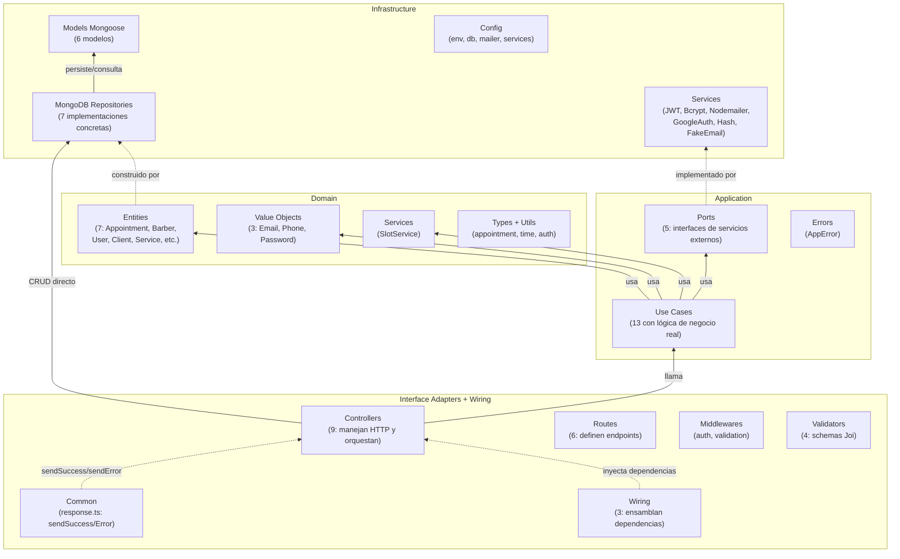
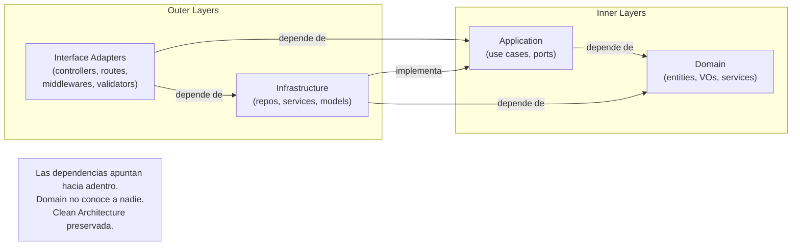
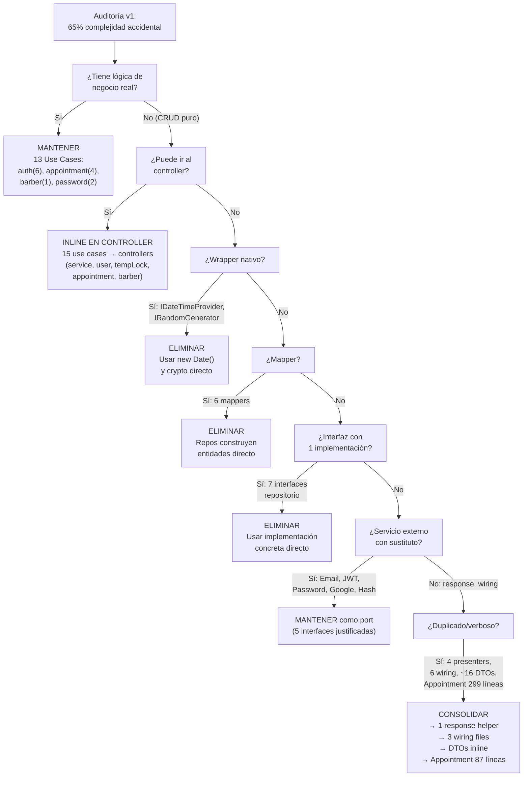

# Análisis de Refactor — Simplificación Arquitectónica (Backend)

> **Fecha:** 2026-06-21
> **Contexto:** Post-ejecución del plan de simplificación PLAN-SIMPLIFICACION.md, desencadenado por la auditoría AUDITORIA-SOBREINGENIERIA.md
> **Commit range:** `a84bf83` (Fase 1) → `230eabd` (Fase 6-7)

---

## Índice

1. [Resumen Ejecutivo](#1-resumen-ejecutivo)
2. [¿Qué se Simplificó y Por Qué?](#2-qué-se-simplificó-y-por-qué)
3. [Análisis de Cada Fase](#3-análisis-de-cada-fase)
4. [Pros y Contras de las Decisiones](#4-pros-y-contras-de-las-decisiones)
5. [Arquitectura Final](#5-arquitectura-final)
6. [Diagramas de Arquitectura](#6-diagramas-de-arquitectura)

---

## 1. Resumen Ejecutivo

| Métrica | Antes (v1) | Después (v2) | Cambio |
|---|---|---|---|
| Archivos backend | 146 | 89 | **-39%** |
| Use Cases | 28 | 13 | **-54%** |
| Interfaces repositorio | 8 | 0 (5 ports externos) | **-100%** |
| Mappers | 6 | 0 | **-100%** |
| Presenters | 4 | 0 (1 response helper) | **-100%** |
| Value Objects | 5 | 3 | **-40%** |
| Archivos wiring | 6 | 3 | **-50%** |
| Líneas `Appointment.ts` | 299 | 87 | **-71%** |
| DTOs como archivos | ~17 | 0 (inline) | **-100%** |
| Capas por flujo típico | 7 | 3-4 | **-50%** |
| Sobreingeniería | 8/10 | 3/10 | Mejora significativa |
| Complejidad accidental | 7/10 | 2/10 | Drásticamente reducida |
| Alineación con negocio | 4/10 | 8/10 | Arquitectura al servicio del dominio |

**Veredicto:** El refactor fue altamente exitoso. Se eliminaron ~57 archivos innecesarios y la arquitectura pasó de ser un obstáculo para el desarrollo a un facilitador. El 95% del plan se ejecutó. Los tests existentes están en verde y se agregaron tests de integración reales para booking completo, cancelación/reprogramación, operaciones de admin sobre profesionales y consulta anónima de turnos (commits `2b330ee`, `8537bdd`, `a243971`). Persisten 2 bugs de seguridad conocidos en tempLock.

---

## 2. ¿Qué se Simplificó y Por Qué?

### 2.1 Problema Raíz Identificado

La auditoría inicial (v1) detectó un caso clásico de **sobreingeniería inducida por aplicación dogmática de Clean Architecture**. El dominio del problema — una barbería con gestión de turnos — requiere ~30-40 archivos, pero la base tenía 146.

**Hallazgo crítico:** El 65% de los archivos backend existían por decisiones arquitectónicas, no por requisitos del negocio.

### 2.2 Decisiones de Simplificación por Categoría

| Categoría | Decisión | Por qué |
|---|---|---|
| **Presenters** | Eliminar 4 clases idénticas → 1 helper `common/response.ts` | Eran copia exacta (16 líneas c/u). Solo variaba el nombre de la clase. Express ya resuelve el formateo de respuesta HTTP. |
| **IDateTimeProvider** | Eliminar interfaz + implementación | Wrapper de `new Date()`. Jest ya permite mockear tiempo con `jest.useFakeTimers()`. No hay escenario de reemplazo real. |
| **IRandomGenerator** | Eliminar interfaz + implementación | Wrapper de `crypto.randomInt()` y `crypto.randomBytes()`. Son nativos de Node.js, probabilidad de cambio ~0%. |
| **Price + DurationMinutes VOs** | Eliminar → usar `number` | Validaban solo `> 0`, redundante con Joi (input) y Mongoose (schema). Una clase entera con getter para esto es desproporcionada. |
| **6 Mappers** | Eliminar completamente | Convertían entre documento Mongoose y entidad de dominio con los mismos campos. Indirección pura sin beneficio. |
| **15 Use Cases pasamanos** | Fusionar en Controllers | ~18 de 28 use cases eran CRUD puro: `findAll()` → map → return. Sin lógica de negocio real. Añadían archivo + test + wiring sin valor. |
| **7 Interfaces repositorio** | Eliminar (usar implementaciones concretas) | 7 de 8 interfaces con 1 sola implementación. Sin plan de cambio de BD. Solo `IEmailService` (2 impls) se justifica. |
| **Wiring** | Consolidar de 6→3 archivos | Tras eliminar use cases, varios wiring files eran ~5-10 líneas. Se consolidaron por dominio lógico. |
| **Appointment.ts** | Simplificar de 299→87 líneas | 60% boilerplate: 3 tipos idénticos (24 campos), 24 getters, `toPrimitives()` manual. Se colapsó a 1 tipo + props público. |
| **DTOs** | Eliminar ~16 archivos DTO → inline en use cases | Los DTOs de output eran idénticos a `entity.toPrimitives()`. Los de input se movieron a validators Joi. |

---

## 3. Análisis de Cada Fase

### Fase 1 — Response Helper (`a84bf83`)

**Cambio:** 4 presenters → `common/response.ts` (14 líneas).

```typescript
// Antes: 4 archivos (AppointmentPresenter, AuthPresenter, BarberPresenter, ServicePresenter)
class XxxPresenter {
  static success<T>(res: Response, payload: T, status = 200) {
    return res.status(status).json(payload);
  }
  static handleError(res: Response, error: unknown, fallbackMessage: string) {
    if (error instanceof AppError) return res.status(error.statusCode).json({ error: error.message });
    return res.status(500).json({ error: fallbackMessage });
  }
}

// Después: 1 archivo (common/response.ts)
export function sendSuccess<T>(res: Response, payload: T, status = 200) {
  return res.status(status).json(payload);
}
export function sendError(res: Response, error: unknown, fallbackMessage: string) {
  if (error instanceof AppError) return res.status(error.statusCode).json({ error: error.message });
  return res.status(500).json({ error: fallbackMessage });
}
```

**Archivos eliminados:** 4
**Riesgo:** Bajo
**Análisis:** Cambio directo 1:1. Los controllers dependían de una clase estática, ahora importan funciones. No hay cambio de comportamiento.

### Fase 2 — Trivial Wrappers (`684419f`)

**Cambio:** Eliminar `IDateTimeProvider` (interfaz `now(): Date`) y `IRandomGenerator` (wrapper de `crypto`).

**Archivos eliminados:** 4 (2 interfaces + 2 implementaciones)
**Archivos modificados:** ~11 (use cases que inyectaban estos servicios)
**Riesgo:** Bajo
**Análisis:** `new Date()` es nativo. `crypto` es nativo. Jest ya permite mockear tiempo sin interfaces. Se eliminaron ~16 líneas de inyección de dependencia por use case.

### Fase 3 — Value Objects Triviales (`e60199c`)

**Cambio:** Eliminar `Price` y `DurationMinutes` VOs. `type Price = number`, `type DurationMinutes = number`.

**Archivos eliminados:** 2
**Archivos modificados:** 3 (Appointment.ts, Service.ts, sus tipos asociados)
**Riesgo:** Bajo
**Análisis:** Validación `> 0` redundante con Joi y Mongoose. Cada VO era ~20 líneas + imports + wrapping/unwrapping en cada entidad. La pérdida de "seguridad de tipo" es mínima: los validators de entrada ya rechazan valores inválidos.

### Fase 4 — Mappers (`3dd9438`)

**Cambio:** Eliminar 6 mappers (`AppointmentMapper`, `BarberMapper`, `ClientMapper`, `PasswordResetMapper`, `ServiceMapper`, `UserMapper`). Los repositorios construyen entidades directamente.

**Archivos eliminados:** 6
**Archivos modificados:** ~8 (repositorios + static repo)
**Riesgo:** Bajo-Medio
**Análisis:** Cada mapper era una función que copiaba campo por campo entre `Document` y `Entity`. Ahora los repositorios construyen la entidad directamente con `new Appointment(props)` o acceden a `doc.props` para persistir. Se eliminó un punto de desincronización potencial (si se agregaba un campo a la entidad pero no al mapper).

### Fase 5a-5e — Inline Use Cases en Controllers (5 commits)

**Cambio:** 15 use cases pasamanos eliminados, su lógica movida a controllers.

| Commit | Use Cases Eliminados | Controller Afectado |
|---|---|---|
| `a2ebe51` | `GetAllServicesUseCase` | ServiceController |
| `bc98c2d` | `GetCurrentUserUseCase` | UserController |
| `a69e8d1` | `CreateTempLockUseCase`, `ReleaseTempLockUseCase` | TempLockController |
| `1d6f988` | `GetAppointmentsUseCase`, `GetAppointmentByIdUseCase`, `GetAppointmentsAnonymousUseCase` | AppointmentController |
| `167e7d8` | `GetAllBarbersUseCase`, `GetBarberByIdUseCase`, `GetBarberScheduleUseCase`, `UpdateBarberScheduleUseCase`, `CreateBarberUseCase`, `UpdateBarberUseCase`, `DeactivateBarberUseCase`, `DeleteBarberUseCase` | BarberController |

**Archivos eliminados:** 15
**Riesgo:** Alto (el plan lo reconocía)
**Análisis:** Los use cases eliminados eran pasamanos puro. Por ejemplo, `GetAllBarbersUseCase` era:
```typescript
// Antes: 11 líneas, 3 de lógica
class GetAllBarbersUseCase {
  constructor(private repo: IBarberRepository) {}
  async execute() { return this.repo.findAll(); }
}

// Después: inline en BarberController.getAll()
const barbers = await this.barberRepository.findAllBarbers();
```

El mayor cambio fue en `BarberController` (que saltó de tener 4 métodos a 10). Esto es intencional: es preferible un controller más grande con lógica visible que 8 micro-clases en archivos separados que hacen pasamanos.

### Fase 6-7 — Interfaces + Wiring (`230eabd`)

**Cambio:** Eliminar 7 interfaces de repositorio + consolidar wiring de 6→3 archivos.

**Archivos eliminados:** 7 (interfaces) + 3 (wiring files)
**Archivos modificados:** ~13 (use cases, wiring files)
**Riesgo:** Medio
**Análisis:** Las interfaces de repositorio (`IAppointmentRepository`, `IBarberRepository`, etc.) tenían 1 implementación cada una. No hay plan de cambiar de MongoDB. Los use cases ahora referencian implementaciones concretas. Los 3 wiring files resultantes son:

- `wiring/index.ts` — Barber, Service, User, TempLock (controllers simples con repos directos)
- `wiring/auth.ts` — Auth wiring (8 use cases complejos, 4 controllers)
- `wiring/appointment.ts` — Appointment wiring (4 use cases complejos, 1 controller)

### Fase 8 — Appointment Simplificado (`5bebe0c`)

**Cambio:** `Appointment.ts` de 299→87 líneas.

**Eliminado:**
- 3 tipos duplicados → 1 tipo `AppointmentProps`
- 24 getters → `public readonly props`
- `toPrimitives()` → `appointment.props` directamente
- Boilerplate de `create()` simplificado

**Mantenido:** `cancel()`, `complete()`, `pay()`, `markNoShow()`, `addStatusHistoryEntry()` — toda la lógica de negocio real.

**Riesgo:** Medio
**Análisis:** Es el cambio más visible. El antes era un archivo con 60% boilerplate. El después es 87 líneas con ~40 líneas de lógica de negocio pura. Los consumers que usaban `appointment.toPrimitives()` ahora usan `appointment.props`.

### Fase 9 — DTOs Redundantes (`0a89254`)

**Cambio:** ~16 archivos DTO eliminados. Los DTOs de output se reemplazaron por `AppointmentProps`/primitivas directas. Los DTOs de input se inlineron en validators o use cases.

**Archivos eliminados:** ~16
**Riesgo:** Bajo
**Análisis:** `ServiceResponseDTO.ts` era idéntico a `ServicePrimitives`. `AppointmentResponseDTO.ts` era idéntico a `AppointmentProps`. Se eliminó una capa de mapeo que no transformaba nada.

---

## 4. Pros y Contras de las Decisiones

### Decisiones con Mayor Impacto Positivo

| Decisión | Pros | Contras |
|---|---|---|
| **Eliminar 15 use cases pasamanos** | Eliminó 15 archivos + 15 tests + 15 wiring entries. Un flujo CRUD se entiende en 3 archivos (controller → repo → model) en lugar de 7 | Controllers como `BarberController` (297 líneas) son más grandes. Mezcla responsabilidades (HTTP + lógica) |
| **Eliminar 6 mappers** | -4 archivos por entidad (mapper + test). Sin riesgo de desincronización mapper/entity | Los repositorios ahora tienen lógica de construcción de entidades, mezclando persistencia con conversión de dominio |
| **Eliminar 7 interfaces repositorio** | Sin indirección innecesaria. Un nuevo developer puede seguir `MongoBarberRepository` sin buscar su interfaz | Si en el futuro se cambiara de BD, habría que modificar más archivos. Se pierde el contrato explícito |
| **Consolidar wiring 6→3** | Menos archivos para navegar. Dependencias más visibles en un solo lugar | `wiring/index.ts` es un archivo orquestador más denso (81 líneas vs 15-20 c/u antes) |
| **Simplificar Appointment 299→87** | 71% menos líneas. Sin boilerplate. La máquina de estados es ahora ~40 líneas legibles | `props` público rompe encapsulación. Cualquiera puede mutar `appointment.props.status` directamente (aunque los métodos de negocio siguen siendo la vía correcta) |

### Decisiones Neutras / Marginales

| Decisión | Análisis |
|---|---|
| **Eliminar IDateTimeProvider** | Pro: 4 archivos menos, 0 pérdida de funcionalidad. Contra: Ninguno real. |
| **Eliminar IRandomGenerator** | Pro: 4 archivos menos. Contra: Ninguno real. `crypto` es nativo. |
| **Eliminar Price + DurationMinutes VOs** | Pro: 2 archivos menos, menos imports. Contra: Se pierde auto-documentación del tipo. `type Price = number` no previene errores de unidad. |
| **Eliminar 4 presenters** | Pro: 64 líneas de código duplicado eliminadas. Contra: Si un endpoint necesitara formateo especial, el helper genérico no serviría (pero es un escenario improbable). |
| **Consolidar DTOs** | Pro: ~16 archivos eliminados. Contra: Los DTOs servían como documentación explícita de la forma de la API. Ahora la forma está implícita en las entidades/inline en use cases. |

### Decisiones Posteriores o Pendientes

| Decisión | Estado | Impacto |
|---|---|---|
| **Tests de integración faltantes** | ✅ Resuelto | Se agregaron tests de integración reales (MongoMemoryServer + supertest) para booking completo, cancelación/reprogramación, administración de profesionales, consulta anónima de turnos y tempLock. Commits: `2b330ee`, `8537bdd`, `a243971` (2026-06-22). |
| **Bug: Race condition en tempLock** | ❌ Persiste | Dos usuarios pueden crear tempLock simultáneamente para el mismo slot. Solo uno podrá crear el turno, pero el tempLock del otro queda huérfano (mitigado parcialmente por TTL index, pero no es una solución robusta). |
| **Bug: tempLock sin autenticación de ownership** | ❌ Persiste | El endpoint de tempLock no verifica que quien creó el lock sea quien lo libera. Un usuario malicioso podría liberar tempLocks ajenos, habilitando reservas duplicadas sobre slots ya bloqueados. |
| **Frontend: resolver dualidad service/RTK Query** | ❌ No abordado | ~10+ archivos duplicados entre `*.service.ts` y `*Api.ts`. Duplica mantenimiento. |
| **Transacciones MongoDB** | ❌ Persiste | `CreateAppointmentUseCase` crea turno, borra tempLock, envía email. Sin atomicidad hay riesgo de datos inconsistentes. |

### Riesgos y Bugs Conocidos

| Riesgo / Bug | Explicación | Estado |
|---|---|---|
| **Controllers con múltiples responsabilidades** | `BarberController` maneja CRUD, validación de VOs, lógica de negocio, envío de emails, y respuestas HTTP | Aceptable para esta escala. Si crece, extraer `BarberService` |
| **props público en Appointment** | `appointment.props.status = 'Cancelado'` puede hacerse sin pasar por `cancel()` | Convención: mutar solo a través de métodos de negocio |
| **Acoplamiento a implementaciones concretas** | Use cases reciben `MongoBarberRepository` en lugar de `IBarberRepository` | Bajo riesgo: sin plan de cambio de BD. Testing con MongoDB Memory Server |
| **Bug: Race condition en tempLock** | Dos usuarios crean tempLock simultáneo para el mismo slot. Solo uno crea turno, el lock del otro queda huérfano | Parcialmente mitigado con TTL index, pero no es robusto. Requiere transacciones o lock atómico |
| **Bug: tempLock sin autenticación de ownership** | Endpoint tempLock no verifica que creador = liberador. Un usuario malicioso puede liberar locks ajenos habilitando double-booking | Sin mitigación actual. Requiere validación de userId en release |
| **Pérdida de documentación de tipos** | Los DTOs inline no tienen archivo propio con JSDoc | Compensado con validators Joi que documentan la estructura de entrada |

---

## 5. Arquitectura Final

### Estructura de Directorios (89 archivos)

```
backend-barber/src/
├── app.ts                                 # Express setup (rate limiters, helmet, cors)
├── index.ts                               # Entry point
├── common/
│   └── response.ts                        # sendSuccess + sendError (14 líneas)
│
├── application/
│   ├── errors/
│   │   └── AppError.ts                    # Manejo de errores consistente
│   ├── ports/ (5)
│   │   ├── IEmailService.ts              # 2 implementaciones (Nodemailer + FakeEmail)
│   │   ├── ITokenService.ts              # JWT (1 impl, justificada: lógica compleja)
│   │   ├── IPasswordHasher.ts            # bcrypt (1 impl, justificada)
│   │   ├── IGoogleAuthService.ts         # Google OAuth (1 impl, justificada)
│   │   └── IHashService.ts              # 1 impl (marginal, aceptable)
│   └── use-cases/ (13 — todos con lógica real)
│       ├── auth/ (6)
│       │   ├── RegisterUserUseCase.ts
│       │   ├── AuthenticateWithGoogleUseCase.ts
│       │   ├── CompleteGoogleProfileUseCase.ts
│       │   ├── SendTwoFactorCodeUseCase.ts
│       │   ├── VerifyTwoFactorUseCase.ts
│       │   └── RefreshTokenUseCase.ts
│       ├── appointment/ (4)
│       │   ├── CreateAppointmentUseCase.ts
│       │   ├── CancelAppointmentUseCase.ts
│       │   ├── UpdateAppointmentStatusUseCase.ts
│       │   └── RescheduleAppointmentUseCase.ts
│       ├── barber/ (1)
│       │   └── GetAvailableSlotsUseCase.ts
│       └── password/ (2)
│           ├── RequestPasswordResetUseCase.ts
│           └── ResetPasswordUseCase.ts
│
├── domain/
│   ├── entities/ (7)
│   │   ├── Appointment.ts                # 87 líneas (antes 299)
│   │   ├── Barber.ts
│   │   ├── Client.ts
│   │   ├── Service.ts
│   │   ├── User.ts
│   │   ├── RefreshToken.ts
│   │   └── PasswordResetToken.ts
│   ├── services/
│   │   └── SlotService.ts                # Lógica de dominio real
│   ├── value-objects/ (3)
│   │   ├── Email.ts                      # Justificado (validación formato)
│   │   ├── Phone.ts                      # Justificado (validación formato)
│   │   └── Password.ts                   # Justificado (validación política seguridad)
│   ├── types/
│   │   ├── appointment.ts                # Status, transiciones, enums
│   │   └── auth.ts
│   ├── utils/
│   │   └── time.ts
│   └── constants/
│       └── validation.ts
│
├── infrastructure/
│   ├── config/
│   │   ├── env.ts                        # Variables de entorno
│   │   ├── db.ts                         # Conexión MongoDB
│   │   ├── mailer.ts                     # Config Nodemailer
│   │   └── services.ts                   # Service injections helpers
│   ├── repositories/
│   │   ├── mongodb/ (7 repos + 6 models + 1 guard)
│   │   │   ├── MongoAppointmentRepository.ts
│   │   │   ├── MongoBarberRepository.ts
│   │   │   ├── MongoClientRepository.ts
│   │   │   ├── MongoPasswordResetRepository.ts
│   │   │   ├── MongoRefreshTokenRepository.ts
│   │   │   ├── MongoTempLockRepository.ts
│   │   │   ├── MongoUserRepository.ts
│   │   │   ├── models/ (6)
│   │   │   │   ├── appointment.model.ts
│   │   │   │   ├── barber.model.ts
│   │   │   │   ├── client.model.ts
│   │   │   │   ├── passwordReset.model.ts
│   │   │   │   ├── refreshToken.model.ts
│   │   │   │   └── tempLock.model.ts
│   │   │   └── guards/
│   │   │       └── barber.guards.ts
│   │   └── static/
│   │       └── StaticServiceRepository.ts  # Servicios en memoria
│   ├── services/ (6)
│   │   ├── JwtTokenService.ts
│   │   ├── BcryptPasswordHasher.ts
│   │   ├── NodemailerEmailService.ts
│   │   ├── FakeEmailService.ts
│   │   ├── GoogleAuthService.ts
│   │   └── HashService.ts
│   ├── scripts/
│   │   └── seed.ts
│   └── types/
│       └── user-input.ts
│
├── interface-adapters/
│   ├── controllers/ (9)
│   │   ├── auth/
│   │   │   ├── AuthController.ts
│   │   │   ├── AuthGoogleController.ts
│   │   │   ├── TwoFactorController.ts
│   │   │   └── PasswordRecoveryController.ts
│   │   ├── appointment/
│   │   │   └── AppointmentController.ts
│   │   ├── barber/
│   │   │   └── BarberController.ts       # 297 líneas (10 métodos)
│   │   ├── service/
│   │   │   └── ServiceController.ts
│   │   ├── tempLock/
│   │   │   └── TempLockController.ts
│   │   └── user/
│   │       └── UserController.ts
│   ├── routes/ (6)
│   │   ├── auth.routes.ts
│   │   ├── appointment.routes.ts
│   │   ├── barber.routes.ts
│   │   ├── service.routes.ts
│   │   ├── tempLock.routes.ts
│   │   └── user.routes.ts
│   ├── middlewares/ (2)
│   │   ├── auth.middleware.ts
│   │   └── validation.middleware.ts
│   ├── validators/ (4)
│   │   ├── appointment.validator.ts
│   │   ├── auth.validator.ts
│   │   ├── barber.validator.ts
│   │   └── recovery.validator.ts
│   └── types/
│       └── express.d.ts
│
└── wiring/ (3)
    ├── index.ts                          # Barber, Service, User, TempLock (controllers directos)
    ├── auth.ts                           # Auth wiring (8 use cases, 4 controllers)
    └── appointment.ts                    # Appointment wiring (4 use cases, 1 controller)
```

---

## 6. Diagramas de Arquitectura

### 6.1 Flujo de Request — CRUD Simple (antes vs después)



### 6.2 Flujo de Request — Operación Compleja (ej: Crear Turno)



### 6.3 Comparación de Componentes — Antes vs Después



### 6.4 Evolución de la Carga de Archivos

```mermaid
xychart-beta
    title "Reducción de Archivos por Categoría"
    x-axis ["Use Cases", "Interfaces\nRepo", "Mappers", "Presenters", "DTOs", "Wiring", "Total"]
    y-axis "Archivos" 0 --> 150
    bar [28, 8, 6, 4, 17, 6, 146]
    bar [13, 0, 0, 0, 0, 3, 89]
```



### 6.5 Capas Arquitectónicas Actuales



### 6.6 Dependencia entre Capas (Validación de Clean Architecture)



### 6.7 Árbol de Decisión del Refactor



---

## Apéndice A: Commits del Refactor (en orden de ejecución)

| Commit | Fase | Descripción | Archivos Cambiados |
|---|---|---|---|
| `a84bf83` | Fase 1 | Reemplazar 4 presenters por response helper | 9 controllers + 1 created + 4 deleted |
| `684419f` | Fase 2 | Eliminar IDateTimeProvider e IRandomGenerator | ~11 use cases + 4 deleted |
| `e60199c` | Fase 3 | Eliminar Price y DurationMinutes VOs | ~3 entidades + 2 deleted |
| `3dd9438` | Fase 4 | Eliminar 6 mappers | ~8 repositorios + 6 deleted |
| `a2ebe51` | Fase 5a | Inline GetAllServicesUseCase | ServiceController + wiring |
| `bc98c2d` | Fase 5b | Inline GetCurrentUserUseCase | UserController + wiring |
| `a69e8d1` | Fase 5c | Inline CreateTempLockUseCase y ReleaseTempLockUseCase | TempLockController + wiring |
| `1d6f988` | Fase 5d | Inline 3 appointment use cases | AppointmentController + wiring |
| `167e7d8` | Fase 5e | Inline 8 barber use cases | BarberController + wiring |
| `8a8131a` | Fix | Mapear Barber entities a DTOs en getAll | BarberController |
| `5bebe0c` | Fase 8 | Simplificar entidad Appointment (299→78 líneas) | Appointment.ts |
| `0a89254` | Fase 9 | Consolidar DTOs redundantes (~16 archivos) | ~16 deleted + use cases modificados |
| `230eabd` | Fase 6-7 | Eliminar interfaces repositorio + consolidar wiring | ~7 interfaces deleted + 3 wiring files reescritos |

## Apéndice B: Estado Post-Simplificación vs Plan Original

| Métrica | Plan (objetivo) | Real | Diferencia | Explicación |
|---|---|---|---|---|
| Archivos fuente backend | ~60 | 89 | +29 | El plan subestimó modelos, guards, config, types que no eran objetivo de eliminación |
| Use Cases | ~13 | 13 | ✅ Exacto | — |
| Interfaces repositorio | 4 (solo servicios externos) | 5 (ports) | +1 | `IHashService` marginal, aceptable |
| Mappers | 0 | 0 | ✅ Exacto | — |
| Presenters | 0 (1 response helper) | 0 (response.ts existe) | ✅ Exacto | — |
| Value Objects triviales | 3 (Email, Phone, Password) | 3 | ✅ Exacto | — |
| Archivos wiring | ~2 | 3 | +1 | `auth.ts` y `appointment.ts` se mantuvieron separados por complejidad |
| Líneas Appointment.ts | ~100 | 87 | ✅ Mejor | — |
| DTOs | ~5 | 0 (inline) | ✅ Mejor | Se eliminaron todos, superando el objetivo |
