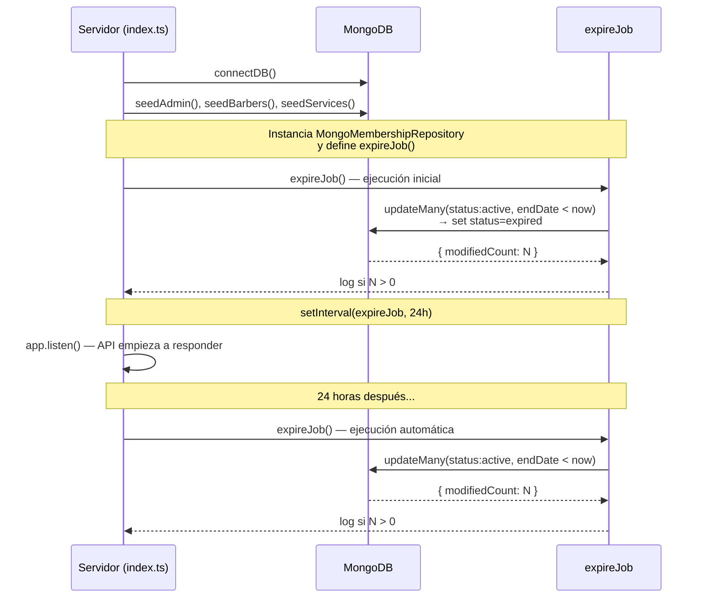
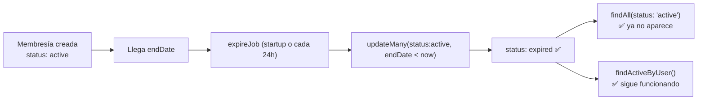

# Expiración automática de membresías

## El problema

Las membresías tienen una `endDate` (fecha de vencimiento), pero cuando esa fecha llegaba, el `status` en la base de datos seguía siendo `'active'`. No había ningún proceso que lo actualizara a `'expired'`.

```mermaid
flowchart LR
    A[Membresía creada<br/>status: active] --> B[Llega endDate]
    B --> C[status: active]<br/>(debería ser expired)
    C --> D["findAll(status: 'active')<br/>❌ la devuelve como activa"]
    C --> E["findActiveByUser()<br/>✅ filtra por fecha, ok"]
```

Algunos métodos del repositorio (`findActiveByUser`, `hasActiveMembership`) filtran por `endDate >= now` además de `status: 'active'`, así que funcionan correctamente. Pero `findAll` (usado por el panel admin) solo filtra por `status` si se lo pasan como query param, sin verificar la fecha. Por lo tanto, una membresía vencida aparecía como activa en el admin.

## La solución

Un job programado que ejecuta `expireExpiredMemberships()` al iniciar la aplicación y luego cada 24 horas.



## Cómo funciona

### 1. La operación contra MongoDB

En `MongoMembershipRepository.ts:118`:

```
expireExpiredMemberships()
  → MembershipModel.updateMany(
      { status: 'active', endDate: { $lt: new Date() } },
      { $set: { status: 'expired' } }
    )
  → devuelve la cantidad de documentos modificados
```

Es un solo `updateMany`, atómico y eficiente. No importa cuántas membresías haya, MongoDB las actualiza en una sola pasada.

### 2. El job (en `index.ts`)

```
Al iniciar la app:
  1. Conectar a MongoDB
  2. Correr seeds
  3. Instanciar MongoMembershipRepository (una sola vez)
  4. Ejecutar expireJob() por primera vez (antes de que la API escuche)
  5. Registrar setInterval(expireJob, 24h)
  6. Arrancar Express (app.listen)
  
Cada 24 horas:
  → expireJob() se ejecuta automáticamente
```

### 3. Flag `running` anti-superposición

El job tiene un flag booleano para evitar que si `expireExpiredMemberships()` llegara a tardar más de 24 horas (escenario extremo), se acumulen ejecuciones:

```mermaid
flowchart TD
    A[setInterval dispara expireJob] --> B{running?}
    B -->|true| C[❌ se descarta esta ejecución]
    B -->|false| D[running = true]
    D --> E[expireExpiredMemberships()]
    E --> F[running = false]
    F --> G[✅ fin]
```

## Estado final



## Cuándo se limpian

| Momento | Qué pasa |
|---|---|
| **Al arrancar la app** | Se ejecuta inmediatamente, antes de que la API escuche. Limpia todas las membresías que vencieron mientras el servidor estuvo apagado. |
| **Cada 24h** | `setInterval` dispara el job automáticamente. Las membresías que venzan durante la operación del servidor se limpian con hasta 24h de retraso. |
| **Si el servidor se cae** | Al reiniciar, el startup limpia todo lo acumulado. No se pierde nada. |

## Archivos modificados

**Solo uno:** `backend-barber/src/index.ts` (~15 líneas agregadas).

Ninguna dependencia nueva, ningún otro archivo tocado.
