# Arquitectura — Nivel 4 (Código)

Diagrama de clases que muestra las entidades, interfaces y relaciones concretas del backend organizadas por capa de Clean Architecture.

---

## Diagrama General de Clases

```mermaid
classDiagram
    %% ========== DOMAIN LAYER ==========
    namespace Domain {
        class User {
            <<entity>>
            +id: string
            +email: string
            +name: string
            +lastname: string
            +phone: string
            +kind: AuthKind
            +authProvider: AuthProvider
            +passwordHash: string
            +googleId: string
            +twoFactor: TwoFactorState
            +lastLoginAt: Date
            +twoFactorFailedAttempts: number
            +twoFactorLockedUntil: Date
            +resetFailedAttempts: number
            +resetLockedUntil: Date
            +create(props) User
            +withPasswordHash(hash) User
            +withTwoFactor(state) User
            +withTwoFactorFailedAttempts(attempts, until) User
            +withTwoFactorLockoutReset() User
            +withResetFailedAttempts(attempts, until) User
            +withResetLockoutReset() User
            +withLastLoginAt(date) User
            +toPrimitives() UserProps
        }
        class Barber {
            <<entity>>
            +services: string[]
            +age: number
            +photoUrl: string
            +isActive: boolean
            +slotDuration: number
            +schedule: BarberSchedule
            +maxAdvanceDays: number
            +passwordHash: string
            +create(props) Barber
            +toPrimitives() BarberProps
        }
        class Client {
            <<entity>>
            +id: string
            +name: string
            +lastname: string
            +phone: string
            +contactEmail: string
            +kind: ClientKind
            +create(props) Client
            +toPrimitives() ClientProps
        }
        class Appointment {
            <<entity>>
            +id: string
            +barberId: string
            +clientId: string
            +clientName: string
            +clientLastname: string
            +clientPhone: string
            +clientEmail: string
            +serviceId: string
            +serviceName: string
            +servicePrice: number
            +serviceDuration: number
            +date: string
            +startTime: string
            +endTime: string
            +status: AppointmentStatus
            +paymentStatus: PaymentStatus
            +paymentMethod: PaymentMethod
            +cancelReason: string
            +cancelledAt: Date
            +cancelledBy: string
            +createdBy: CreatedBy
            +statusHistory: StatusHistoryEntry[]
            +createdAt: Date
            +updatedAt: Date
            +create(props) Appointment
            +cancel(reason, cancelledBy)
            +pay(actor)
            +complete(actor)
            +markNoShow(actor)
            +addStatusHistoryEntry(status, actor)
            +toPrimitives() AppointmentPrimitives
        }
        class Service {
            <<entity>>
            +id: string
            +name: string
            +description: string
            +price: number
            +imageUrl: string
        }
        class RefreshToken {
            <<entity>>
            +id: string
            +tokenHash: string
            +userId: string
            +expiresAt: Date
            +revoked: boolean
            +createdAt: Date
            +create(props) RefreshToken
            +isExpired(now) boolean
            +revoke() RefreshToken
        }
        class PasswordResetToken {
            <<entity>>
            +id: string
            +userId: string
            +expiresAt: Date
            +create(props) PasswordResetToken
        }
        class Email {
            <<value object>>
            +create(raw) Email
            +getValue() string
        }
        class Password {
            <<value object>>
            +create(raw) Password
        }
        class Phone {
            <<value object>>
            +create(raw) Phone
            +getValue() string
        }
        class Price {
            <<value object>>
            +create(amount) Price
            +getValue() number
        }
        class DurationMinutes {
            <<value object>>
            +create(minutes) DurationMinutes
            +getValue() number
        }
        class SlotService {
            <<domain service>>
            +execute(date, schedule, slotDuration, occupiedSlots) SlotsResult
            +isValidDate(date) boolean
        }
        class AppointmentStatus {
            <<type>>
            'Confirmado' | 'Completado' | 'Cancelado' | 'NoShow'
        }
        class VALID_TRANSITIONS {
            <<const>>
            Confirmado: ['Completado', 'Cancelado', 'NoShow']
            Completado: []
            Cancelado: []
            NoShow: []
        }
        class PaymentStatus {
            <<type>>
            'Pendiente' | 'Pagado'
        }
        class PaymentMethod {
            <<type>>
            'local' | 'online' | 'memberPass'
        }
        class AuthTypes {
            <<type>>
            AuthProvider: 'local' | 'google'
            BarberKind: 'Admin' | 'Empleado'
            ClientKind: 'Registrado' | 'NoRegistrado'
            AuthKind: BarberKind | 'Registrado'
        }
        class ClientKind {
            <<type>>
            Registrado
            NoRegistrado
        }
        class IUserRepository {
            <<interface>>
            +findById(id) User
            +findByEmail(email) User
            +findByPhone(phone) User
            +createRegisteredClient(user) User
            +updatePassword(userId, hash) void
            +updateTwoFactor(userId, update) void
            +updateLastLogin(userId) void
            +updateUserSecurity(userId, update) void
        }
        class IBarberRepository {
            <<interface>>
            +findBarberById(id) Barber
            +findAllBarbers() Barber[]
            +createBarber(barber) Barber
            +updateBarber(id, update) Barber
            +deactivateBarber(id) void
            +deleteBarber(id) void
            +updateSchedule(id, schedule) Barber
        }
        class IClientRepository {
            <<interface>>
            +findByEmail(email) Client
            +findByPhone(phone) Client
            +createUnregistered(data) Client
        }
        class IAppointmentRepository {
            <<interface>>
            +findById(id) Appointment
            +findMany(filters) Appointment[]
            +findByBarberAndDate(barberId, date) Appointment[]
            +findByClientAndDate(clientId, date) Appointment[]
            +findByContactAndDate(date, email, phone) Appointment[]
            +findByClientId(clientId) Appointment[]
            +findByContact(email, phone) Appointment[]
            +create(data) Appointment
            +update(id, data) Appointment
            +updateClientId(id, clientId) Appointment
            +updateStatus(id, data) Appointment
        }
        class IRefreshTokenRepository {
            <<interface>>
            +create(tokenHash, userId, expiresAt) RefreshToken
            +findByTokenHash(hash) RefreshToken
            +revoke(tokenHash) void
            +revokeAllByUserId(userId) void
        }
        class IPasswordResetRepository {
            <<interface>>
            +create(userId, tokenHash, expiresAt) void
            +verifyAndConsume(tokenHash) PasswordResetToken
        }
        class IServiceRepository {
            <<interface>>
            +findAll() Service[]
            +findById(id) Service
        }
        class ITempLockRepository {
            <<interface>>
            +create(data) string
            +deleteMany(filter) void
            +deleteOne(barberId, date, startTime) void
            +deleteById(id) void
            +findByBarberAndDate(barberId, date) TempLockData[]
            +findById(id) TempLockWithId
        }
    }

    %% Domain Associations
    Appointment --> Barber : barberId >
    Appointment --> Client : clientId ?
    Appointment --> Service : serviceId >
    Appointment --> AppointmentStatus : status
```



### Capa de Aplicación

```mermaid
classDiagram
    %% ========== APPLICATION LAYER ==========
    namespace Application {
        class ITokenService {
            <<interface>>
            +sign(payload) string
            +verify(token) TokenPayload
            +signAccessToken(payload) string
            +signRefreshToken(payload) string
            +verifyAccessToken(token) TokenPayload
            +verifyRefreshToken(token) TokenPayload
            +signPartialToken(email) string
            +verifyPartialToken(token) EmailPayload
        }
        class IEmailService {
            <<interface>>
            +sendMail(message) Promise<void>
        }
        class IHashService {
            <<interface>>
            +sha256(input) string
            +constantTimeEqual(a, b) boolean
        }
        class IPasswordHasher {
            <<interface>>
            +hash(password) string
            +compare(password, hash) boolean
        }
        class IGoogleAuthService {
            <<interface>>
            +verifyIdToken(idToken) GoogleUser
        }
        class IDateTimeProvider {
            <<interface>>
            +now() Date
        }
        class IRandomGenerator {
            <<interface>>
            +generateNumericCode(length) string
            +generateHexToken(bytes) string
        }
        class AppError {
            +message: string
            +statusCode: number
        }
        class MessageResponse {
            +message: string
        }
        class AuthTokensResponse {
            +token: string
            +refreshToken: string
        }
        class EmailPayload {
            +email: string
        }
        class AppointmentResponse {
            +appointment: Appointment
        }
        class GoogleLoginResponse {
            +requiresProfileCompletion: boolean
            +partialToken: string
            +token: string
            +refreshToken: string
        }
        class RegisterUserUseCase {
            +execute(dto) MessageResponse
        }
        class AuthenticateWithGoogleUseCase {
            +execute(dto) GoogleLoginResponse
        }
        class CompleteGoogleProfileUseCase {
            +execute(dto) AuthTokensResponse
        }
        class SendTwoFactorCodeUseCase {
            +execute(dto) MessageResponse
        }
        class VerifyTwoFactorUseCase {
            +execute(dto) AuthTokensResponse
        }
        class RefreshTokenUseCase {
            +execute(refreshToken) AuthTokensResponse
        }
        class RequestPasswordResetUseCase {
            +execute(dto) MessageResponse
        }
        class ResetPasswordUseCase {
            +execute(dto) MessageResponse
        }
        class CreateAppointmentUseCase {
            +execute(dto) AppointmentResponse
        }
        class CancelAppointmentUseCase {
            +execute(id, userId, userKind, reason) Appointment
        }
        class RescheduleAppointmentUseCase {
            +execute(id, dto, userId, userKind) Appointment
        }
        class GetAppointmentsUseCase {
            +execute(filters) Appointment[]
        }
        class GetAppointmentByIdUseCase {
            +execute(id, userId, userKind) Appointment
        }
        class UpdateAppointmentStatusUseCase {
            +execute(id, dto) Appointment
        }
        class CreateBarberUseCase {
            +execute(dto) Barber
        }
        class GetAllBarbersUseCase {
            +execute() Barber[]
        }
        class GetBarberByIdUseCase {
            +execute(barberId) Barber
        }
        class UpdateBarberUseCase {
            +execute(barberId, dto) Barber
        }
        class DeleteBarberUseCase {
            +execute(barberId) MessageResponse
        }
        class DeactivateBarberUseCase {
            +execute(barberId) MessageResponse
        }
        class GetBarberScheduleUseCase {
            +execute(barberId) BarberSchedule
        }
        class UpdateBarberScheduleUseCase {
            +execute(barberId, schedule) Barber
        }
        class GetAvailableSlotsUseCase {
            +execute(barberId, date) SlotsResult
        }
        class GetAllServicesUseCase {
            +execute() Service[]
        }
        class CreateTempLockUseCase {
            +execute(dto) void
        }
        class GetAppointmentsAnonymousUseCase {
            +execute(dto) AppointmentResponseDTO[]
        }
        class ReleaseTempLockUseCase {
            +execute(tempLockId) void
        }
        class         GetAppointmentsAnonymousUseCase {
            +execute(dto) AppointmentResponseDTO[]
        }
        ReleaseTempLockUseCase {
            +execute(tempLockId) void
        }
        GetCurrentUserUseCase {
            +execute(userId) User
        }
    }

    %% ========== INFRASTRUCTURE LAYER ==========
    namespace Infrastructure {
        class MongoUserRepository {
            -UserModel: Model
            +findById(id) User
            +findByEmail(email) User
            +findByPhone(phone) User
            +createRegisteredClient(user) User
            +updatePassword(userId, hash) void
            +updateTwoFactor(userId, update) void
            +updateLastLogin(userId) void
            +updateUserSecurity(userId, update) void
        }
        class MongoBarberRepository {
            -BarberModel: Model
            +findBarberById(id) Barber
            +findAllBarbers() Barber[]
            +createBarber(barber) Barber
            +updateBarber(id, update) Barber
            +deactivateBarber(id) void
            +deleteBarber(id) void
            +updateSchedule(id, schedule) Barber
        }
        class MongoClientRepository {
            -ClientModel: Model
            +findByEmail(email) Client
            +findByPhone(phone) Client
            +createUnregistered(data) Client
        }
        class MongoAppointmentRepository {
            -AppointmentModel: Model
            +findById(id) Appointment
            +findMany(filters) Appointment[]
            +findByBarberAndDate(barberId, date) Appointment[]
            +findByClientAndDate(clientId, date) Appointment[]
            +findByContactAndDate(date, email, phone) Appointment[]
            +findByClientId(clientId) Appointment[]
            +findByContact(email, phone) Appointment[]
            +create(data) Appointment
            +update(id, data) Appointment
            +updateClientId(id, clientId) Appointment
            +updateStatus(id, data) Appointment
        }
        class MongoRefreshTokenRepository {
            -RefreshTokenModel: Model
            +create(tokenHash, userId, expiresAt) RefreshToken
            +findByTokenHash(hash) RefreshToken
            +revoke(tokenHash) void
            +revokeAllByUserId(userId) void
        }
        class MongoPasswordResetRepository {
            -PasswordResetModel: Model
            +create(userId, tokenHash, expiresAt) void
            +verifyAndConsume(tokenHash) PasswordResetToken
        }
        class MongoTempLockRepository {
            -TempLockModel: Model
            +create(data) void
            +deleteMany(filter) void
            +deleteOne(barberId, date, startTime) void
            +findByBarberAndDate(barberId, date) TempLockData[]
        }
        class StaticServiceRepository {
            -services: Service[]
            +findAll() Service[]
            +findById(id) Service
        }
        class JwtTokenService {
            -config: JwtTokenServiceConfig
            +sign(payload) string
            +verify(token) TokenPayload
            +signAccessToken(payload) string
            +signRefreshToken(payload) string
            +verifyAccessToken(token) TokenPayload
            +verifyRefreshToken(token) TokenPayload
            +signPartialToken(email) string
            +verifyPartialToken(token) ~{email}~
        }
        class BcryptPasswordHasher {
            +hash(password) string
            +compare(password, hash) boolean
        }
        class NodemailerEmailService {
            +sendMail(message) Promise~void~
        }
        class FakeEmailService {
            +sendMail(message) Promise~void~
            +getCode(email) string
            +clear() void
        }
        class GoogleAuthService {
            -client: OAuth2Client
            -clientId: string
            +verifyIdToken(token) GoogleUser
        }
        class HashService {
            +sha256(input) string
            +constantTimeEqual(a, b) boolean
        }
        class RandomGenerator {
            +generateNumericCode(length) string
            +generateHexToken(bytes) string
        }
        class DateTimeProvider {
            +now() Date
        }
        class AppointmentMapper {
            +fromDocument(doc) Appointment
            +toDocumentData(primitives) Record~string, unknown~
        }
        class BarberMapper {
            +fromDocument(doc) Barber
            +toPersist(barber) Record~string, unknown~
        }
        class ClientMapper {
            +fromDocument(doc) Client
            +toPersist(client) Record~string, unknown~
        }
        class UserMapper {
            +fromDocument(doc) User
        }
        class ServiceMapper {
            +fromDocument(doc) Service
        }
        class PasswordResetMapper {
            +fromDocument(doc) PasswordResetToken
        }
    }

    %% ========== INTERFACE-ADAPTERS LAYER ==========
    namespace InterfaceAdapters {
        class AuthController {
            +register(req, res) Response
            +refresh(req, res) Response
            +logout(req, res) Response
        }
        class AuthGoogleController {
            +googleLogin(req, res) Response
            +completeProfile(req, res) Response
        }
        class TwoFactorController {
            +sendTwoFactorCode(req, res) Response
            +verifyTwoFactorCode(req, res) Response
        }
        class PasswordRecoveryController {
            +requestReset(req, res) Response
            +resetPassword(req, res) Response
        }
        class BarberController {
            +getAllPublic(req, res) Response
            +create(req, res) Response
            +getAll(req, res) Response
            +getById(req, res) Response
            +update(req, res) Response
            +delete(req, res) Response
            +getSchedule(req, res) Response
            +updateSchedule(req, res) Response
            +getSlots(req, res) Response
        }
        class AppointmentController {
            +create(req, res) Response
            +getAll(req, res) Response
            +getById(req, res) Response
            +cancel(req, res) Response
            +updateStatus(req, res) Response
            +reschedule(req, res) Response
            +getAnonymous(req, res) Response
        }
        class ServiceController {
            +getAll(req, res) Response
        }
        class TempLockController {
            +create(req, res) Response
            +release(req, res) Response
        }
        class UserController {
            +getMe(req, res) Response
        }
        class AuthMiddleware {
            +createAuthenticate(tokenService) Middleware
            +authorize(...kinds) Middleware
            +authorizeSelfOrKinds(paramKey, ...kinds) Middleware
            +createOptionalAuth(tokenService) Middleware
        }
        class ValidationMiddleware {
            +validate(schemas) Middleware
        }
        class AuthPresenter {
            +static success(res, payload, status) Response
            +static handleError(res, error, fallback) Response
        }
        class BarberPresenter {
            +static success(res, payload, status) Response
            +static handleError(res, error, fallback) Response
        }
        class AppointmentPresenter {
            +static success(res, payload, status) Response
            +static handleError(res, error, fallback) Response
        }
        class ServicePresenter {
            +static success(res, payload, status) Response
            +static handleError(res, error, fallback) Response
        }
    }

    %% ========== RELATIONSHIPS ==========

    %% Domain Inheritance
    Barber --|> User : extends via discriminator (kind='Admin'|'Empleado')
    Client --|> User : extends via discriminator (kind='Registrado'|'NoRegistrado')

    %% Domain Associations
    Appointment --> Barber : barberId >
    Appointment --> Client : clientId ?
    Appointment --> Service : serviceId >
    Appointment --> AppointmentStatus : status

    %% Domain Interface Implementations (Infra)
    MongoUserRepository ..|> IUserRepository : implements
    MongoBarberRepository ..|> IBarberRepository : implements
    MongoClientRepository ..|> IClientRepository : implements
    MongoAppointmentRepository ..|> IAppointmentRepository : implements
    MongoRefreshTokenRepository ..|> IRefreshTokenRepository : implements
    MongoPasswordResetRepository ..|> IPasswordResetRepository : implements
    MongoTempLockRepository ..|> ITempLockRepository : implements
    StaticServiceRepository ..|> IServiceRepository : implements
    JwtTokenService ..|> ITokenService : implements
    BcryptPasswordHasher ..|> IPasswordHasher : implements
    NodemailerEmailService ..|> IEmailService : implements
    FakeEmailService ..|> IEmailService : implements
    GoogleAuthService ..|> IGoogleAuthService : implements
    HashService ..|> IHashService : implements
    RandomGenerator ..|> IRandomGenerator : implements
    DateTimeProvider ..|> IDateTimeProvider : implements

    %% Application → Domain (Use Cases depend on Repos)
    RegisterUserUseCase --> IUserRepository : depends
    RegisterUserUseCase --> IPasswordHasher : depends
    AuthenticateWithGoogleUseCase --> IUserRepository : depends
    AuthenticateWithGoogleUseCase --> IGoogleAuthService : depends
    AuthenticateWithGoogleUseCase --> ITokenService : depends
    AuthenticateWithGoogleUseCase --> IRefreshTokenRepository : depends
    AuthenticateWithGoogleUseCase --> IHashService : depends
    AuthenticateWithGoogleUseCase --> IDateTimeProvider : depends
    AuthenticateWithGoogleUseCase --> IPasswordHasher : depends
    CompleteGoogleProfileUseCase --> IUserRepository : depends
    CompleteGoogleProfileUseCase --> ITokenService : depends
    CompleteGoogleProfileUseCase --> IHashService : depends
    CompleteGoogleProfileUseCase --> IDateTimeProvider : depends
    CompleteGoogleProfileUseCase --> IRefreshTokenRepository : depends
    SendTwoFactorCodeUseCase --> IUserRepository : depends
    SendTwoFactorCodeUseCase --> IPasswordHasher : depends
    SendTwoFactorCodeUseCase --> IEmailService : depends
    SendTwoFactorCodeUseCase --> IRandomGenerator : depends
    SendTwoFactorCodeUseCase --> IHashService : depends
    SendTwoFactorCodeUseCase --> IDateTimeProvider : depends
    VerifyTwoFactorUseCase --> IUserRepository : depends
    VerifyTwoFactorUseCase --> ITokenService : depends
    VerifyTwoFactorUseCase --> IHashService : depends
    VerifyTwoFactorUseCase --> IDateTimeProvider : depends
    VerifyTwoFactorUseCase --> IRefreshTokenRepository : depends
    RefreshTokenUseCase --> ITokenService : depends
    RefreshTokenUseCase --> IRefreshTokenRepository : depends
    RefreshTokenUseCase --> IHashService : depends
    RefreshTokenUseCase --> IDateTimeProvider : depends
    RequestPasswordResetUseCase --> IUserRepository : depends
    RequestPasswordResetUseCase --> IPasswordResetRepository : depends
    RequestPasswordResetUseCase --> IEmailService : depends
    RequestPasswordResetUseCase --> IRandomGenerator : depends
    RequestPasswordResetUseCase --> IHashService : depends
    RequestPasswordResetUseCase --> IDateTimeProvider : depends
    ResetPasswordUseCase --> IUserRepository : depends
    ResetPasswordUseCase --> IPasswordResetRepository : depends
    ResetPasswordUseCase --> IPasswordHasher : depends
    ResetPasswordUseCase --> IHashService : depends
    ResetPasswordUseCase --> IDateTimeProvider : depends
    CreateAppointmentUseCase --> IAppointmentRepository : depends
    CreateAppointmentUseCase --> IBarberRepository : depends
    CreateAppointmentUseCase --> IClientRepository : depends
    CreateAppointmentUseCase --> IServiceRepository : depends
    CreateAppointmentUseCase --> IEmailService : depends
    CreateAppointmentUseCase --> ITempLockRepository : depends
    CancelAppointmentUseCase --> IAppointmentRepository : depends
    CancelAppointmentUseCase --> IEmailService : depends
    RescheduleAppointmentUseCase --> IAppointmentRepository : depends
    RescheduleAppointmentUseCase --> IBarberRepository : depends
    RescheduleAppointmentUseCase --> IServiceRepository : depends
    RescheduleAppointmentUseCase --> IEmailService : depends
    GetAppointmentsUseCase --> IAppointmentRepository : depends
    GetAppointmentByIdUseCase --> IAppointmentRepository : depends
    UpdateAppointmentStatusUseCase --> IAppointmentRepository : depends
    CreateBarberUseCase --> IUserRepository : depends
    CreateBarberUseCase --> IBarberRepository : depends
    CreateBarberUseCase --> IPasswordHasher : depends
    GetAllBarbersUseCase --> IBarberRepository : depends
    GetBarberByIdUseCase --> IBarberRepository : depends
    UpdateBarberUseCase --> IUserRepository : depends
    UpdateBarberUseCase --> IBarberRepository : depends
    UpdateBarberUseCase --> IPasswordHasher : depends
    DeleteBarberUseCase --> IBarberRepository : depends
    DeleteBarberUseCase --> IAppointmentRepository : depends
    DeleteBarberUseCase --> ITempLockRepository : depends
    DeleteBarberUseCase --> IEmailService : depends
    DeactivateBarberUseCase --> IBarberRepository : depends
    GetBarberScheduleUseCase --> IBarberRepository : depends
    UpdateBarberScheduleUseCase --> IBarberRepository : depends
    GetAvailableSlotsUseCase --> IBarberRepository : depends
    GetAvailableSlotsUseCase --> SlotService : depends
    GetAvailableSlotsUseCase --> IAppointmentRepository : depends
    GetAvailableSlotsUseCase --> ITempLockRepository : depends
    GetAllServicesUseCase --> IServiceRepository : depends
    CreateTempLockUseCase --> ITempLockRepository : depends
    GetAppointmentsAnonymousUseCase --> IAppointmentRepository : depends
    ReleaseTempLockUseCase --> ITempLockRepository : depends
    GetCurrentUserUseCase --> IUserRepository : depends
```

### Capa de Infraestructura

```mermaid
classDiagram
    %% ========== INFRASTRUCTURE LAYER ==========
    namespace Infrastructure {
        class MongoUserRepository {
            -UserModel: Model
            +findById(id) User
            +findByEmail(email) User
            +findByPhone(phone) User
            +createRegisteredClient(user) User
            +updatePassword(userId, hash) void
            +updateTwoFactor(userId, update) void
            +updateLastLogin(userId) void
            +updateUserSecurity(userId, update) void
        }
        class MongoBarberRepository {
            -BarberModel: Model
            +findBarberById(id) Barber
            +findAllBarbers() Barber[]
            +createBarber(barber) Barber
            +updateBarber(id, update) Barber
            +deactivateBarber(id) void
            +deleteBarber(id) void
            +updateSchedule(id, schedule) Barber
        }
        class MongoClientRepository {
            -ClientModel: Model
            +findByEmail(email) Client
            +findByPhone(phone) Client
            +createUnregistered(data) Client
        }
        class MongoAppointmentRepository {
            -AppointmentModel: Model
            +findById(id) Appointment
            +findMany(filters) Appointment[]
            +findByBarberAndDate(barberId, date) Appointment[]
            +findByClientAndDate(clientId, date) Appointment[]
            +findByContactAndDate(date, email, phone) Appointment[]
            +findByClientId(clientId) Appointment[]
            +findByContact(email, phone) Appointment[]
            +create(data) Appointment
            +update(id, data) Appointment
            +updateClientId(id, clientId) Appointment
            +updateStatus(id, data) Appointment
        }
        class MongoRefreshTokenRepository {
            -RefreshTokenModel: Model
            +create(tokenHash, userId, expiresAt) RefreshToken
            +findByTokenHash(hash) RefreshToken
            +revoke(tokenHash) void
            +revokeAllByUserId(userId) void
        }
        class MongoPasswordResetRepository {
            -PasswordResetModel: Model
            +create(userId, tokenHash, expiresAt) void
            +verifyAndConsume(tokenHash) PasswordResetToken
        }
        class MongoTempLockRepository {
            -TempLockModel: Model
            +create(data) void
            +deleteMany(filter) void
            +deleteOne(barberId, date, startTime) void
            +findByBarberAndDate(barberId, date) TempLockData[]
        }
        class StaticServiceRepository {
            -services: Service[]
            +findAll() Service[]
            +findById(id) Service
        }
        class JwtTokenService {
            -config: JwtTokenServiceConfig
            +sign(payload) string
            +verify(token) TokenPayload
            +signAccessToken(payload) string
            +signRefreshToken(payload) string
            +verifyAccessToken(token) TokenPayload
            +verifyRefreshToken(token) TokenPayload
            +signPartialToken(email) string
            +verifyPartialToken(token) EmailPayload
        }
        class BcryptPasswordHasher {
            +hash(password) string
            +compare(password, hash) boolean
        }
        class NodemailerEmailService {
            +sendMail(message) Promise<void>
        }
        class FakeEmailService {
            +sendMail(message) Promise<void>
            +getCode(email) string
            +clear() void
        }
        class GoogleAuthService {
            -client: OAuth2Client
            -clientId: string
            +verifyIdToken(token) GoogleUser
        }
        class HashService {
            +sha256(input) string
            +constantTimeEqual(a, b) boolean
        }
        class RandomGenerator {
            +generateNumericCode(length) string
            +generateHexToken(bytes) string
        }
        class DateTimeProvider {
            +now() Date
        }
        class AppointmentMapper {
            +fromDocument(doc) Appointment
            +toDocumentData(primitives) Record<string, unknown>
        }
        class BarberMapper {
            +fromDocument(doc) Barber
            +toPersist(barber) Record<string, unknown>
        }
        class ClientMapper {
            +fromDocument(doc) Client
            +toPersist(client) Record<string, unknown>
        }
        class UserMapper {
            +fromDocument(doc) User
        }
        class ServiceMapper {
            +fromDocument(doc) Service
        }
        class PasswordResetMapper {
            +fromDocument(doc) PasswordResetToken
        }
    }

    %% Interface Implementations
    MongoUserRepository ..|> IUserRepository : implements
    MongoBarberRepository ..|> IBarberRepository : implements
    MongoClientRepository ..|> IClientRepository : implements
    MongoAppointmentRepository ..|> IAppointmentRepository : implements
    MongoRefreshTokenRepository ..|> IRefreshTokenRepository : implements
    MongoPasswordResetRepository ..|> IPasswordResetRepository : implements
    MongoTempLockRepository ..|> ITempLockRepository : implements
    StaticServiceRepository ..|> IServiceRepository : implements
    JwtTokenService ..|> ITokenService : implements
    BcryptPasswordHasher ..|> IPasswordHasher : implements
    NodemailerEmailService ..|> IEmailService : implements
    FakeEmailService ..|> IEmailService : implements
    GoogleAuthService ..|> IGoogleAuthService : implements
    HashService ..|> IHashService : implements
    RandomGenerator ..|> IRandomGenerator : implements
    DateTimeProvider ..|> IDateTimeProvider : implements

    %% Mapper Usage
    MongoAppointmentRepository --> AppointmentMapper : uses
    MongoBarberRepository --> BarberMapper : uses
    MongoClientRepository --> ClientMapper : uses
    MongoUserRepository --> UserMapper : uses
    StaticServiceRepository --> ServiceMapper : uses
    MongoPasswordResetRepository --> PasswordResetMapper : uses
```



### Capa de Interfaces de Adaptador

```mermaid
classDiagram
    %% ========== INTERFACE-ADAPTERS LAYER ==========
    namespace InterfaceAdapters {
        class AuthController {
            +register(req, res) Response
            +refresh(req, res) Response
            +logout(req, res) Response
        }
        class AuthGoogleController {
            +googleLogin(req, res) Response
            +completeProfile(req, res) Response
        }
        class TwoFactorController {
            +sendTwoFactorCode(req, res) Response
            +verifyTwoFactorCode(req, res) Response
        }
        class PasswordRecoveryController {
            +requestReset(req, res) Response
            +resetPassword(req, res) Response
        }
        class BarberController {
            +getAllPublic(req, res) Response
            +create(req, res) Response
            +getAll(req, res) Response
            +getById(req, res) Response
            +update(req, res) Response
            +delete(req, res) Response
            +getSchedule(req, res) Response
            +updateSchedule(req, res) Response
            +getSlots(req, res) Response
        }
        class AppointmentController {
            +create(req, res) Response
            +getAll(req, res) Response
            +getById(req, res) Response
            +cancel(req, res) Response
            +updateStatus(req, res) Response
            +reschedule(req, res) Response
            +getAnonymous(req, res) Response
        }
        class ServiceController {
            +getAll(req, res) Response
        }
        class TempLockController {
            +create(req, res) Response
            +release(req, res) Response
        }
        class UserController {
            +getMe(req, res) Response
        }
        class AuthMiddleware {
            +createAuthenticate(tokenService) Middleware
            +authorize(...kinds) Middleware
            +authorizeSelfOrKinds(paramKey, ...kinds) Middleware
            +createOptionalAuth(tokenService) Middleware
        }
        class ValidationMiddleware {
            +validate(schemas) Middleware
        }
        class AuthPresenter {
            +static success(res, payload, status) Response
            +static handleError(res, error, fallback) Response
        }
        class BarberPresenter {
            +static success(res, payload, status) Response
            +static handleError(res, error, fallback) Response
        }
        class AppointmentPresenter {
            +static success(res, payload, status) Response
            +static handleError(res, error, fallback) Response
        }
        class ServicePresenter {
            +static success(res, payload, status) Response
            +static handleError(res, error, fallback) Response
        }
    }

    %% Controller → Use Case
    AuthController --> RegisterUserUseCase : executes
    AuthController --> RefreshTokenUseCase : executes
    AuthGoogleController --> AuthenticateWithGoogleUseCase : executes
    AuthGoogleController --> CompleteGoogleProfileUseCase : executes
    TwoFactorController --> SendTwoFactorCodeUseCase : executes
    TwoFactorController --> VerifyTwoFactorUseCase : executes
    PasswordRecoveryController --> RequestPasswordResetUseCase : executes
    PasswordRecoveryController --> ResetPasswordUseCase : executes
    BarberController --> CreateBarberUseCase : executes
    BarberController --> GetAllBarbersUseCase : executes
    BarberController --> GetBarberByIdUseCase : executes
    BarberController --> UpdateBarberUseCase : executes
    BarberController --> DeleteBarberUseCase : executes
    BarberController --> DeactivateBarberUseCase : executes
    BarberController --> GetBarberScheduleUseCase : executes
    BarberController --> UpdateBarberScheduleUseCase : executes
    BarberController --> GetAvailableSlotsUseCase : executes
    AppointmentController --> CreateAppointmentUseCase : executes
    AppointmentController --> GetAppointmentsUseCase : executes
    AppointmentController --> GetAppointmentByIdUseCase : executes
    AppointmentController --> CancelAppointmentUseCase : executes
    AppointmentController --> UpdateAppointmentStatusUseCase : executes
    AppointmentController --> RescheduleAppointmentUseCase : executes
    AppointmentController --> GetAppointmentsAnonymousUseCase : executes
    ServiceController --> GetAllServicesUseCase : executes
    TempLockController --> CreateTempLockUseCase : executes
    TempLockController --> ReleaseTempLockUseCase : executes
    UserController --> GetCurrentUserUseCase : executes

    %% Controller → Presenter
    AuthController --> AuthPresenter : uses
    AuthGoogleController --> AuthPresenter : uses
    TwoFactorController --> AuthPresenter : uses
    PasswordRecoveryController --> AuthPresenter : uses
    BarberController --> BarberPresenter : uses
    AppointmentController --> AppointmentPresenter : uses
    ServiceController --> ServicePresenter : uses
    TempLockController --> BarberPresenter : uses
    UserController --> AuthPresenter : uses
```



---

## Descripción

El Nivel 4 expone la estructura de clases concreta del backend siguiendo Clean Architecture. Se destacan:

- **Entidades standalone:** `Barber` y `Client` son entidades independientes (no heredan de `User`). Comparten campos comunes pero no hay herencia por discriminador. `User` se usa para usuarios del sistema con autenticación; `Barber` y `Client` son tipos separados que se persisten en colecciones distintas.
- **Inversión de dependencias:** Los 28 `UseCases` en `application/` dependen de interfaces definidas en `domain/repositories/` y `application/ports/`. La capa `infrastructure/` las implementa sin que el core de negocio conozca detalles de MongoDB, JWT, bcrypt o Nodemailer.
- **Mappers como traducción:** Los repositorios de infraestructura usan `*Mapper` para convertir entre documentos de Mongoose y entidades de dominio, manteniendo el dominio puro (sin acoplamiento a la ODM).
- **Controllers como orquestadores HTTP:** Los controladores reciben `req/res` de Express, ejecutan un caso de uso y delegan la respuesta en un `Presenter`.
- **Wiring (no visible en clases):** Los módulos en `wiring/` construyen manualmente cada controlador inyectándole sus dependencias (use cases, repositorios, servicios) sin contenedor IoC.
- **Domain types:** `appointment.ts` define la máquina de estados `VALID_TRANSITIONS` con estados `Confirmado`, `Completado`, `Cancelado` y `NoShow`, más `PaymentStatus` (`Pendiente`|`Pagado`), `PaymentMethod` (`local`|`online`|`memberPass`) y `StatusHistoryEntry`. `auth.ts` define tipos `AuthProvider`, `BarberKind`, `ClientKind` y `AuthKind` (`Admin` | `Empleado` | `Registrado`), que reemplazó a `UserRole` en la entidad `User`.
- **Autenticación en 2 pasos (2FA obligatorio):** No hay un endpoint `/login`. El flujo es: `POST /auth/2fa/send` (valida credenciales + envía código) → `POST /auth/2fa/verify` (valida código + emite tokens). Esto está orquestado por `SendTwoFactorCodeUseCase` y `VerifyTwoFactorUseCase`.
- **Refresh Token Rotation:** `RefreshTokenUseCase` revoca el token anterior al refrescar. Si se reutiliza un token ya revocado, se revocan **todos** los tokens del usuario (detección de robo).
- **Anti brute-force nativo:** `VerifyTwoFactorUseCase` y `ResetPasswordUseCase` implementan lockout tras 5 intentos fallidos (15 min de bloqueo), persistido en `twoFactorLockedUntil` / `resetLockedUntil` del usuario.
- **Retry con exponential backoff:** `SendTwoFactorCodeUseCase` y `RequestPasswordResetUseCase` reintentan el envío de email hasta 3 veces con backoff de 500ms → 1000ms.
- **TempLock con TTL index:** Los bloqueos temporales de slots se autoeliminan tras 300 segundos vía `expireAfterSeconds` en MongoDB, complementado con un índice único compuesto `{barberId, date, startTime}` que previene doble reserva a nivel DB.
- **Appointment unique index:** Índice único `{barberId, date, startTime}` en appointments previene double-booking incluso si la lógica de aplicación falla.
