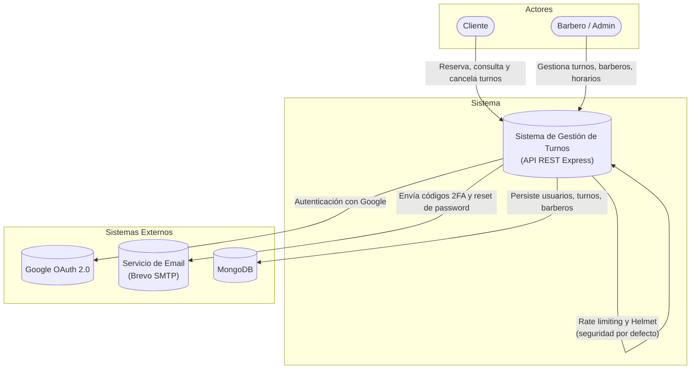

# Documentación de Arquitectura — Sistema de Gestión de Turnos (Barbería)

Modelo C4 (Niveles 1 a 3) generado a partir del escaneo del código fuente.

---

## Nivel 1 — Contexto del Sistema



El sistema es una API REST que expone endpoints para que clientes reserven turnos y administradores/barberos gestionen la operación. Se integra con Google OAuth para autenticación social, con un servicio SMTP (Brevo vía Nodemailer) para el envío de códigos 2FA obligatorios y reseteo de contraseñas, y con MongoDB como única fuente de verdad.

**Flujo de login (2FA obligatorio):** El login no es un solo paso. Primero el cliente envía email+password a `POST /auth/2fa/send`, que valida credenciales y envía un código de 6 dígitos por email. Luego el cliente verifica el código en `POST /auth/2fa/verify` para recibir los tokens JWT. No existe un endpoint `/login` tradicional.

**Seguridad inbound:** La API aplica rate limiting específico por ruta, helmet con defaults, CORS whitelist, y validación Joi en todos los endpoints.

---

## Nivel 2 — Contenedores

```mermaid
graph TD
    subgraph "Actores"
        C([Cliente])
        A([Barbero / Admin])
    end

    subgraph "Sistema de Gestión de Turnos"
        API["API Express<br/>(TypeScript, Express 5, CommonJS)<br/>Puerto 3000<br/>Clean Architecture"]
        WC["Web Client<br/>(React 19 + Vite, futuro frontend)<br/>Puerto 5173"]
    end

    subgraph "Sistemas Externos"
        OAUTH[("Google OAuth 2.0<br/>google-auth-library")]
        EMAIL[("Brevo SMTP<br/>(Nodemailer)")]
        DB[(("MongoDB<br/>(Mongoose 9)"))]
    end

    C -->|"HTTP/JSON"| WC
    C -->|"HTTP/JSON"| API
    A -->|"HTTP/JSON"| WC
    A -->|"HTTP/JSON"| API
    WC -->|"HTTP/JSON (localhost:3000)"| API
    API -->|"Mongoose ODM"| DB
    API -->|"google-auth-library"| OAUTH
    API -->|"Nodemailer + Brevo SMTP"| EMAIL

    style API fill:#1168bd,color:#fff
    style WC fill:#1168bd,color:#fff
```

La API Express es el backend monolítico con Clean Architecture. MongoDB es la base de datos documental. El Web Client (React) se comunica exclusivamente con la API. Los servicios externos son Google OAuth (autenticación) y Brevo SMTP (email 2FA, password reset). La API escucha en puerto 3000, el frontend en 5173.

**Seguridad a nivel contenedor:** Helmet (con `crossOriginOpenerPolicy: false`), CORS whitelist configurable vía `CORS_ORIGIN`, y 6 rate limiters por ruta aplicados a nivel de Express.

---

## Nivel 3 — Componentes (API)

```mermaid
graph TD
    subgraph "interface-adapters"
        direction TB
        ROUTES["Routes<br/>(auth, barber, appointment,<br/>service, tempLock, user)"]
        CTRL["Controllers<br/>(Auth, AuthGoogle, TwoFactor,<br/>PasswordRecovery, Barber,<br/>Appointment, Service, TempLock)"]
        MID["Middlewares<br/>(createAuthenticate, authorize,<br/>authorizeSelfOrKinds,<br/>createOptionalAuth, validate)"]
        PRES["Presenters<br/>(Auth, Barber, Appointment,<br/>Service)"]
        VAL["Validators<br/>(Joi schemas: auth, barber,<br/>appointment, recovery)"]
    end

    subgraph "application"
        direction TB
        UC["Use Cases<br/>(26 casos: auth 6, barber 9,<br/>appointment 6, password 2,<br/>service 1, tempLock 1, user 1)"]
        PORTS["Ports / Interfaces<br/>(IEmailService, ITokenService,<br/>IHashService, IPasswordHasher,<br/>IGoogleAuthService,<br/>IDateTimeProvider,<br/>IRandomGenerator)"]
        DTO["DTOs<br/>(auth, barber, appointment,<br/>password, service)"]
        ERR["AppError<br/>(message + statusCode)"]
    end

    subgraph "domain"
        direction TB
        ENT["Entities<br/>(Appointment, Barber, Client,<br/>Service, User, RefreshToken,<br/>PasswordResetToken)"]
        VO["Value Objects<br/>(Email, Password, Phone,<br/>Price, DurationMinutes)"]
        REPOS["Repository Interfaces<br/>(IAppointmentRepo, IBarberRepo,<br/>IClientRepo, IUserRepo,<br/>IRefreshTokenRepo,<br/>IPasswordResetRepo,<br/>IServiceRepo, ITempLockRepo)"]
        DSVC["Domain Services<br/>(SlotService)"]
        DTYPES["Domain Types<br/>(appointment.ts con VALID_TRANSITIONS,<br/>auth.ts con AuthProvider/BarberKind/ClientKind)"]
        UTILS["Domain Utils<br/>(time.ts con toMinutes, doesOverlap,<br/>getDayKey, getNowInTimezone)"]
    end

    subgraph "infrastructure"
        direction TB
        MDB_REPOS["MongoDB Repositories<br/>(8 implementaciones<br/>con Mongoose models)"]
        STAT_REPO["Static Repositories<br/>(StaticServiceRepository)"]
        MAPPERS["Mappers<br/>(Appointment, Barber, Client,<br/>User, Service, PasswordReset)"]
        MODELS["Mongoose Models<br/>(appointment, barber, client,<br/>tempLock, refreshToken,<br/>passwordReset)"]
        SVC["Services<br/>(JwtTokenService,<br/>BcryptPasswordHasher,<br/>GoogleAuthService,<br/>NodemailerEmailService,<br/>FakeEmailService,<br/>DateTimeProvider,<br/>HashService, RandomGenerator)"]
        CFG["Config<br/>(env.ts, db.ts, mailer.ts,<br/>services.ts)"]
        SCRIPT["Scripts<br/>(seed.ts)"]
    end

    subgraph "wiring"
        direction TB
        WIRING["Wiring Modules<br/>(auth.ts, barber.ts,<br/>appointment.ts, service.ts,<br/>tempLock.ts, user.ts)"]
    end

    subgraph "security"
        direction TB
        RATE_LIMIT["Rate Limiters<br/>(7 instancias: registerLimiter,<br/>resetLimiter, twoFALimiter,<br/>googleLimiter, refreshLimiter,<br/>loginLimiter, tempLockLimiter)"]
        HELMET["Helmet<br/>(global, default CSP)"]
        CORS["CORS<br/>(whitelist desde CORS_ORIGIN)"]
        ANTIBF["Anti Brute-Force<br/>(Account lockout: 2FA y reset<br/>tras 5 intentos fallidos,<br/>15 min de bloqueo)"]
        RETRY["Retry + Exponential Backoff<br/>(envío email: 3 intentos,<br/>500ms → 1000ms)"]
        TOKEN_ROT["Refresh Token Rotation<br/>(revocación + detección<br/>de robo: revoca TODOS<br/>los tokens si se reusa uno)"]
        HASH_CONST["Constant-Time Compare<br/>(HMAC-SHA256 + timingSafeEqual<br/>para códigos 2FA y tokens)"]
    end

    ROUTES -->|"usan"| MID
    ROUTES -->|"usan"| VAL
    ROUTES -->|"delegan en"| CTRL
    CTRL -->|"usan"| PRES
    CTRL -->|"ejecutan"| UC
    UC -->|"implementan"| PORTS
    UC -->|"consultan"| REPOS
    UC -->|"instancian"| ENT
    UC -->|"usan"| VO
    UC -->|"usan"| DSVC
    UC -->|"lanzan"| ERR
    UC -->|"usan"| DTO
    SVC -->|"implementan"| PORTS
    MDB_REPOS -->|"implementan"| REPOS
    MDB_REPOS -->|"usan"| MAPPERS
    MDB_REPOS -->|"usan"| MODELS
    MDB_REPOS -->|"usan"| CFG
    STAT_REPO -->|"implementa"| REPOS
    WIRING -->|"ensambla"| MDB_REPOS
    WIRING -->|"ensambla"| STAT_REPO
    WIRING -->|"ensambla"| SVC
    WIRING -->|"ensambla"| UC
    WIRING -->|"ensambla"| CTRL
    RATE_LIMIT -->|"protege"| ROUTES
    HELMET -->|"protege"| API
    CORS -->|"restringe"| API
    ANTIBF -->|"implementado en"| UC
    RETRY -->|"implementado en"| UC
    TOKEN_ROT -->|"implementado en"| UC
    HASH_CONST -->|"usado por"| UC

    style interface-adapters fill:#d4e6f1,color:#000
    style application fill:#f0f3c0,color:#000
    style domain fill:#f5cba7,color:#000
    style infrastructure fill:#d5f5e3,color:#000
    style wiring fill:#e8daef,color:#000
    style security fill:#f9e79f,color:#000
```



La API sigue Clean Architecture estricta con dependencias apuntando hacia adentro (dominio no conoce infraestructura). La capa `wiring` ensambla manualmente todas las dependencias (DI sin contenedor). Los 26 casos de uso orquestan la lógica de negocio; el dominio contiene reglas puras (entities, value objects, tipos con máquina de estados para Appointment) y el servicio de dominio `SlotService` para cálculo de disponibilidad horaria. La infraestructura implementa repositorios MongoDB con mappers que traducen entre modelos de Mongoose y entidades de dominio.

### Mecanismos de seguridad reales

| Mecanismo | Dónde | Evidencia |
|---|---|---|
| **Helmet** | Global (`app.use(helmet(...))`) | `src/app.ts:16-19` |
| **CORS** | Global con whitelist | `src/app.ts:22-29` |
| **Rate limiting** | 7 limiters: register (10/15min), reset (3/15min), 2FA (5/15min), google (5/15min), refresh (10/15min), tempLock (20/5min), login (5/15min, definido no usado) | `src/app.ts:31-85`, `tempLock.routes.ts:17-21` |
| **Anti brute-force** | Lockout tras 5 intentos fallidos en 2FA y reset, 15 min de bloqueo | `VerifyTwoFactorUseCase.ts`, `ResetPasswordUseCase.ts` |
| **Retry + exp. backoff** | Envío de email: 3 intentos, backoff 500ms→1000ms | `SendTwoFactorCodeUseCase.ts:62-83`, `RequestPasswordResetUseCase.ts:40-57` |
| **Refresh token rotation** | Al refrescar: revoca el anterior; si se reusa uno revocado: revoca TODOS | `RefreshTokenUseCase.ts:30-33` |
| **Constant-time compare** | HMAC-SHA256 + `crypto.timingSafeEqual` para códigos 2FA | `HashService.ts`, `VerifyTwoFactorUseCase.ts:49` |
| **Partial token (Google)** | Token 5min para completar perfil Google | `JwtTokenService.ts:102-108` |
| **Unique compound index** | Previene double-booking en DB (no solo en lógica) | `appointment.model.ts:101`, `tempLock.model.ts:37` |

### Mecanismos de resiliencia reales

| Mecanismo | Dónde | Evidencia |
|---|---|---|
| **TTL index** | TempLock: auto-delete tras 300s (5 min) | `tempLock.model.ts:36` |
| **Retry con backoff** | Envío de emails (2FA y password reset) | `SendTwoFactorCodeUseCase.ts`, `RequestPasswordResetUseCase.ts` |
| **Health check** | `GET /health` → `{ status: "ok" }` | `app.ts:93-95` |
| **Error handler global** | Captura errores no manejados, responde 500 | `app.ts:97-100` |
| **Email async fire-and-forget** | Notificaciones de turno no bloquean respuesta | `CreateAppointmentUseCase.ts:128`, `CancelAppointmentUseCase.ts` |

### Lo que NO existe (no documentar)

- ❌ No existe Winston/Pino/logger estructurado
- ❌ No existe correlation ID / request tracing
- ❌ No existe graceful shutdown
- ❌ No existe CSRF
- ❌ No existen transacciones MongoDB
- ❌ No existe idempotency keys
- ❌ No existe circuit breaker
- ❌ No existe caché (Redis o en memoria)
- ❌ No existen colas / workers
- ❌ No existe TTL index en refresh_tokens ni passwordresets
- ❌ No existe auditoría de operaciones

---

# Cambios realizados (vs versión anterior)

## Nivel 1 — Contexto

| Cambio | Evidencia | Justificación |
|---|---|---|
| Se agregó nota sobre flujo de login 2FA | `SendTwoFactorCodeUseCase.ts`, `VerifyTwoFactorUseCase.ts` | El login NO es un solo paso; primero se envía código, luego se verifica |
| Se documentó rate limiting como control inbound global | `app.ts:31-85` | Existían 6 rate limiters aplicados a rutas pero no se documentaban |

## Nivel 2 — Contenedores

| Cambio | Evidencia | Justificación |
|---|---|---|
| Se añadió puerto 3000 como detalle del contenedor API | `index.ts:17` | Ya se mencionaba pero faltaba referencia a la línea |
| Se documentaron Helmet y CORS como medidas de seguridad a nivel contenedor | `app.ts:16-29` | Son configuraciones globales de Express, no componentes internos |

## Nivel 3 — Componentes

| Cambio | Evidencia | Justificación |
|---|---|---|
| Se agregó endpoint `GET /api/users/me` con UserController, GetCurrentUserUseCase y wiring | `interface-adapters/routes/user.routes.ts`, `controllers/user/UserController.ts`, `application/use-cases/user/GetCurrentUserUseCase.ts`, `wiring/user.ts` | Issue #5: endpoint para que el frontend obtenga el perfil del usuario autenticado |
| Se actualizó conteo de Use Cases: 25 → 26 | Se agregó `GetCurrentUserUseCase` | Nuevo caso de uso para obtener perfil de usuario |
| Se agregaron los 7 rate limiters como subcomponente de seguridad | `app.ts:31-85`, `tempLock.routes.ts:17-21` | Eran 6 definiciones en app.ts + 1 en tempLock (loginLimiter definido pero no usado) |
| Se agregó bloque "security" con Helmet, CORS, AntiBF, Retry, Token Rotation, Constant-Time | Código fuente verificado en cada caso | Existían pero no se documentaban en ningún nivel |
| Se corrigió conteo de Use Cases: de 26 → 25 | Conteo real de archivos en `src/application/use-cases/` | El número anterior era incorrecto |
| Se agregaron controllers faltantes: AuthGoogle, TwoFactor, PasswordRecovery, Service, TempLock | `interface-adapters/controllers/` | Existían 8 controllers, no 3 |
| Se agregaron middlewares faltantes: authorizeSelfOrKinds, createOptionalAuth | `auth.middleware.ts` | Eran 4 factories exportadas, no 3 |
| Se agregó StaticServiceRepository | `infrastructure/repositories/static/` | Repositorio existente no documentado |
| Se agregaron Domain Types (appointment.ts, auth.ts) | `domain/types/` | Tipos existentes con máquina de estados |
| Se agregó Domain Utils (time.ts) | `domain/utils/time.ts` | Utilidades existentes usadas por SlotService y CreateAppointmentUseCase |
| Se agregó FakeEmailService | `infrastructure/services/FakeEmailService.ts` | Servicio existente usado en tests |
| Se agregaron modelos Mongoose faltantes: tempLock, refreshToken, passwordReset | `infrastructure/repositories/mongodb/models/` | Modelos existentes pero no mencionados |
| Se documentó TTL index en TempLock | `tempLock.model.ts:36` | Mecanismo de resiliencia existente |
| Se documentó unique compound index en Appointment y TempLock | `appointment.model.ts:101`, `tempLock.model.ts:37` | Previenen double-booking a nivel DB |
| Se documentó anti brute-force con lockout (2FA y reset) | `VerifyTwoFactorUseCase.ts`, `ResetPasswordUseCase.ts` | Mecanismo de seguridad existente |
| Se documentó retry con exponential backoff para emails | `SendTwoFactorCodeUseCase.ts:62-83`, `RequestPasswordResetUseCase.ts:40-57` | Mecanismo de resiliencia existente |
| Se documentó refresh token rotation + theft detection | `RefreshTokenUseCase.ts:30-33` | Mecanismo de seguridad existente |
| Se documentó constant-time compare con HMAC-SHA256 | `HashService.ts`, `VerifyTwoFactorUseCase.ts:49` | Mecanismo de seguridad existente |
| Se documentó health check endpoint | `app.ts:93-95` | Endpoint existente |
| Se documentó error handler global | `app.ts:97-100` | Middleware existente |
| Se documentó email async fire-and-forget | `CreateAppointmentUseCase.ts:128` | Patrón existente |
| Se quitó mención de casos de uso inexistentes | N/A | El conteo anterior (26) era incorrecto |
| Se añadió sección "Lo que NO existe" | N/A | Clarifica límites reales del sistema |

## Nivel 4 — Código

| Cambio | Evidencia | Justificación |
|---|---|---|
| Se agregó GetCurrentUserUseCase | `application/use-cases/user/GetCurrentUserUseCase.ts` | Issue #5: nuevo caso de uso para obtener perfil del usuario autenticado |
| Se agregó UserController con método getMe | `interface-adapters/controllers/user/UserController.ts` | Controller para GET /api/users/me |
| Se agregó user.routes.ts | `interface-adapters/routes/user.routes.ts` | Ruta protegida /api/users/me |
| Se agregó wiring/user.ts | `wiring/user.ts` | Ensamblaje de dependencias para módulo user |
| Se agregó `findById` a IUserRepository y MongoUserRepository | `domain/repositories/IUserRepository.ts`, `infrastructure/repositories/mongodb/MongoUserRepository.ts` | Necesario para GetCurrentUserUseCase |
| Se agregaron `findByClientId`, `findByContact`, `updateClientId` a IAppointmentRepository y MongoAppointmentRepository | `domain/repositories/IAppointmentRepository.ts`, `infrastructure/repositories/mongodb/MongoAppointmentRepository.ts` | Métodos para buscar y actualizar turnos por cliente |
| Se cambió tipo `kind` de UserEntity de `UserRole` a `AuthKind` | `domain/entities/User.ts`, `domain/types/auth.ts` | Type alignment: UserRole eliminado, AuthKind agrupa Admin, Empleado y Registrado |
| Se limpió AuthKind: eliminado `NoRegistrado` | `domain/types/auth.ts` | NoRegistrado ya no es un auth kind; ClientKind conserva 'Registrado' y 'NoRegistrado' para Client entity |
| Se eliminó `UserRole` de `User.ts`, ahora importa `AuthKind` | `domain/entities/User.ts` | Type alignment: Reemplazo de UserRole por AuthKind |
| Se agregaron 13 Use Cases faltantes | `src/application/use-cases/` | Solo 12 de 25 estaban documentados |
| Se agregaron 4 Controllers faltantes | `interface-adapters/controllers/` | Solo 3 de 7 estaban documentados |
| Se agregaron 2 Presenters faltantes | `interface-adapters/presenters/` | Solo 2 de 4 estaban documentados |
| Se agregaron 4 repositorios faltantes | `infrastructure/repositories/` | Solo 3 de 8 implementaciones estaban documentadas |
| Se agregaron 3 servicios faltantes | `infrastructure/services/` | HashService, RandomGenerator, DateTimeProvider |
| Se agregaron 2 entidades de dominio faltantes | `domain/entities/` | RefreshToken, PasswordResetToken |
| Se agregaron 3 interfaces de puertos faltantes | `application/ports/` | IHashService, IRandomGenerator, IDateTimeProvider |
| Se agregó authorizeSelfOrKinds middleware | `auth.middleware.ts` | Factory existente no documentada |
| Se corrigieron métodos de repositorios | `domain/repositories/` | Las firmas anteriores no coincidían con la realidad |
| Se corrigieron propiedades de entidades | `domain/entities/` | Faltaban campos como twoFactorFailedAttempts, authProvider, etc. |
| Se corrigió Appointment para incluir clientName, serviceName, endTime, etc. | `domain/entities/Appointment.ts` | La entidad tenía campos incorrectos / incompletos |
| Se agregó StaticServiceRepository | `infrastructure/repositories/static/` | Implementación existente |
| Se agregó FakeEmailService | `infrastructure/services/FakeEmailService.ts` | Implementación existente para testing |
| Se agregaron tipos de dominio: AppointmentStatus, VALID_TRANSITIONS, AuthTypes | `domain/types/` | Tipos existentes |
| Se agregaron 6 Mappers | `infrastructure/mappers/` | Solo 2 de 8 estaban documentados |
| Se corrigieron relaciones de dependencia entre Use Cases y repositorios | `wiring/` archivos | Muchas dependencias estaban omitidas |
| Se corrigió Appointment: ahora usa cancel(), confirm(), complete() como métodos de dominio | `domain/entities/Appointment.ts` | Métodos existentes que modelan máquina de estados |
| Se corrigió User para incluir withPasswordHash, withTwoFactor y demás métodos de proyección | `domain/entities/User.ts` | Métodos existentes de inmutabilidad funcional |

---

# Hallazgos Arquitectónicos

## Inconsistencias detectadas

1. **loginLimiter definido pero no usado** (`app.ts:31-37`): Se instancia un rate limiter para login pero nunca se aplica a ninguna ruta. No existe un endpoint `/login` tradicional (el login es 2-step con 2FA), por lo que este limiter es código muerto.

2. **Sin TTL index en refresh_tokens ni passwordresets**: Las colecciones `refresh_tokens` y `passwordresets` acumulan documentos expirados indefinidamente. `refreshToken.model.ts` no tiene `expireAfterSeconds`, y `passwordReset.model.ts` tampoco. Esto genera crecimiento infinito de almacenamiento.

3. **Barber schema sin `timestamps: true`**: A diferencia de Appointment y TempLock, el modelo Barber no tiene timestamps automáticos. Esto es inconsistente.

4. **RefreshToken.createdAt usa `default: Date.now` (no timestamps)**: A diferencia de otros modelos, RefreshToken no usa la opción `timestamps: true` de Mongoose, sino un default manual. Inconsistencia menor.

5. **No hay graceful shutdown**: El servidor Express no maneja `SIGTERM`/`SIGINT`. Una interrupción abrupta puede dejar conexiones abiertas de MongoDB.

## Deuda técnica identificada

1. **Logging con console.log/console.error**: No hay Winston, Pino ni ningún logger estructurado. Esto impide filtrar por nivel, correlacionar eventos en producción, o enviar logs a sistemas externos.

2. **Sin correlation IDs ni request tracing**: No hay un identificador único por request que permita seguir el flujo completo a través de use cases y llamadas externas. Dificulta debugging.

3. **Sin transacciones MongoDB**: `CreateAppointmentUseCase` ejecuta múltiples operaciones (crear appointment, eliminar tempLock, enviar email) sin atomicidad. Si falla después de crear el appointment pero antes de eliminar el tempLock, el slot queda ocupado y bloqueado.

4. **Email async fire-and-forget con `.catch()`**: Las notificaciones de turno se envían sin esperar respuesta. Si el servicio de email falla, no hay reintento ni cola de mensajes fallidos. El error solo se loguea con `console.error`.

5. **Sin idempotency keys en creación de turnos**: Si el cliente envía dos veces el mismo `POST /api/appointments`, se podrían crear dos turnos (aunque el índice único lo previene para mismo barber+date+time, el clientId podría ser diferente).

## Patrones fuertes (aciertos)

1. **Clean Architecture estricta**: Las dependencias apuntan correctamente hacia adentro. El dominio no importa nada de infraestructura. Los repositorios son interfaces en dominio, implementaciones en infraestructura.

2. **Factory-based middlewares**: Los middlewares reciben sus dependencias por constructor (ej: `createAuthenticate(tokenService)`), lo que permite testing unitario real sin mockear módulos de Express.

3. **Anti brute-force nativo**: Account lockout para 2FA y reset de password con persistencia en MongoDB. Bien implementado con contadores y timestamps de bloqueo.

4. **Refresh token rotation con theft detection**: Si un token ya revocado se reutiliza, se revocan TODOS los tokens del usuario. Esto es una defensa sólida contra robo de tokens.

5. **Constant-time comparison para códigos 2FA**: Uso de `crypto.timingSafeEqual` previene timing attacks en la verificación de códigos.

6. **Rate limiting específico por ruta**: Cada operación sensible tiene su propio rate limiter con límites diferenciados (register: 10, reset: 3, 2FA: 5, etc.).

7. **Retry con exponential backoff para emails**: Aunque básico (3 intentos, backoff 500-1000ms), es una implementación pragmática de resiliencia para envío de emails.

8. **Unique compound indexes a nivel DB**: El índice único `{barberId, date, startTime}` tanto en appointments como en tempLocks es una barrera de seguridad doble contra race conditions.

9. **Wiring manual sin DI container**: Aunque trabajoso, evita magic IoC y hace las dependencias explícitas y rastreables.

10. **Domain entity inmutabilidad funcional**: `User` usa métodos `with*()` que devuelven nuevas instancias en lugar de mutar, siguiendo principios de inmutabilidad.

## Riesgos reales

1. **Race condition en creación de turnos**: Aunque el índice único previene duplicados exactos, el flujo de tempLock → appointment no es atómico. Dos usuarios podrían crear tempLocks para el mismo slot y solo uno recibiría error 409 al crear el appointment, mientras el tempLock del otro quedaría huérfano (aunque con TTL de 5 min).

2. **Sin límite de conexiones a MongoDB**: `mongoose.connect()` usa default pool size (100). Bajo alta concurrencia podría ser insuficiente.

3. **Sin autenticación en tempLock**: `POST /api/appointments/temp-lock` no requiere autenticación ni verifica ownership. Solo tiene rate limiting (20/5min). Cualquier cliente (incluso no registrado) puede bloquear slots de cualquier barbero.

4. **CORS abierto a múltiples origenes**: `config.corsOrigin.split(",")` permite whitelist múltiple, pero `credentials: true` combinado con múltiples origenes incrementa superficie de ataque.

5. **Sin validación de request body sanitization**: Joi valida tipos y formato pero no sanitiza contenido (ej: XSS en `clientName`). Aunque MongoDB no es vulnerable a SQL injection, el dato se almacena y podría ser renderizado en el frontend sin escapar.
