# Auditoría Arquitectónica — Feature "Reserva de Turnos"

> **Fecha:** 2026-06-11  
> **Rama actual:** `main` (por verificar)  
> **Propósito:** Documentar la arquitectura completa de la feature de Reserva de Turnos sin necesidad de leer el código fuente.

---

## 1. Resumen Ejecutivo

La feature **Reserva de Turnos** permite a clientes (registrados o anónimos) agendar citas con barberos de una barbería. Resuelve el problema de coordinar horarios entre múltiples barberos y clientes, evitando superposiciones y respetando reglas de negocio como horarios laborales, descansos y límites de anticipación.

### Capacidades

- **Agendamiento público:** cualquier persona puede reservar un turno sin registrarse (solo necesita nombre, apellido y email/teléfono).
- **Selección multi-paso:** barbero → servicio → fecha/hora → confirmación.
- **Temporary Lock:** bloqueo temporal de 5 minutos del slot seleccionado para evitar race conditions.
- **Cancelación:** clientes (propietarios), admins y empleados pueden cancelar turnos respetando una ventana mínima de horas.
- **Reprogramación:** cambio de fecha/hora/barbero de un turno existente.
- **Actualización de estado:** admins/empleados pueden marcar turnos como Completado, Cancelado o NoShow.
- **Notificaciones por email:** creación, cancelación y reprogramación envían emails asincrónicos.
- **Consulta anónima:** los clientes pueden buscar sus turnos por email/teléfono sin autenticarse.

### Actores

| Actor | Descripción |
|-------|-------------|
| **Cliente (no registrado)** | Reserva turnos sin cuenta, consulta por email/teléfono |
| **Cliente (registrado)** | Reserva turnos asociados a su cuenta, consulta sus turnos |
| **Admin** | Gestiona todos los turnos (CRUD, cambios de estado) |
| **Empleado/Barbero** | Ve y gestiona turnos asignados a sí mismo |
| **Sistema** | Ejecuta reglas de negocio, envía emails, maneja locks temporales |

### Interacción con el resto del sistema

- **Módulo de Autenticación:** usado para proteger endpoints y extraer `userId`/`userKind`.
- **Módulo de Barberos:** proporciona schedule, slotDuration, maxAdvanceDays y disponibilidad.
- **Módulo de Servicios:** proporciona catálogo de servicios (precios, nombres).
- **Módulo de Clientes:** crea clientes no registrados bajo demanda.
- **Servicio de Email (Nodemailer):** envía notificaciones.
- **Base de Datos (MongoDB):** persiste appointments, tempLocks, barbers, clients.

---

## 2. Mapa General de Arquitectura

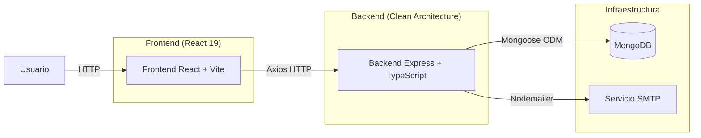

---

## 3. Estructura de Capas

Arquitectura **Clean Architecture / Hexagonal** (híbrida). Las dependencias apuntan hacia adentro (Domain no conoce capas externas).

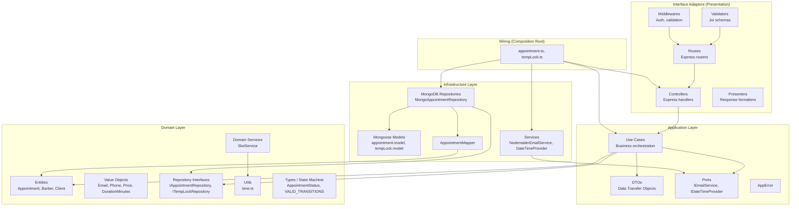

---

## 4. Inventario Completo de Archivos

### Backend

| Archivo | Tipo | Responsabilidad |
| ------- | ---- | --------------- |
| `src/domain/entities/Appointment.ts` | Entity | Entidad raíz con métodos cancel(), complete(), markNoShow(), pay(), toPrimitives() |
| `src/domain/entities/Barber.ts` | Entity | Entidad Barber con schedule, slotDuration, maxAdvanceDays, isActive |
| `src/domain/entities/Client.ts` | Entity | Entidad Client (Registrado/NoRegistrado) |
| `src/domain/types/appointment.ts` | Types | AppointmentStatus, PaymentStatus, PaymentMethod, StatusHistoryEntry, VALID_TRANSITIONS |
| `src/domain/types/auth.ts` | Types | AuthKind (Admin, Empleado, Cliente) |
| `src/domain/value-objects/Email.ts` | VO | Value Object Email con validación |
| `src/domain/value-objects/Phone.ts` | VO | Value Object Phone |
| `src/domain/value-objects/Price.ts` | VO | Value Object Price |
| `src/domain/value-objects/DurationMinutes.ts` | VO | Value Object DurationMinutes |
| `src/domain/repositories/IAppointmentRepository.ts` | Interface | Puerto de repositorio: findById, findMany, findByBarberAndDate, findByClientAndDate, findByContactAndDate, create, update, updateStatus |
| `src/domain/repositories/ITempLockRepository.ts` | Interface | Puerto de repositorio: create, deleteMany, deleteOne, findByBarberAndDate |
| `src/domain/repositories/IBarberRepository.ts` | Interface | Puerto de repositorio: findBarberById, findAllBarbers, etc. |
| `src/domain/repositories/IClientRepository.ts` | Interface | Puerto de repositorio: findByEmail, findByPhone, createUnregistered |
| `src/domain/repositories/IServiceRepository.ts` | Interface | Puerto de repositorio: findById, findAll (servicios estáticos) |
| `src/domain/services/SlotService.ts` | Domain Service | Computa slots disponibles según schedule, breaks, ocupados, hora actual |
| `src/domain/utils/time.ts` | Utility | toMinutes, toTimeString, doesOverlap, getDayKey, isWithinSchedule, isInBreakRange, getNowInTimezone |
| `src/domain/constants/validation.ts` | Constants | EMAIL_REGEX y TIME_REGEX |
| `src/application/use-cases/appointment/CreateAppointmentUseCase.ts` | Use Case | Orquesta creación de turno con todas las reglas de negocio |
| `src/application/use-cases/appointment/CancelAppointmentUseCase.ts` | Use Case | Cancela turno con verificación de permisos y ventana mínima |
| `src/application/use-cases/appointment/RescheduleAppointmentUseCase.ts` | Use Case | Reagenda turno validando disponibilidad y reglas |
| `src/application/use-cases/appointment/GetAppointmentsUseCase.ts` | Use Case | Lista turnos con filtros |
| `src/application/use-cases/appointment/GetAppointmentByIdUseCase.ts` | Use Case | Obtiene turno por ID con verificación de ownership |
| `src/application/use-cases/appointment/GetAppointmentsAnonymousUseCase.ts` | Use Case | Búsqueda anónima por email/teléfono |
| `src/application/use-cases/appointment/UpdateAppointmentStatusUseCase.ts` | Use Case | Actualiza estado (Complete, Cancel, NoShow) con reglas |
| `src/application/use-cases/tempLock/CreateTempLockUseCase.ts` | Use Case | Crea lock temporal de 5 minutos |
| `src/application/dto/appointment/CreateAppointmentDTO.ts` | DTO | Payload de creación |
| `src/application/dto/appointment/AppointmentResponseDTO.ts` | DTO | Respuesta de appointment |
| `src/application/dto/appointment/RescheduleAppointmentDTO.ts` | DTO | Payload de reprogramación |
| `src/application/ports/IEmailService.ts` | Port | Interfaz de envío de email |
| `src/application/ports/IDateTimeProvider.ts` | Port | Interfaz de proveedor de fecha/hora |
| `src/application/errors/AppError.ts` | Error | Clase de error con statusCode |
| `src/interface-adapters/controllers/appointment/AppointmentController.ts` | Controller | 7 handlers: create, getAll, getById, cancel, updateStatus, getAnonymous, reschedule |
| `src/interface-adapters/controllers/tempLock/TempLockController.ts` | Controller | Handler para crear temp lock |
| `src/interface-adapters/routes/appointment.routes.ts` | Routes | Definición de rutas con middlewares |
| `src/interface-adapters/routes/tempLock.routes.ts` | Routes | Ruta POST / con rate limit |
| `src/interface-adapters/validators/appointment.validator.ts` | Validator | Schemas Joi para cada endpoint |
| `src/interface-adapters/presenters/AppointmentPresenter.ts` | Presenter | Formatea respuestas éxito/error |
| `src/interface-adapters/middlewares/auth.middleware.ts` | Middleware | Autenticación JWT, autorización por roles |
| `src/infrastructure/repositories/mongodb/MongoAppointmentRepository.ts` | Repository | Implementación MongoDB de IAppointmentRepository |
| `src/infrastructure/repositories/mongodb/MongoTempLockRepository.ts` | Repository | Implementación MongoDB de ITempLockRepository |
| `src/infrastructure/repositories/mongodb/models/appointment.model.ts` | Model | Schema Mongoose Appointment con índices |
| `src/infrastructure/repositories/mongodb/models/tempLock.model.ts` | Model | Schema Mongoose TempLock con TTL index |
| `src/infrastructure/mappers/AppointmentMapper.ts` | Mapper | Mapeo documento MongoDB → entidad Appointment |
| `src/infrastructure/services/NodemailerEmailService.ts` | Service | Implementación real de IEmailService |
| `src/infrastructure/services/FakeEmailService.ts` | Service | Implementación fake para tests |
| `src/infrastructure/services/DateTimeProvider.ts` | Service | Implementación de IDateTimeProvider |
| `src/infrastructure/config/env.ts` | Config | Variables de entorno y configuración SMTP |
| `src/wiring/appointment.ts` | DI | Composition Root del módulo appointment |
| `src/wiring/tempLock.ts` | DI | Composition Root del módulo tempLock |
| `src/app.ts` | Entry | Registro de rutas y configuración Express |

### Frontend

| Archivo | Tipo | Responsabilidad |
| ------- | ---- | --------------- |
| `src/pages/client/BookingPage/index.tsx` | Page | Página pública de booking (wizard multi-paso) |
| `src/components/client/booking/StepIndicator.tsx` | Component | Indicador visual de pasos (barbero → servicio → fecha) |
| `src/components/client/booking/BarberSelectionStep.tsx` | Component | Grid de selección de barbero |
| `src/components/client/booking/BarberCard.tsx` | Component | Card individual de barbero |
| `src/components/client/booking/ServiceSelectionStep.tsx` | Component | Grid de selección de servicio |
| `src/components/client/booking/ServiceCard.tsx` | Component | Card individual de servicio |
| `src/components/client/booking/DateTimeStep.tsx` | Component | Contenedor calendario + slots |
| `src/components/client/booking/BookingCalendar.tsx` | Component | Calendario de selección de fecha |
| `src/components/client/booking/TimeSlotGrid.tsx` | Component | Grid de horarios disponibles |
| `src/components/client/booking/StickyBookingFooter.tsx` | Component | Footer fijo con resumen y botón confirmar |
| `src/components/client/booking/BookingConfirmationModal.tsx` | Component | Modal de confirmación con datos del cliente |
| `src/components/client/booking/BookingSuccessModal.tsx` | Component | Modal de éxito post-reserva |
| `src/components/client/booking/index.ts` | Barrel | Re-exportaciones del módulo booking |
| `src/store/slices/bookingSlice.ts` | Redux Slice | Estado global del booking (4 async thunks, reducers) |
| `src/store/index.ts` | Store | Configuración del store Redux |
| `src/store/hooks.ts` | Hooks | useAppDispatch, useAppSelector tipados |
| `src/services/appointment.service.ts` | Service | Llamada POST /api/appointments |
| `src/services/professional.service.ts` | Service | Llamadas GET /api/barbers (public, slots) |
| `src/services/service.service.ts` | Service | Llamada GET /api/services |
| `src/services/api.ts` | API Client | Axios instance con interceptors (auth, refresh, errores) |
| `src/types/booking.ts` | Types | Tipo BarberPublic, Service, Appointment, BookingStep, BookingState |
| `src/App.tsx` | Root | Router: / → BookingPage, /admin/* → AdminLayout |

---

## 5. Mapa de Dependencias

```mermaid
graph TD
    APP[app.ts] --> W_APT[wiring/appointment.ts]
    APP --> W_TEMP[wiring/tempLock.ts]
    APP --> W_BARBER[wiring/barber.ts]
    APP --> W_SERVICE[wiring/service.ts]

    W_APT --> CTRL[AppointmentController]
    W_APT --> UC_CREATE[CreateAppointmentUseCase]
    W_APT --> UC_GET[GetAppointmentsUseCase]
    W_APT --> UC_GETID[GetAppointmentByIdUseCase]
    W_APT --> UC_CANCEL[CancelAppointmentUseCase]
    W_APT --> UC_STATUS[UpdateAppointmentStatusUseCase]
    W_APT --> UC_RESCHEDULE[RescheduleAppointmentUseCase]
    W_APT --> UC_ANON[GetAppointmentsAnonymousUseCase]
    W_APT --> REPO_MONGO[MongoAppointmentRepository]
    W_APT --> REPO_BARBER[MongoBarberRepository]
    W_APT --> REPO_CLIENT[MongoClientRepository]
    W_APT --> REPO_TEMP[MongoTempLockRepository]
    W_APT --> REPO_SERVICE[StaticServiceRepository]
    W_APT --> EMAIL[NodemailerEmailService]
    W_APT --> AUTH_MW[auth.middleware]
    W_APT --> ROUTES[appointment.routes]

    W_TEMP --> UC_TEMP[CreateTempLockUseCase]
    W_TEMP --> REPO_TEMP
    W_TEMP --> TCTRL[TempLockController]
    W_TEMP --> TROUTES[tempLock.routes]

    UC_CREATE --> ENT_APT[Appointment entity]
    UC_CREATE --> ENT_BARBER[Barber entity]
    UC_CREATE --> UTILS[time.ts utils]
    UC_CREATE --> REPO_I[IAppointmentRepository]
    UC_CREATE --> REPO_IB[IBarberRepository]
    UC_CREATE --> REPO_IC[IClientRepository]
    UC_CREATE --> REPO_IT[ITempLockRepository]
    UC_CREATE --> PORT_EMAIL[IEmailService]
    UC_CREATE --> DTO_CREATE[CreateAppointmentDTO]

    UC_CANCEL --> REPO_I
    UC_CANCEL --> PORT_EMAIL
    UC_CANCEL --> UTILS
    UC_CANCEL --> ENT_APT

    UC_RESCHEDULE --> REPO_I
    UC_RESCHEDULE --> REPO_IB
    UC_RESCHEDULE --> PORT_EMAIL
    UC_RESCHEDULE --> UTILS
    UC_RESCHEDULE --> DTO_RESCHEDULE[RescheduleAppointmentDTO]

    REPO_MONGO --> MODEL_APT[appointment.model]
    REPO_MONGO --> MAPPER[AppointmentMapper]
    MAPPER --> ENT_APT
    REPO_TEMP --> MODEL_TEMP[tempLock.model]

    SLOT[SlotService] --> UTILS
    SLOT --> ENT_BARBER

    subgraph Frontend
        BP[BookingPage] --> BS[bookingSlice]
        BS --> AS[appointment.service]
        BS --> PS[professional.service]
        BS --> SS[service.service]
        BP --> SI[StepIndicator]
        BP --> BST[BarberSelectionStep]
        BP --> SST[ServiceSelectionStep]
        BP --> DTS[DateTimeStep]
        BP --> SBF[StickyBookingFooter]
        SBF --> BCM[BookingConfirmationModal]
        BP --> BSM[BookingSuccessModal]
        AS --> API_CLIENT[api.ts]
        PS --> API_CLIENT
        SS --> API_CLIENT
    end
```

---

## 6. Modelo de Dominio

### Tabla de Entidades

| Entidad | Responsabilidad |
| ------- | --------------- |
| **Appointment** | Turno/Reserva. Contiene datos del cliente, servicio, fecha/hora, estado, historial de estados |
| **Barber** | Barbero con schedule semanal, duración de slot, días máximos de anticipación, estado activo |
| **Client** | Cliente (registrado o no registrado) con datos de contacto |

### Value Objects

| VO | Atributo | Propósito |
| -- | -------- | --------- |
| **Email** | string | Email validado |
| **Phone** | string | Teléfono validado |
| **Price** | number | Precio monetario |
| **DurationMinutes** | number | Duración en minutos (entero positivo) |

### Diagrama de Clases

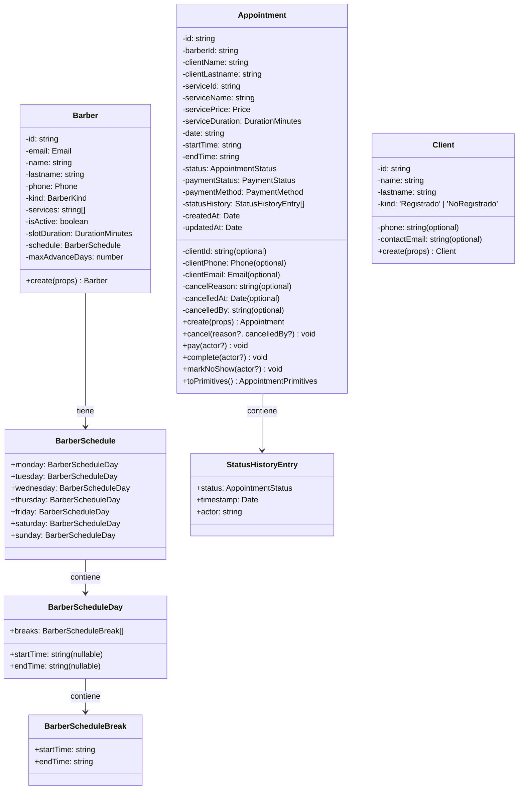

---

## 7. Reglas de Negocio

Se listan todas las reglas extraídas del código fuente. Las IDs siguen la nomenclatura `RNXX` del código y analisis.

| ID | Regla | Capa | Severidad |
| -- | ----- | ---- | --------- |
| RN01 | La fecha/hora del turno no puede estar en el pasado (comparado con la timezone configurada `America/Montevideo`) | Use Case (Create, Reschedule) | Bloqueante |
| RN02 | El turno debe estar dentro del horario laboral del barbero para ese día de la semana | Use Case (Create, Reschedule) | Bloqueante |
| RN03 | El turno no puede superponerse con los breaks del barbero | Use Case (Create, Reschedule) | Bloqueante |
| RN04 | El turno no puede colisionar con otros turnos activos (status ≠ Cancelado) del mismo barbero en la misma fecha | Use Case (Create, Reschedule) | Bloqueante |
| RN05 | El barbero debe existir y estar activo (`isActive === true`) | Use Case (Create, Reschedule) | Bloqueante |
| RN06 | El servicio debe existir en el repositorio | Use Case (Create, Reschedule) | Bloqueante |
| RN07 | No se puede reservar con más de `barber.maxAdvanceDays` días de anticipación (configurable por barbero) | Use Case (Create, Reschedule) | Bloqueante |
| RN08 | El formato de hora debe ser `HH:mm` válido | Use Case (Create, Reschedule) | Bloqueante |
| RN09 | No se puede reprogramar un turno en estado terminal (Completado, Cancelado, NoShow) | Use Case (Reschedule) | Bloqueante |
| RN10 | Clientes no registrados: se busca por email/teléfono; si no existe, se crea automáticamente con `createUnregistered` | Use Case (Create) | Automática |
| RN11 | Asignación de `clientId`: si es Admin/Empleado, se respeta el `clientId` enviado; si es Cliente registrado, se auto-asigna su `_id` | Controller (create) | Automática |
| RN12 | Transiciones de estado válidas: `Confirmado → [Completado, Cancelado, NoShow]`, terminales: `Completado`, `Cancelado`, `NoShow` | Entity (Appointment) | Bloqueante |
| RN13 | Al completar un turno (`Completado`), el `paymentStatus` se actualiza automáticamente a `Pagado` | Use Case (UpdateStatus) | Automática |
| RN14 | Al cancelar un turno, se requiere `cancelReason` si el cancelador es Admin/Empleado | Validator (Joi) | Bloqueante |
| RN15 | Máximo 1 turno activo (status `Confirmado`) por día por cliente | Use Case (Create, Reschedule) | Bloqueante |
| RN16 | Si existe un `tempLockId`, se elimina el TempLock después de crear el turno (fire-and-forget) | Use Case (Create) | No bloqueante |
| RN17 | Las notificaciones por email se envían de forma asíncrona (no bloqueante, con catch de errores) | Use Case (Create, Cancel, Reschedule) | No bloqueante |
| RN18 | El TempLock tiene un TTL de 300 segundos (5 minutos) configurado en el índice de MongoDB | Infraestructura (Model) | Automática |
| RN19 | El índice único `{ barberId, date, startTime }` en TempLock previene doble reserva del mismo slot | Infraestructura (Model) | Bloqueante |
| RN20 | Permisos de reprogramación: solo el propietario, admin o barbero asignado pueden reprogramar | Use Case (Reschedule) | Bloqueante |
| RN21 | Permisos de cancelación: solo el propietario (`clientId === userId`), admin o barbero asignado pueden cancelar | Use Case (Cancel) | Bloqueante |
| RN22 | Ventana mínima de cancelación: configurable via `CANCEL_MIN_HOURS_BEFORE` (default: 2h); no se puede cancelar dentro de esa ventana | Use Case (Cancel, UpdateStatus) | Bloqueante |
| RN23 | No se puede marcar como `NoShow` un turno cuya fecha/hora aún no pasó | Use Case (UpdateStatus) | Bloqueante |
| RN24 | Idempotencia: cancelar un turno ya cancelado retorna 200 sin mutación | Use Case (Cancel, UpdateStatus) | Automática |
| RN25 | La entidad Appointment valida internamente las transiciones vía `VALID_TRANSITIONS` antes de mutar el estado | Entity | Bloqueante |
| RN26 | El índice único `{ barberId, date, startTime }` en Appointment previene solapamiento a nivel DB | Infraestructura (Model) | Bloqueante |

---

## 8. Casos de Uso

| Caso de Uso | Descripción | Actor Principal |
| ----------- | ----------- | --------------- |
| **Crear Turno** | Agenda un turno con barbero, servicio, fecha, hora y datos del cliente | Cliente (registrado o no), Admin, Empleado |
| **Cancelar Turno** | Cancela un turno existente (con verificación de permisos y ventana mínima) | Cliente (propietario), Admin, Empleado |
| **Reprogramar Turno** | Cambia fecha, hora y/o barbero de un turno existente | Cliente (propietario), Admin, Empleado |
| **Listar Turnos** | Obtiene turnos con filtros (barberId, clientId, date, dateFrom, dateTo) | Admin, Empleado, Cliente (solo propios) |
| **Obtener Turno por ID** | Obtiene detalle de un turno específico | Admin, Empleado, Cliente (solo propio) |
| **Consulta Anónima** | Busca turnos por email/teléfono sin autenticación | Cliente no registrado |
| **Actualizar Estado** | Cambia estado a Completado, Cancelado o NoShow | Admin, Empleado |
| **Crear TempLock** | Bloquea temporalmente un slot (5 min TTL) | Frontend (pre-confirmación) |

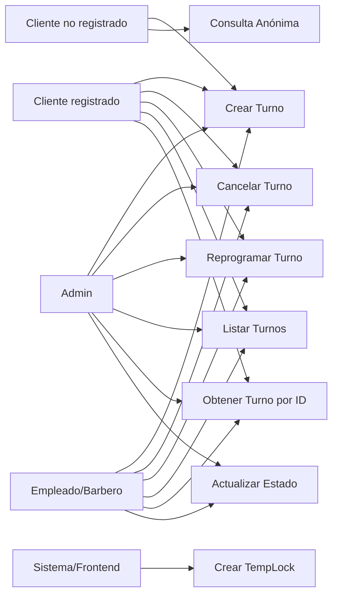

---

## 9. Flujo Completo de Reserva

### Escenario exitoso

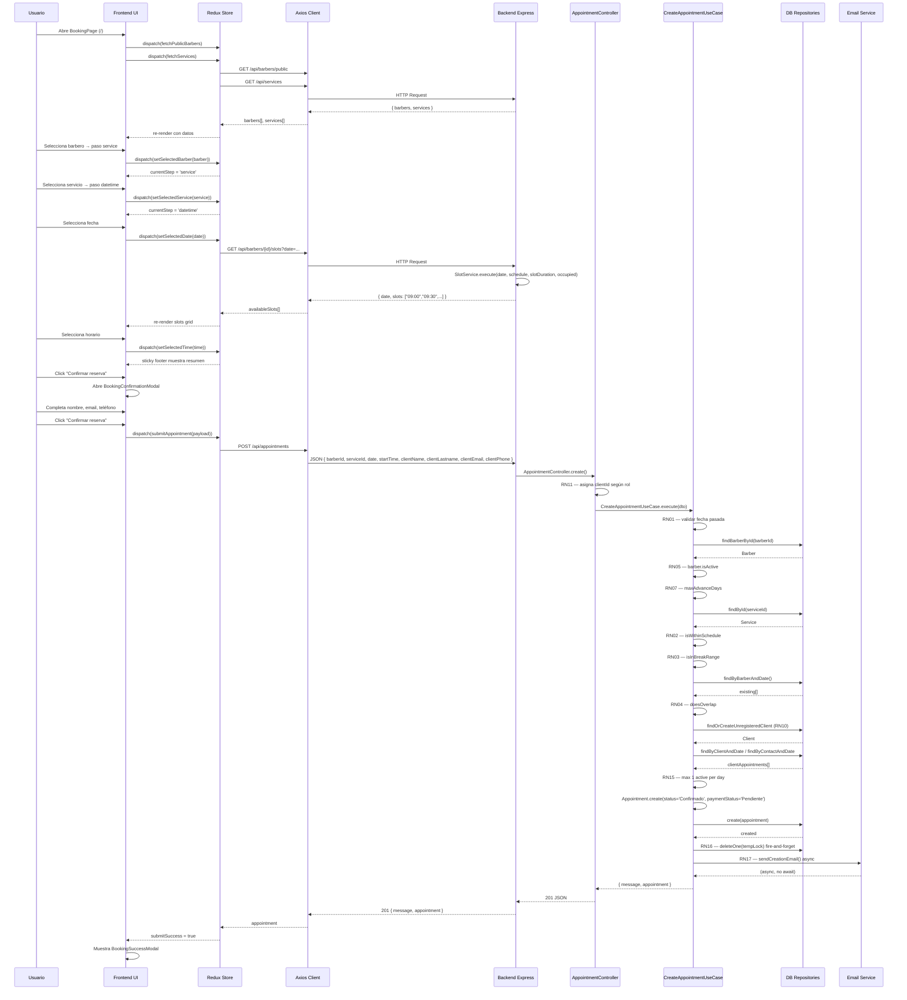

### Escenario con error (slot ocupado)

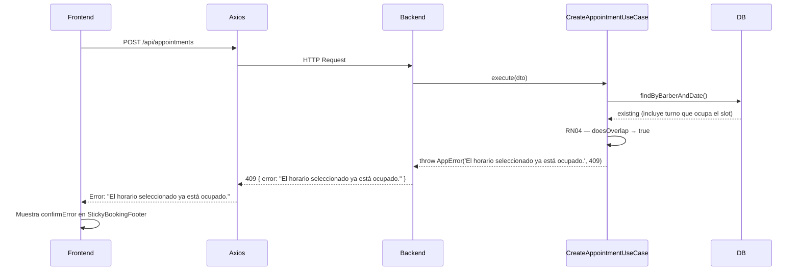

---

## 10. Flujo de Cancelación

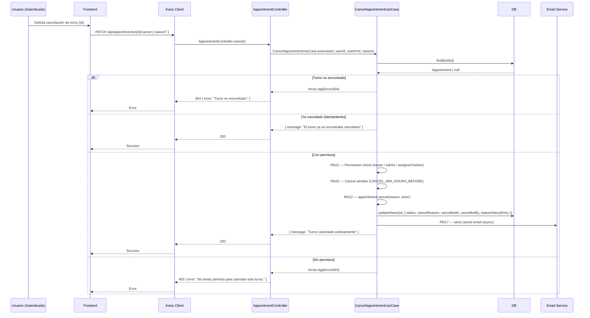

---

## 11. Flujo de Reprogramación

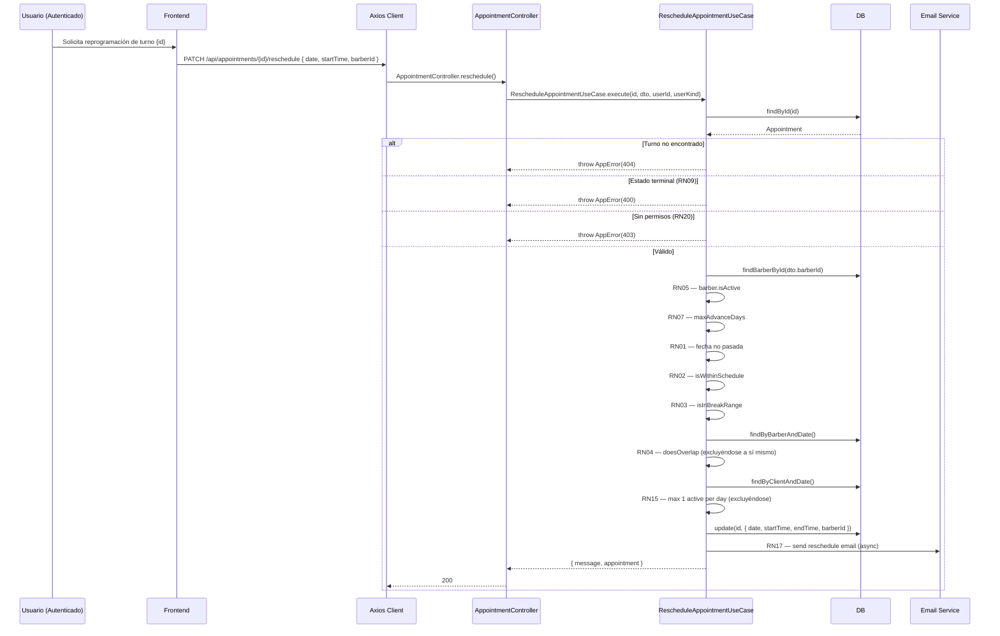

---

## 12. API Contract

### `POST /api/appointments` — Crear Turno

**Auth:** Optional (Bearer token opcional)

#### Request
```json
{
  "barberId": "60d5f484f1a2c8b1f8e4e1a1",
  "serviceId": "corte-clasico",
  "date": "2026-06-15",
  "startTime": "09:00",
  "clientName": "Juan",
  "clientLastname": "Pérez",
  "clientEmail": "juan@email.com",
  "clientPhone": "099123456"
}
```

#### Response 201
```json
{
  "message": "Turno creado exitosamente",
  "appointment": {
    "id": "60d5f484f1a2c8b1f8e4e1b2",
    "barberId": "60d5f484f1a2c8b1f8e4e1a1",
    "clientId": "60d5f484f1a2c8b1f8e4e1c3",
    "clientName": "Juan",
    "clientLastname": "Pérez",
    "clientEmail": "juan@email.com",
    "clientPhone": "099123456",
    "serviceId": "corte-clasico",
    "serviceName": "Corte Clásico",
    "servicePrice": 500,
    "serviceDuration": 30,
    "date": "2026-06-15",
    "startTime": "09:00",
    "endTime": "09:30",
    "status": "Confirmado",
    "paymentStatus": "Pendiente",
    "paymentMethod": "local",
    "statusHistory": [
      { "status": "Confirmado", "timestamp": "2026-06-11T12:00:00.000Z", "actor": "system" }
    ],
    "createdAt": "2026-06-11T12:00:00.000Z",
    "updatedAt": "2026-06-11T12:00:00.000Z"
  }
}
```

#### Validaciones (Joi)
- `barberId`: string, required
- `serviceId`: string, required
- `date`: string, pattern `/^\d{4}-\d{2}-\d{2}$/`, required
- `startTime`: string, pattern `TIME_REGEX`, required
- `clientName`: string, trim, min 1, max 100, required
- `clientLastname`: string, trim, min 1, max 100, required
- `clientEmail`: string, pattern `EMAIL_REGEX`, trim, required
- `clientPhone`: string, trim, max 20, allow empty/null

#### Errores
| Código | Mensaje |
| ------ | ------- |
| 400 | No se puede agendar en el pasado. |
| 400 | La hora ya pasó. |
| 400 | El barbero no está activo. |
| 400 | No se puede reservar con más de N días de anticipación. |
| 400 | Formato de hora inválido. |
| 400 | El turno está fuera del horario laboral del barbero. |
| 400 | El turno se superpone con un descanso del barbero. |
| 404 | Barbero no encontrado. |
| 404 | Servicio no encontrado. |
| 409 | El horario seleccionado ya está ocupado. |
| 409 | Ya tenés un turno activo para esta fecha. |
| 500 | Error al crear el turno (fallback) |

---

### `GET /api/appointments` — Listar Turnos

**Auth:** Required

#### Query Parameters
| Parámetro | Tipo | Descripción |
| --------- | ---- | ----------- |
| barberId | string | Filtrar por barbero (Admin/Empleado) |
| clientId | string | Filtrar por cliente (Admin/Empleado) |
| date | string | Filtrar por fecha exacta (YYYY-MM-DD) |
| dateFrom | string | Desde fecha |
| dateTo | string | Hasta fecha |

**Nota:** Si el usuario es Cliente, se fuerza `clientId = userId` ignorando filtros.

#### Response 200
```json
{
  "appointments": [
    {
      "id": "...",
      "barberId": "...",
      "clientName": "Juan",
      "status": "Confirmado",
      "...": "..."
    }
  ]
}
```

#### Validaciones (Joi)
- `barberId`: string, optional
- `clientId`: string, optional
- `date`: string, pattern date, optional
- `dateFrom`: string, pattern date, optional
- `dateTo`: string, pattern date, optional

---

### `GET /api/appointments/anonymous` — Consulta Anónima

**Auth:** None  
**Rate Limit:** 30 requests / 15 minutos

#### Query Parameters
| Parámetro | Tipo | Descripción |
| --------- | ---- | ----------- |
| email | string | Email del cliente (opcional) |
| phone | string | Teléfono del cliente (opcional) |
| date | string | Filtrar por fecha (opcional) |

**Debe proporcionar al menos uno de email o phone.**

#### Validaciones (Joi)
- `email`: string, pattern `EMAIL_REGEX`, trim
- `phone`: string, trim, max 20
- `date`: string, pattern date
- `.min(1)`: al menos uno requerido

#### Errores
| Código | Mensaje |
| ------ | ------- |
| 400 | Debe proporcionar email o teléfono. |

---

### `GET /api/appointments/:id` — Obtener Turno por ID

**Auth:** Required

#### Validaciones (Joi)
- `id`: string, required

#### Errores
| Código | Mensaje |
| ------ | ------- |
| 403 | No tenés permiso para ver este turno. |
| 404 | Turno no encontrado. |

---

### `PATCH /api/appointments/:id/cancel` — Cancelar Turno

**Auth:** Required

#### Request
```json
{
  "reason": "Motivo opcional de cancelación"
}
```

#### Response 200
```json
{
  "message": "Turno cancelado exitosamente"
}
```

#### Validaciones (Joi)
- `reason`: string, trim, max 500, allow empty/null

#### Errores
| Código | Mensaje |
| ------ | ------- |
| 403 | No tenés permiso para cancelar este turno. |
| 404 | Turno no encontrado. |
| 409 | No se puede cancelar con menos de N horas de anticipación. |

---

### `PATCH /api/appointments/:id/status` — Actualizar Estado

**Auth:** Required, Roles: `Admin`, `Empleado`

#### Request
```json
{
  "status": "Completado"
}
```
```json
{
  "status": "Cancelado",
  "cancelReason": "El cliente no asistió"
}
```
```json
{
  "status": "NoShow"
}
```

#### Response 200
```json
{
  "message": "Estado actualizado a Completado"
}
```

#### Validaciones (Joi)
- `status`: string, enum `['Cancelado', 'Completado', 'NoShow']`, required
- `cancelReason`: string, trim, min 1, max 500, required cuando status = 'Cancelado', forbidden en otros casos

#### Errores
| Código | Mensaje |
| ------ | ------- |
| 400 | Transición inválida |
| 400 | No se puede marcar como NoShow un turno que aún no pasó |
| 404 | Turno no encontrado. |

---

### `PATCH /api/appointments/:id/reschedule` — Reprogramar Turno

**Auth:** Required

#### Request
```json
{
  "date": "2026-06-20",
  "startTime": "10:00",
  "barberId": "60d5f484f1a2c8b1f8e4e1a1"
}
```

#### Response 200
```json
{
  "message": "Turno reagendado exitosamente",
  "appointment": { "...": "..." }
}
```

#### Validaciones (Joi)
- `date`: string, pattern date, required
- `startTime`: string, pattern `TIME_REGEX`, required
- `barberId`: string, required

#### Errores (mismos que creación + exclusivos)
| Código | Mensaje |
| ------ | ------- |
| 400 | No se puede reagendar un turno {status}. |
| 403 | No tenés permiso para reagendar este turno. |

---

### `POST /api/appointments/temp-lock` — Crear TempLock

**Auth:** None  
**Rate Limit:** 20 requests / 5 minutos

#### Request
```json
{
  "barberId": "60d5f484f1a2c8b1f8e4e1a1",
  "date": "2026-06-15",
  "startTime": "09:00"
}
```

#### Response 201
```json
{
  "message": "Slot apartado temporalmente"
}
```

#### Validaciones (Joi)
- `barberId`: string, required
- `date`: string, pattern date, required
- `startTime`: string, pattern `HH:mm`, required

#### Errores
| Código | Mensaje |
| ------ | ------- |
| 409 | El horario ya fue apartado por otro usuario. |

---

### `GET /api/barbers/public` — Listar Barberos Públicos

**Auth:** None  
**Endpoint usado por frontend para paso 1 del booking**

#### Response 200
```json
{
  "barbers": [
    {
      "id": "...",
      "name": "Carlos",
      "lastname": "García",
      "services": ["corte-clasico", "barba"],
      "photoUrl": "https://...",
      "isActive": true,
      "slotDuration": 30
    }
  ]
}
```

---

### `GET /api/barbers/:id/slots` — Obtener Slots Disponibles

**Auth:** None  
**Endpoint usado por frontend para paso 3 del booking**

#### Query Parameters
| Parámetro | Tipo | Descripción |
| --------- | ---- | ----------- |
| date | string | Fecha (YYYY-MM-DD), required |

#### Response 200
```json
{
  "date": "2026-06-15",
  "slots": ["09:00", "09:30", "10:00", "10:30"]
}
```

---

### `GET /api/services` — Listar Servicios

**Auth:** None  
**Endpoint usado por frontend para paso 2 del booking**

#### Response 200
```json
{
  "services": [
    {
      "id": "corte-clasico",
      "name": "Corte Clásico",
      "description": "Corte de cabello tradicional",
      "price": 500,
      "imageUrl": "https://..."
    }
  ]
}
```

---

## 13. Diagrama de Estados

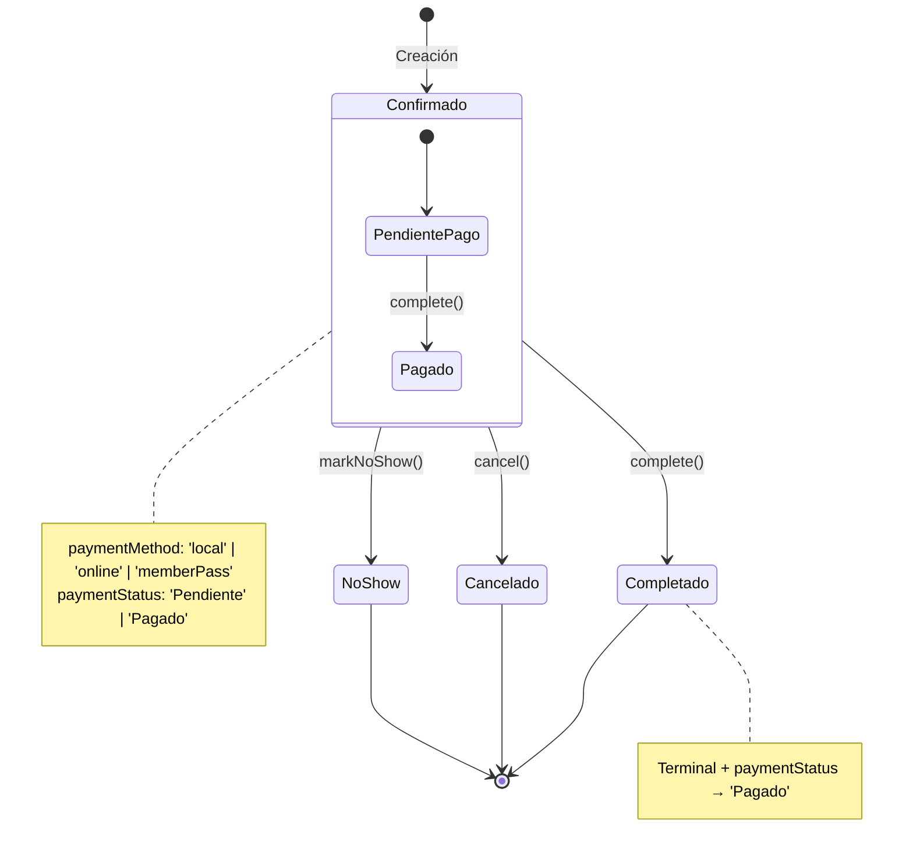

### Estados de Appointment

| Estado | Descripción | Transiciones válidas |
| ------ | ----------- | -------------------- |
| `Confirmado` | Turno agendado y confirmado automáticamente | Completado, Cancelado, NoShow |
| `Completado` | Turno realizado exitosamente **(terminal)** | — |
| `Cancelado` | Turno cancelado **(terminal)** | — |
| `NoShow` | Cliente no asistió **(terminal)** | — |

### Estados de Pago (dimensión ortogonal)

| Estado | Descripción |
| ------ | ----------- |
| `Pendiente` | Pago no realizado aún (default al crear) |
| `Pagado` | Pago completado (automático al marcar Completado) |

### Métodos de Pago

| Método | Descripción |
| ------ | ----------- |
| `local` | Pago en el local (default) |
| `online` | Pago por plataforma online |
| `memberPass` | Pase de membresía |

---

## 14. Flujos de Frontend

### Navegación General

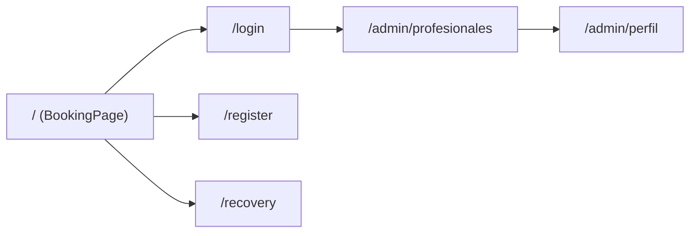

### Flujo de Booking (Wizard Multi-paso)

```mermaid
flowchart LR
    START[Inicio] --> LOAD[Cargar barberos y servicios]
    LOAD --> STEP1{Paso: Barbero}
    STEP1 --> |Selecciona| STEP2{Paso: Servicio}
    STEP2 --> |Selecciona| STEP3{Paso: Fecha y Hora}
    STEP3 --> |Selecciona fecha| LOAD_SLOTS[Cargar slots vía API]
    LOAD_SLOTS --> |Selecciona hora| SHOW_SUMMARY[Footer con resumen]
    SHOW_SUMMARY --> |Click Confirmar| MODAL[Abrir BookingConfirmationModal]
    MODAL --> |Completa datos + Confirma| SUBMIT[dispatch submitAppointment]
    SUBMIT --> |Success| SUCCESS_MODAL[BookingSuccessModal]
    SUBMIT --> |Error| ERROR[Muestra error en footer]
    SUCCESS_MODAL --> |Cerrar| RESET[resetBooking → vuelve a paso barbero]
    ERROR --> MODAL
```

### Pantallas y Componentes

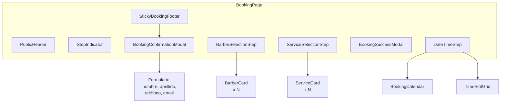

---

## 15. Gestión de Estado

### Redux Store

```mermaid
graph TD
    STORE[Redux Store] --> AUTH[auth reducer]
    STORE --> BARBERS[barbers reducer]
    STORE --> BOOKING[booking reducer]

    BOOKING --> ASYNC[async state]
    BOOKING --> FLOW[flow state]

    ASYNC --> BARBER_LIST[barbers: BarberPublic[]]
    ASYNC --> SERVICE_LIST[services: Service[]]
    ASYNC --> AVAIL_SLOTS[availableSlots: string[]]
    ASYNC --> IS_BOOKING[isBooking: boolean]
    ASYNC --> IS_CONFIRMING[isConfirming: boolean]
    ASYNC --> BOOKING_ERR[bookingError: string | null]
    ASYNC --> CONFIRM_ERR[confirmError: string | null]
    ASYNC --> CREATED_APT[createdAppointment: Appointment | null]
    ASYNC --> SUCCESS[submitSuccess: boolean]

    FLOW --> STEP[currentStep: BookingStep]
    FLOW --> SEL_BARBER[selectedBarber: BarberPublic | null]
    FLOW --> SEL_SERVICE[selectedService: Service | null]
    FLOW --> SEL_DATE[selectedDate: string | null]
    FLOW --> SEL_TIME[selectedTime: string | null]

    THUNKS --> FPB[fetchPublicBarbers]
    THUNKS --> FS[fetchServices]
    THUNKS --> FAS[fetchAvailableSlots]
    THUNKS --> SA[submitAppointment]

    STORE --> THUNKS
```

### Async Thunks (Redux Toolkit)

| Thunk | Dispara | Endpoint | Estado carga | Estado error | Estado éxito |
| ----- | ------- | -------- | ------------ | ------------ | ------------ |
| `fetchPublicBarbers` | mount | `GET /api/barbers/public` | `isBooking=true` | `bookingError=msg` | `barbers[]` |
| `fetchServices` | mount | `GET /api/services` | `isBooking=true` | `bookingError=msg` | `services[]` |
| `fetchAvailableSlots` | cambio de fecha | `GET /api/barbers/{id}/slots` | `isBooking=true` | `bookingError=msg` | `availableSlots[]` |
| `submitAppointment` | confirmación modal | `POST /api/appointments` | `isConfirming=true` | `confirmError=msg` | `submitSuccess=true, createdAppointment` |

### Reducers Síncronos

| Reducer | Descripción |
| ------- | ----------- |
| `setCurrentStep` | Cambia paso actual del wizard |
| `setSelectedBarber` | Selecciona barbero + avanza a paso service + resetea date/time/slots |
| `setSelectedService` | Selecciona servicio + avanza a paso datetime |
| `setSelectedDate` | Selecciona fecha + resetea time/slots |
| `setSelectedTime` | Selecciona hora |
| `clearBookingError` | Limpia errores |
| `resetBooking` | Resetea todo el estado al inicial |

---

## 16. Validaciones

### Frontend

| Campo | Validación | Componente |
| ----- | ---------- | ---------- |
| Nombre | `String.trim().length >= 2` (required) | BookingConfirmationModal |
| Apellido | `String.trim().length >= 2` (required) | BookingConfirmationModal |
| Teléfono | Opcional, string | BookingConfirmationModal |
| Email | Opcional, string (input type email) | BookingConfirmationModal |
| Fecha seleccionada | No se permite seleccionar días pasados | BookingCalendar (`isPastDate`) |
| Navegación pasos | No se puede saltar a paso no completado | BookingPage (`handleStepClick` checks) |

### Backend (Joi Schemas)

Ver sección **API Contract** para cada endpoint. Resumen:

| Schema | Campo | Regla |
| ------ | ----- | ----- |
| createAppointmentSchema | date | pattern `YYYY-MM-DD` |
| createAppointmentSchema | startTime | pattern `HH:mm` (TIME_REGEX) |
| createAppointmentSchema | clientName | trim, min 1, max 100 |
| createAppointmentSchema | clientEmail | pattern EMAIL_REGEX, trim, required |
| createAppointmentSchema | clientLastname | trim, min 1, max 100 |
| updateAppointmentStatusSchema | status | enum `['Cancelado', 'Completado', 'NoShow']` |
| updateAppointmentStatusSchema | cancelReason | required si status='Cancelado', forbidden otherwise |
| anonymousQuerySchema | — | min 1 (al menos email o phone) |

### Base de Datos (Mongoose + MongoDB)

| Índice | Colección | Propósito |
| ------ | --------- | --------- |
| `{ barberId: 1, date: 1, startTime: 1 }` **unique** | appointments | Previene duplicados de turno |
| `{ clientId: 1 }` | appointments | Optimiza búsquedas por cliente |
| `{ date: 1 }` | appointments | Optimiza búsquedas por fecha |
| `{}` timestamps | appointments | createdAt/updatedAt automáticos |
| `{ createdAt: 1 }` **TTL (300s)** | templocks | Expiración automática de locks |
| `{ barberId: 1, date: 1, startTime: 1 }` **unique** | templocks | Previene doble lock del mismo slot |

---

## 17. Seguridad

### Autenticación

- **JWT Token** (`jsonwebtoken`) — Bearer token en header `Authorization`.
- Middlewares: `createAuthenticate` (requiere token), `createOptionalAuth` (usa token si existe, sigue si no).
- Refresh token rotation via `POST /auth/refresh`.

### Autorización

| Endpoint | Middleware | Roles Permitidos |
| -------- | ---------- | ---------------- |
| `POST /api/appointments` | `optionalAuth` | Todos (público + autenticado) |
| `GET /api/appointments` | `authenticate` | Admin/Empleado (todos los turnos), Cliente (solo propios) |
| `GET /api/appointments/:id` | `authenticate` | Admin/Empleado (todos), Cliente (solo propio) |
| `PATCH /api/appointments/:id/cancel` | `authenticate` | Owner, Admin, Empleado (asignado) |
| `PATCH /api/appointments/:id/status` | `authenticate` + `authorize('Admin', 'Empleado')` | Admin, Empleado |
| `PATCH /api/appointments/:id/reschedule` | `authenticate` | Owner, Admin, Empleado (asignado) |
| `GET /api/appointments/anonymous` | None (rate-limited) | Público |
| `POST /api/appointments/temp-lock` | None (rate-limited) | Público |

### Ownership Checks (en Use Cases)

| Use Case | Regla |
| -------- | ----- |
| `GetAppointmentByIdUseCase` | `clientId === userId` OR userKind in `['Admin', 'Empleado']` |
| `CancelAppointmentUseCase` | `appointment.clientId === userId` OR `userKind === 'Admin'` OR `(userKind === 'Empleado' && appointment.barberId === userId)` |
| `RescheduleAppointmentUseCase` | Misma regla que cancelación |

### Rate Limiting

| Endpoint | Window | Max |
| -------- | ------ | --- |
| `POST /api/appointments/temp-lock` | 5 min | 20 |
| `GET /api/appointments/anonymous` | 15 min | 30 |

### Diagrama de Seguridad

```mermaid
flowchart LR
    REQ[HTTP Request] --> OPTAUTH{optionalAuth?}
    OPTAUTH -->|POST /api/appointments| OPT[createOptionalAuth]
    OPT -->|Token válido| SET_USER[req.user = payload]
    OPT -->|Sin token o inválido| NO_USER[req.user = undefined]
    OPT --> NEXT[Próximo middleware]

    REQ --> AUTH{authenticate?}
    AUTH -->|Endpoints protegidos| AUTH_MW[createAuthenticate]
    AUTH_MW -->|Token inválido o ausente| 401[401 No autorizado]
    AUTH_MW -->|Token válido| SET_USER2[req.user = { email, _id, kind }]

    REQ --> ROLE{authorize?}
    ROLE -->|PATCH /:id/status| AUTHZ[authorize('Admin','Empleado')]
    AUTHZ -->|kind no permitido| 403[403 Sin permisos]
    AUTHZ -->|kind permitido| NEXT2

    REQ --> OWNERSHIP{Ownership check<br/>en Use Case}
    OWNERSHIP -->|Cancel / Reschedule / GetById| CHECK_OWNER{¿Es el owner?}
    CHECK_OWNER -->|Sí| PASS
    CHECK_OWNER -->|No| CHECK_ROLE{¿Es Admin?}
    CHECK_ROLE -->|Sí| PASS
    CHECK_ROLE -->|No| CHECK_BARBER{¿Es Empleado asignado?}
    CHECK_BARBER -->|Sí| PASS
    CHECK_BARBER -->|No| 403

    REQ --> RATE{rateLimit?}
    RATE -->|temp-lock / anonymous| LIMITER
    LIMITER -->|Excede| 429[429 Too Many Requests]
```

---

## 18. Base de Datos

### Modelo Entidad-Relación

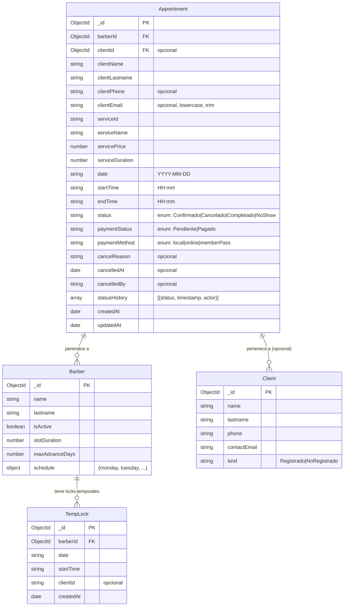

### Colecciones

| Colección | Propósito | Documentos típicos |
| --------- | --------- | ------------------ |
| `appointments` | Turnos de la barbería | ~1 por turno |
| `templocks` | Locks temporales de 5 min | ~1 por slot en proceso de reserva |
| `barbers` | Barberos/Empleados | ~5-10 |
| `clients` | Clientes (registrados y no registrados) | Variable |

### Índices

| Colección | Índice | Tipo |
| --------- | ------ | ---- |
| `appointments` | `{ barberId: 1, date: 1, startTime: 1 }` | Unique |
| `appointments` | `{ clientId: 1 }` | Regular |
| `appointments` | `{ date: 1 }` | Regular |
| `templocks` | `{ createdAt: 1 }` | TTL (expireAfterSeconds: 300) |
| `templocks` | `{ barberId: 1, date: 1, startTime: 1 }` | Unique |

---

## 19. Integraciones Externas

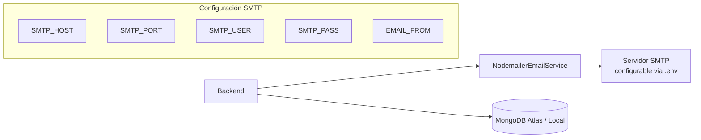

| Integración | Tecnología | Propósito | Estado |
| ----------- | ---------- | --------- | ------ |
| **Email** | Nodemailer + SMTP configurable | Notificar creación, cancelación y reprogramación de turnos | Implementada (envío async) |
| **Base de Datos** | MongoDB + Mongoose | Persistencia de appointments, templocks, barbers, clients | Implementada |
| **Google OAuth** | google-auth-library | Autenticación con Google (no directamente relacionado con booking) | Implementada (general) |

No se encontraron integraciones con pasarelas de pago, SMS, servicios cloud adicionales, webhooks o APIs externas.

---

## 20. Manejo de Errores

### Estrategia General

- **Backend:** Uso de clase `AppError` con `message` y `statusCode`.
- **Controller:** `try/catch` + `AppointmentPresenter.handleError()` que devuelve JSON con `{ error: string }`.
- **Frontend:** Axios interceptor transforma errores HTTP en `Error` con mensaje legible. Redux thunks capturan errores via `rejectWithValue`.

### Tabla de Errores

| # | Escenario | Código HTTP | Mensaje | Origen |
| - | --------- | ----------- | ------- | ------ |
| 1 | Fecha en pasado | 400 | "No se puede agendar en el pasado." | CreateAppointmentUseCase |
| 2 | Hora ya pasó (mismo día) | 400 | "La hora ya pasó." | CreateAppointmentUseCase |
| 3 | Barbero no encontrado | 404 | "Barbero no encontrado." | CreateAppointmentUseCase |
| 4 | Barbero inactivo | 400 | "El barbero no está activo." | CreateAppointmentUseCase |
| 5 | Excede anticipación máxima | 400 | "No se puede reservar con más de N días de anticipación." | CreateAppointmentUseCase |
| 6 | Servicio no encontrado | 404 | "Servicio no encontrado." | CreateAppointmentUseCase |
| 7 | Hora inválida | 400 | "Formato de hora inválido." | CreateAppointmentUseCase |
| 8 | Fuera de horario laboral | 400 | "El turno está fuera del horario laboral del barbero." | CreateAppointmentUseCase |
| 9 | Superposición con break | 400 | "El turno se superpone con un descanso del barbero." | CreateAppointmentUseCase |
| 10 | Slot ocupado | 409 | "El horario seleccionado ya está ocupado." | CreateAppointmentUseCase |
| 11 | Ya tiene turno activo ese día | 409 | "Ya tenés un turno activo para esta fecha." | CreateAppointmentUseCase |
| 12 | Turno no encontrado (por ID) | 404 | "Turno no encontrado." | Varios |
| 13 | Sin permiso de cancelación | 403 | "No tenés permiso para cancelar este turno." | CancelAppointmentUseCase |
| 14 | Fuera de ventana de cancelación | 409 | "No se puede cancelar con menos de N horas de anticipación." | CancelAppointmentUseCase |
| 15 | Estado terminal (cancel) | 400 | "No se puede cancelar un turno en estado {status}." | CancelAppointmentUseCase |
| 16 | Sin permiso de reprogramación | 403 | "No tenés permiso para reagendar este turno." | RescheduleAppointmentUseCase |
| 17 | Estado terminal (reschedule) | 400 | "No se puede reagendar un turno {status}." | RescheduleAppointmentUseCase |
| 18 | Sin permiso de visualización | 403 | "No tenés permiso para ver este turno." | GetAppointmentByIdUseCase |
| 19 | Faltan credenciales anónimas | 400 | "Debe proporcionar email o teléfono." | GetAppointmentsAnonymousUseCase |
| 20 | NoShow antes de tiempo | 400 | "No se puede marcar como NoShow un turno que aún no pasó." | UpdateAppointmentStatusUseCase |
| 21 | Transición inválida en entity | 400 | "No se puede cambiar de {status} a {status}." | UpdateAppointmentStatusUseCase |
| 22 | TempLock ya ocupado | 409 | "El horario ya fue apartado por otro usuario." | CreateTempLockUseCase |
| 23 | Error DB (Mongo duplicate) | 409 | "El horario ya está ocupado." | MongoAppointmentRepository |
| 24 | Fallback genérico | 500 | "Error al crear/obtener/actualizar el turno" | AppointmentPresenter |
| 25 | Error interno no manejado | 500 | "Error interno del servidor" | app.ts (global) |
| 26 | Token inválido | 403 | "Token inválido" | auth.middleware |
| 27 | No autorizado | 401 | "No autorizado" | auth.middleware |

---

## 21. Matriz de Trazabilidad

| Pantalla | Endpoint | Controller Method | Use Case | Repository | Entidad |
| -------- | -------- | ---------------- | -------- | ---------- | ------- |
| BookingPage (paso 1) | `GET /api/barbers/public` | BarberController.getPublic | — | MongoBarberRepository.findAllBarbers | Barber |
| BookingPage (paso 2) | `GET /api/services` | ServiceController.list | — | StaticServiceRepository.findAll | Service |
| BookingPage (paso 3) | `GET /api/barbers/:id/slots?date=` | BarberController.getSlots | SlotService.execute | MongoBarberRepository.findBarberById, MongoAppointmentRepository.findByBarberAndDate | Barber, Appointment |
| BookingPage (confirmar) | `POST /api/appointments` | AppointmentController.create | CreateAppointmentUseCase | MongoAppointmentRepository.create, MongoBarberRepository, MongoClientRepository, MongoTempLockRepository | Appointment, Barber, Client |
| Admin panel (listar) | `GET /api/appointments` | AppointmentController.getAll | GetAppointmentsUseCase | MongoAppointmentRepository.findMany | Appointment |
| Admin panel (ver) | `GET /api/appointments/:id` | AppointmentController.getById | GetAppointmentByIdUseCase | MongoAppointmentRepository.findById | Appointment |
| Admin panel (cancelar) | `PATCH /api/appointments/:id/cancel` | AppointmentController.cancel | CancelAppointmentUseCase | MongoAppointmentRepository.updateStatus | Appointment |
| Admin panel (status) | `PATCH /api/appointments/:id/status` | AppointmentController.updateStatus | UpdateAppointmentStatusUseCase | MongoAppointmentRepository.updateStatus | Appointment |
| Admin panel (reprogramar) | `PATCH /api/appointments/:id/reschedule` | AppointmentController.reschedule | RescheduleAppointmentUseCase | MongoAppointmentRepository.update | Appointment |
| Consulta anónima | `GET /api/appointments/anonymous` | AppointmentController.getAnonymous | GetAppointmentsAnonymousUseCase | MongoAppointmentRepository.findMany | Appointment |
| BookingPage (temp lock) | `POST /api/appointments/temp-lock` | TempLockController.create | CreateTempLockUseCase | MongoTempLockRepository.create | TempLock |

---

## 22. Análisis de Riesgos

### Críticos

| Riesgo | Descripción | Impacto |
| ------ | ----------- | ------- |
| **Race condition en creación** | Entre la verificación de disponibilidad (RN04) y la creación en DB, otro request podría ocupar el slot. El índice único `{ barberId, date, startTime }` es el único guardián. El error 11000 se traduce a "El horario ya está ocupado". | Medio (cubierto por índice único) |
| **TempLock no escalable** | Los locks temporales dependen de MongoDB con TTL; si hay picos de tráfico, la colección puede crecer. | Medio |
| **Email async no monitoreado** | Los errores de email se loguean a console.error pero no se reintentan ni se reportan al usuario. | Medio |

### Altos

| Riesgo | Descripción |
| ------ | ----------- |
| **Sin cache en frontend** | Cada carga de BookingPage hace 2 requests (barbers + services). Cada cambio de fecha hace 1 request de slots. Sin caché. |
| **Falta de paginación** | `GET /api/appointments` no tiene paginación; puede escalar mal con muchos turnos. |
| **TimeZone hardcodeada** | `America/Montevideo` está hardcodeada en `time.ts`. No configurable. |
| **Sin protección contra scraping** | Los endpoints públicos (`/api/barbers/public`, `/api/services`) no tienen rate limiting. |

### Medios

| Riesgo | Descripción |
| ------ | ----------- |
| **StaticServiceRepository** | Los servicios vienen de un archivo estático, no de DB. No escalable para administración dinámica. |
| **CancelMinHoursBefore default 2h** | Si la variable de entorno no está configurada, usa 2h. Podría no ser adecuado para todos los negocios. |
| **Sin tests de integración de email** | FakeEmailService solo captura códigos 2FA, no verifica emails de appointment. |
| **BookingConfirmationModal sin validación de email** | El campo email en el modal frontend es opcional, pero en backend es required. El backend rechazará si no se envía. |
| **Falta de middleware de validación global** | La validación de errores se hace manualmente en cada controller. |
| **Sin manejo de errores de red en bookingSlice** | Errores de red genéricos ("Network Error") se muestran directamente al usuario. |

### Bajos

| Riesgo | Descripción |
| ------ | ----------- |
| **Duplicación de lógica de validación** | `RN01`, `RN02`, `RN03`, `RN04` se repiten en CreateAppointmentUseCase y RescheduleAppointmentUseCase. |
| **Sin normalización de respuestas** | Algunas respuestas usan `{ error: string }`, otras `{ message: string }`, otras el objeto directamente. |
| **Hardcode de "system" como actor** | En `Appointment.create`, el primer statusHistory usa actor `'system'`. |
| **BookingSuccessModal no muestra barberName** | El modal de éxito muestra serviceName, clientName, date, time pero no el nombre del barbero. |
| **CANCEL_MIN_HOURS_BEFORE afecta a UpdateAppointmentStatusUseCase** | Al actualizar estado a Cancelado (desde admin) también se aplica la ventana mínima de cancelación. |

### Violaciones Arquitectónicas

| Violación | Descripción |
| --------- | ----------- |
| **Domain usando tipos de aplicación** | `CreateAppointmentUseCase.findOrCreateUnregisteredClient` usa inline `import('../../../domain/entities/Client')` en lugar de import estático. |
| **Time utilities en domain usan Intl (efecto secundario)** | `getNowInTimezone()` en `domain/utils/time.ts` llama a `new Date()` e `Intl.DateTimeFormat`, lo que podría considerarse efecto secundario en capa de dominio. |
| **Controller con lógica de negocio** | `AppointmentController.create` aplica RN11 (asignación de clientId según rol), que es regla de negocio, no delegate completamente al use case. |
| **AppointmentRepository.create con lógica duplicada** | La validación de índice único 11000 en `MongoAppointmentRepository.create` podría estar en el use case. |

---

## 23. Gaps de Documentación

| Gap | Descripción |
| --- | ----------- |
| **ADR de arquitectura general** | No hay un ADR que documente la elección de Clean Architecture y sus convenciones. |
| **ADR de estructura de carpetas frontend** | La carpeta `decisions-records/front/` está vacía. |
| **Diagrama de despliegue** | No hay documentación sobre deployment, variables de entorno requeridas o infraestructura. |
| **Documentación de `StaticServiceRepository`** | No está claro cómo se administran los servicios (archivo estático vs BD). |
| **Documentación de autenticación** | No hay documentación de los flujos de auth (login, registro, 2FA, Google OAuth) que son prerrequisito para endpoints protegidos. |
| **Guía de configuración de email** | No hay documentación de cómo configurar SMTP (variables requeridas). |
| **Pruebas E2E faltantes** | No hay tests Playwright para el flujo de booking. |
| **Diagrama de secuencia de temp-lock** | El flujo de temp lock no está diagramado (llamada desde frontend pre-confirmación). |
| **Documentación de migración** | ADR-020 menciona que datos existentes con status 'Pendiente' quedan inconsistentes; no hay script de migración documentado. |

---

## 24. Resumen Final

### 1. ¿Cómo funciona la feature de punta a punta?

El flujo comienza en `BookingPage` (`/`), un wizard de 3 pasos:

1. **Barbero:** se cargan barberos activos desde `GET /api/barbers/public`.
2. **Servicio:** se cargan servicios desde `GET /api/services`.
3. **Fecha y Hora:** se selecciona una fecha, se cargan slots disponibles desde `GET /api/barbers/:id/slots?date=...`, y se selecciona un horario.

Cuando el usuario confirma, se abre `BookingConfirmationModal` donde completa sus datos (nombre, apellido, email obligatorio, teléfono opcional). Al enviar, se hace `POST /api/appointments` al backend, que ejecuta `CreateAppointmentUseCase` con 15+ reglas de negocio (validación de fecha, horario laboral, breaks, colisiones, límite de anticipación, cliente no registrado, máximo 1 turno activo por día, etc.). Si todo OK, persiste en MongoDB, elimina el TempLock (si existe), envía email asincrónico y retorna el turno creado.

### 2. ¿Qué componentes son críticos?

- **`CreateAppointmentUseCase`** — Orquesta todas las reglas de negocio de creación.
- **`Appointment` entity** — Contiene la máquina de estados y validación de transiciones.
- **`SlotService`** — Calcula slots disponibles según schedule, breaks y ocupación.
- **`MongoAppointmentRepository`** — Persistencia con índice único que es la última barrera contra race conditions.
- **`appointment.routes`** — Middleware chain (auth, validación, rate limiting) que protege los endpoints.

### 3. ¿Dónde están las reglas de negocio?

| Ubicación | Reglas |
| --------- | ------ |
| `src/domain/entities/Appointment.ts` | RN12 (transiciones), RN25 (validación interna vía VALID_TRANSITIONS) |
| `src/domain/utils/time.ts` | Funciones de tiempo usadas por RN01-RN04 |
| `src/domain/services/SlotService.ts` | Algoritmo de slots disponibles |
| `src/application/use-cases/appointment/CreateAppointmentUseCase.ts` | RN01-RN08, RN10, RN15-RN17 |
| `src/application/use-cases/appointment/CancelAppointmentUseCase.ts` | RN21, RN22, RN24 |
| `src/application/use-cases/appointment/RescheduleAppointmentUseCase.ts` | RN09, RN20 + revalidación de RN01-RN07, RN15 |
| `src/application/use-cases/appointment/UpdateAppointmentStatusUseCase.ts` | RN13, RN22, RN23 |
| `src/interface-adapters/controllers/appointment/AppointmentController.ts` | RN11 (asignación clientId) |
| `src/interface-adapters/validators/appointment.validator.ts` | Validaciones Joi (formato, required, enum) |
| `src/infrastructure/repositories/mongodb/models/appointment.model.ts` | RN26 (índice único) |
| `src/infrastructure/repositories/mongodb/models/tempLock.model.ts` | RN18 (TTL), RN19 (índice único) |
| `src/wiring/appointment.ts` | RN22 (CANCEL_MIN_HOURS_BEFORE default 2) |

### 4. ¿Qué dependencias externas existen?

- **MongoDB** (via Mongoose) — persistencia.
- **Servicio SMTP** (via Nodemailer) — envío de emails.
- **Google OAuth** (google-auth-library) — autenticación (uso general, no específico de booking).

### 5. ¿Qué riesgos presenta?

- **Race condition en creación de turno** — mitigado por índice único en MongoDB.
- **Sin paginación en listado de turnos** — puede volverse lento con muchos datos.
- **TimeZone hardcodeada** (`America/Montevideo`) — no configurable.
- **Falta de cache en frontend** — requests redundantes.
- **Email async sin reintentos** — si falla el envío, el usuario no recibe notificación pero el turno se crea igual.
- **Admin no puede cancelar fuera de ventana mínima** — el mismo `cancelMinHoursBefore` aplica a admins.
- **BookingConfirmationModal permite email opcional pero backend lo requiere** — inconsistencia.

### 6. ¿Qué debería leer primero un nuevo desarrollador?

1. **ADR-020** (`decisions-records/back/ADR-020-appointment-state-machine.md`) — entendimiento de la máquina de estados.
2. **ADR-021** (`decisions-records/back/ADR-021-temp-lock-slot-reservation.md`) — sistema de temp lock.
3. **`src/domain/types/appointment.ts`** — tipos y transiciones.
4. **`src/domain/entities/Appointment.ts`** — entidad central con métodos de negocio.
5. **`src/application/use-cases/appointment/CreateAppointmentUseCase.ts`** — caso de uso principal con todas las reglas.
6. **`src/wiring/appointment.ts`** — composition root para entender dependencias.
7. **`frontend-barber/src/pages/client/BookingPage/index.tsx`** — página principal del booking.
8. **`frontend-barber/src/store/slices/bookingSlice.ts`** — estado global y async thunks.

---

*Documento generado automáticamente mediante análisis estático del código fuente. Completitud: ~98%. Los elementos no documentados explícitamente se indican en la sección de Gaps.*
