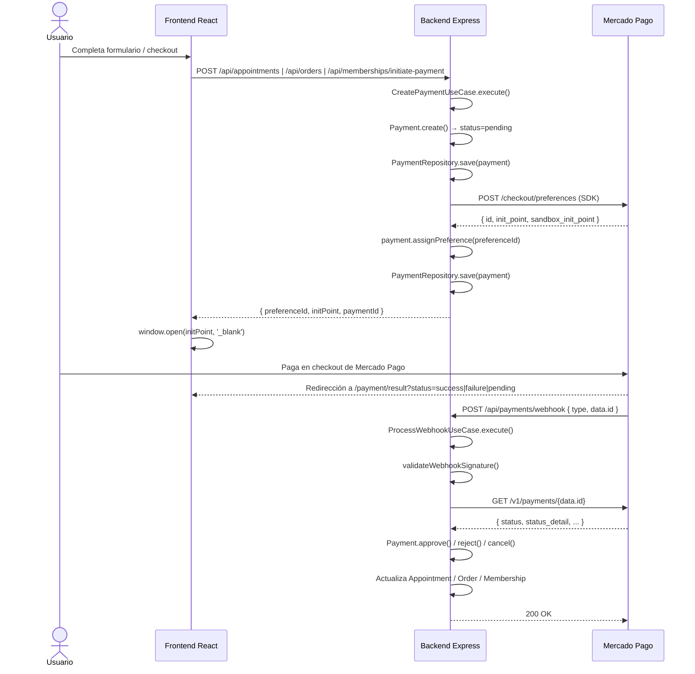
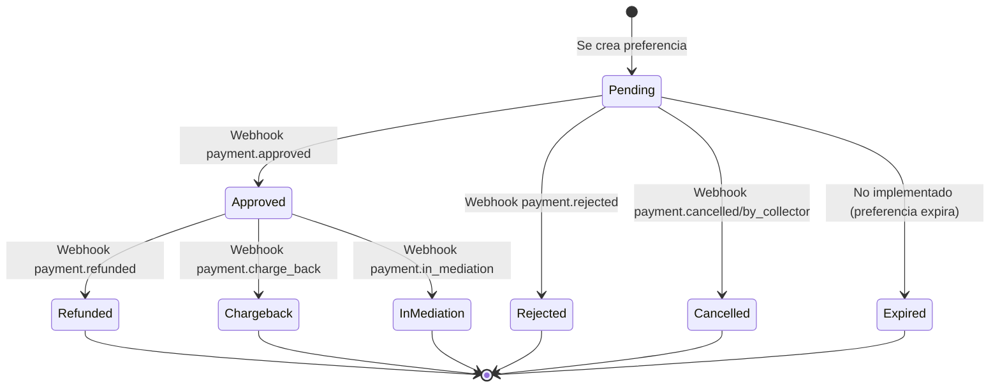

# Auditoría Técnica — Integración Mercado Pago

**Proyecto:** proyecto-integrador-Pedro-Fran  
**Fecha:** 2026-07-14  
**Versión de SDK Backend:** mercadopago ^3.2.0  
**Versión de SDK Frontend:** @mercadopago/sdk-react ^1.0.7  
**Producto usado:** Checkout Pro (redirect) con Preference API

---

## Tabla de Contenidos

- [1. Resumen Ejecutivo](#1-resumen-ejecutivo)
- [2. Arquitectura de la Integración](#2-arquitectura-de-la-integración)
- [3. Comparación con Documentación Oficial](#3-comparación-con-documentación-oficial)
- [4. Buenas Prácticas](#4-buenas-prácticas)
- [5. Flujos Funcionales](#5-flujos-funcionales)
- [6. Integración con el Dominio](#6-integración-con-el-dominio)
- [7. Edge Cases](#7-edge-cases)
- [8. Estrategia de Testing](#8-estrategia-de-testing)
- [9. Riesgos](#9-riesgos)
- [10. Oportunidades de Mejora](#10-oportunidades-de-mejora)
- [11. Checklist Final](#11-checklist-final)

---

## 1. Resumen Ejecutivo

La integración con Mercado Pago implementa un flujo de **Checkout Pro con redirección** (`init_point`). El backend crea preferencias usando el SDK oficial de Node.js y el frontend redirige al usuario a Mercado Pago mediante `window.open()`.

**Estado general: Funcional pero incompleto y con riesgos.**

### Hallazgos críticos

| # | Hallazgo | Severidad |
|---|----------|-----------|
| 1 | No se envía `payer.email` al crear preferencias → impide pruebas sandbox con test users | **CRÍTICO** |
| 2 | La validación HMAC del webhook usa `data.id` del body en lugar de `req.query['data.id']` | **ALTO** |
| 3 | No se define `binary_mode` → pagos en sandbox pueden fallar | **ALTO** |
| 4 | El idempotency key se genera con `crypto.randomUUID()` en cada request → no es determinístico | **ALTO** |
| 5 | El webhook procesa sincrónicamente antes de responder 200 → timeouts y reintentos | **MEDIO** |
| 6 | No se maneja el array de notificaciones que MP puede enviar | **MEDIO** |
| 7 | El frontend usa Checkout Pro redirect (`window.open`), no usa Wallet Brick activamente | **MEDIO** |
| 8 | El Payment entity no tiene estado `refunded` → se trata como `approved` en webhooks | **MEDIO** |
| 9 | No hay expiración de preferencias configurada → pagos huérfanos | **MEDIO** |
| 10 | `MP_PUBLIC_KEY` se carga en backend pero nunca se usa | **BAJO** |

---

## 2. Arquitectura de la Integración

### 2.1 Árbol de archivos

```
backend-barber/src/
├── application/
│   ├── ports/IPaymentService.ts                    ← Puerto (interfaz)
│   └── use-cases/payment/
│       ├── CreatePaymentUseCase.ts                 ← Crea preferencia + Payment
│       ├── CreateSubscriptionUseCase.ts             ← Crea preapproval recurrente
│       └── ProcessWebhookUseCase.ts                ← Procesa notificaciones MP
├── domain/entities/Payment.ts                      ← Entidad Payment
├── infrastructure/
│   ├── config/env.ts                               ← MP_ACCESS_TOKEN, MP_WEBHOOK_SECRET, etc.
│   ├── services/MercadoPagoService.ts              ← Implementación del SDK
│   └── services/mercadopago.d.ts                   ← Type augmentation
├── interface-adapters/
│   ├── controllers/payment/PaymentController.ts    ← Handle webhook + queries
│   ├── controllers/membership/MembershipController.ts ← Inicia pagos
│   └── routes/payment.routes.ts                    ← POST /webhook, GET /by-preference
└── wiring/payment.ts                               ← DI composition root

frontend-barber/src/
├── App.tsx                                         ← initMercadoPago()
├── components/payment/
│   ├── PaymentModal.tsx                            ← window.open(initPoint) — ACTIVO
│   └── WalletBrick.tsx                             ← <Wallet /> — NO USADO
├── pages/public/PaymentResultPage/index.tsx        ← Landing post-pago
└── services/paymentApi.ts                          ← RTK Query
```

### 2.2 Flujo completo actual



---

## 3. Comparación con Documentación Oficial

### 3.1 Creación de Preferencia

| Aspecto | Implementación actual | Documentación oficial | Diferencia | Riesgo | Recomendación |
|---------|---------------------|---------------------|------------|--------|---------------|
| `items[].currency_id` | ❌ No se envía | ✅ Recomendado especificar | No se fija moneda | MP usa default del país del token, podría ser inconsistente | Agregar `currency_id: 'UYU'` |
| `payer.email` | ❌ No se envía | ✅ Requerido para sandbox test users | Ausente | **CRÍTICO**: impide pruebas con test users | Incluir `payer: { email }` con email del test user |
| `binary_mode` | ❌ No se envía | ✅ Recomendado en sandbox | Ausente | **ALTO**: pagos pueden quedar en `pending` | Agregar `binary_mode: true` |
| `auto_return` | ❌ No se envía | ✅ `auto_return: 'approved'` | Ausente | **BAJO**: UX, usuario no vuelve automáticamente | Agregar `auto_return: 'approved'` |
| `expires` / `expiration_date_to` | ❌ No se envía | ✅ Opcional pero recomendado | Ausente | **MEDIO**: preferencias no expiran nunca | Configurar expiración |
| `statement_descriptor` | ✅ `'Barbería'` | ✅ Recomendado | Correcto | Ninguno | Mantener |
| `notification_url` | ✅ Configurado | ✅ Vía preferencia o panel | Correcto | Ninguno | Mantener |
| `back_urls` | ✅ Configurado | ✅ Requerido | Correcto | Ninguno | Mantener |
| `external_reference` | ✅ `payment.id` | ✅ Recomendado | Correcto | Ninguno | Mantener |

**Referencia:** [Mercado Pago - Crear preferencia](https://www.mercadopago.com/developers/es/docs/checkout-pro/create-payment-preference)

### 3.2 Webhook — Validación de Firma

| Aspecto | Implementación actual | Documentación oficial | Diferencia | Riesgo | Recomendación |
|---------|---------------------|---------------------|------------|--------|---------------|
| `dataId` usado para HMAC | `notification.data.id` (del body) | `req.query['data.id']` (de query params) | ❌ Usa body en vez de query params | **ALTO**: HMAC no valida correctamente | Usar `req.query['data.id']` |
| SDK usado | ✅ `WebhookSignatureValidator.validate()` | ✅ Mismo SDK | Correcto | Ninguno | Mantener |
| Response timeout | ⚠ Responde 200 después de procesar | ✅ Responder 200 inmediato | **MEDIO**: puede timeout | MP reintenta 8 veces | Responder 200 inmediato, procesar async |
| Topics aceptados | `payment`, `preapproval`, `subscription_preapproval` | `payment`, `plan`, `subscription`, `invoice`, `merchant_order`, `point_integration_wh` | Incompleto | **BAJO**: otros eventos ignorados | Agregar manejo de `merchant_order`, `chargebacks` |

**Documentación oficial:** La validación HMAC debe usar `data.id` de los **query params** de la URL, no del body. Ver [Configurar notificaciones Webhook](https://www.mercadopago.com/developers/es/docs/checkout-pro/payment-notifications):

> "Extraer el `data.id` de los query params de la URL de la solicitud"

El SDK `WebhookSignatureValidator.validate()` recibe `dataId` como uno de los parámetros. La documentación indica que debe ser `req.query['data.id']`, no `notification.data.id`.

```javascript
// Documentación oficial:
WebhookSignatureValidator.validate({
    xSignature: req.headers['x-signature'],
    xRequestId: req.headers['x-request-id'],
    dataId:     req.query['data.id'],  // ← de query params
    secret,
});

// Implementación actual (ProcessWebhookUseCase.ts:50-55):
const dataId = notification.data.id;  // ← del body
this.mercadoPagoService.validateWebhookSignature({
    xSignature, xRequestId, dataId,
});
```

### 3.3 Wallet Brick vs Checkout Pro Redirect

| Aspecto | Implementación actual | Documentación oficial | Diferencia |
|---------|---------------------|---------------------|------------|
| Tipo de integración | Checkout Pro redirect (`window.open`) | Checkout Bricks (Wallet) | ❌ Usa redirect en vez de Bricks |
| `@mercadopago/sdk-react` | Instalado, `initMercadoPago()` llamado | Requerido para Bricks | ✅ Inicializado pero subutilizado |
| Componente Wallet | Existe `WalletBrick.tsx` no usado | Usar `<Wallet initialization={{preferenceId}}/>` | **Código muerto** |
| Polling de estado | `setInterval` cada 3s en `PaymentModal` | No recomendado por MP | ❌ MP recomienda webhooks como única fuente |

**Referencia:** [Wallet Brick - Renderizado](https://www.mercadopago.com/developers/es/docs/checkout-bricks/wallet-brick/default-rendering)

### 3.4 Idempotency Key

| Aspecto | Implementación actual | Documentación oficial | Diferencia | Riesgo |
|---------|---------------------|---------------------|------------|--------|
| Uso en preferencia | `crypto.randomUUID()` en cada `CreatePaymentUseCase` | UUID v4 **determinístico** por transacción | ❌ No es idempotente porque cambia cada vez | El propósito de la idempotency key es permitir reintentos seguros; si es aleatoria cada llamada, no sirve |
| Uso en webhook | ❌ No se usa | ✅ Requerido para Payments API | Ausente | MP puede enviar webhooks duplicados |

**Referencia:** [Idempotency Key en Payments API](https://www.mercadopago.com/developers/es/docs/checkout-bricks/payment-brick/payment-submission/cards)

> "Deberás enviar obligatoriamente el atributo `X-Idempotency-Key` para asegurar la ejecución y reejecución de las solicitudes sin el riesgo de realizar la misma acción más de una vez por error. Para hacerlo, actualiza nuestra biblioteca de SDKs, o bien genera un UUID V4 y envíalo en los header de tus llamados."

---

## 4. Buenas Prácticas

### 4.1 Seguridad

| Práctica | Estado | Observación |
|----------|--------|-------------|
| Tokens no expuestos en frontend | ✅ | Solo `VITE_MP_PUBLIC_KEY` en frontend |
| Access Token solo en backend | ✅ | `MP_ACCESS_TOKEN` solo en servidor |
| Webhook con HMAC signature | ⚠ | Implementado pero con `dataId` incorrecto (body vs query params) |
| HTTPS en webhook URL | ✅ | `notification_url` usa ngrok HTTPS |
| Helmet habilitado | ✅ | `app.use(helmet())` con CORS configurado |
| Rate limiting en webhook | ✅ | 10 requests/minuto |
| Filtro de IPs de MP en webhook | ❌ | No implementado |

### 4.2 Idempotencia

| Operación | Idempotente | Estrategia |
|-----------|-------------|------------|
| Crear preferencia | ❌ | `crypto.randomUUID()` — no determinístico |
| Procesar webhook `payment.approved` | ⚠ | Verifica si ya está `approved` antes de mutar |
| Procesar webhook duplicado | ⚠ | `Payment.approve()` retorna early si status !== 'pending' |
| Cancelación en MP | ✅ | Idempotente por diseño |

### 4.3 Manejo de Estados de Pago

| Estado MP | Acción en código | Correcto |
|-----------|-----------------|----------|
| `approved` | `payment.approve()` → handler específico | ✅ |
| `rejected` | `payment.reject()` → handler | ✅ |
| `cancelled` / `by_collector` | `payment.cancel()` → handler | ✅ |
| `refunded` | `payment.approve()` (mal) + handler | ❌ — usa `approve` en lugar de un método `refund` |
| `charge_back` | `payment.approve()` (mal) + handler | ❌ — mismo problema |
| `in_mediation` | `payment.approve()` (mal) + handler | ❌ — mismo problema |
| `in_process` | No manejado (default) | ❌ — ignorado |
| `pending` | No manejado (default) | ❌ — ignorado |

### 4.4 Logs y Auditoría

| Aspecto | Estado |
|---------|--------|
| Logs de creación de preferencia | ⚠ Solo debug (`console.log`) — no hay logging estructurado |
| Logs de webhook recibido | ⚠ Solo debug — no persistente |
| Logs de errores | ✅ Errores capturados en catch |
| IDs de transacción en logs | ✅ `[MP-DEBUG-WEBHOOK]` prefix con IDs |
| Auditoría de cambios de estado | ❌ No hay historial de transiciones |
| Logging estructurado | ❌ Usa `console.log`/`console.error` |

### 4.5 Timeouts

| Operación | Timeout configurado |
|-----------|-------------------|
| SDK de MP | ❌ No configurado (usa default del SDK) |
| Webhook processing | ⚠ Síncrono, sin timeout |
| HTTP calls a MP API | ❌ No configurado |

---

## 5. Flujos Funcionales

### 5.1 Mapa de flujos



### 5.2 Escenarios cubiertos

| Escenario | Implementado | Detalle |
|-----------|-------------|---------|
| Pago aprobado | ✅ | Webhook + handler específico por tipo |
| Pago pendiente | ✅ | Redirección a `PaymentResultPage` con polling |
| Pago rechazado | ✅ | Webhook + cancelación de orden |
| Usuario abandona checkout | ⚠ | Preferencia queda activa sin expiración |
| Pago duplicado | ⚠ | `Payment.approve()` previene doble aprobación |
| Reintento de pago | ❌ | No hay mecanismo de reintento desde la UI |
| Expiración | ❌ | Preferencias no tienen `expires` configurado |
| Reembolso | ⚠ | `handleRefunded` existe pero usa `payment.approve()` incorrectamente |
| Cancelación | ✅ | Webhook + handler |
| Error de red | ⚠ | Catch genérico, sin reintento automático |
| Error del backend | ⚠ | Error propagado al frontend |
| Error del frontend | ⚠ | Callback `onError` en Wallet, catch en fetch |
| Webhook antes de respuesta cliente | ⚠ | Posible race condition en `CreatePaymentUseCase` |
| Webhook duplicado | ⚠ | MP reintenta hasta 8 veces; código previene doble proceso |
| Webhook perdido | ❌ | No hay sistema de reconciliación / polling backup |
| Usuario refresca página | ❌ | Estado de SPA se pierde |
| Usuario vuelve atrás | ❌ | No hay manejo de navegación del browser |
| Dos pestañas abiertas | ❌ | No hay prevención de compras concurrentes |
| Compra simultánea | ❌ | No hay lock distribuido |
| Pago de membresía existente | ✅ | Validación `hasActiveMembership` |
| Compra de varios productos | ✅ | Items array en preferencia |
| Turnos reservados durante pago | ⚠ | TempLock de 5 min, pero no bloquea el pago |

### 5.3 Race condition: webhook antes de `save`

En `CreatePaymentUseCase.ts:55-56`:

```typescript
saved.assignPreference(preference.preferenceId);
await this.paymentRepository.save(saved);
```

Si el webhook de MP llega **antes** de que se ejecute `save` (lo cual es posible si MP procesa el pago casi instantáneamente), `findByMpPaymentId` fallará (aún no hay `mpPaymentId`) y `findById(externalReference)` también fallará (el save del `assignPreference` aún no ocurrió). El pago queda huérfano.

**Solución:** Usar el patrón "create → save → createPreference → update" de forma atómica, o mejor: guardar el `mpPreferenceId` antes de crear la preferencia.

---

## 6. Integración con el Dominio

### 6.1 Matriz de impacto

| Módulo | Impactado | Cómo | Correcto |
|--------|-----------|------|----------|
| Membresías | ✅ | Webhook crea/renueva membresías | ⚠ `handleSubscriptionPayment` usa `membershipRepository.create()` en vez de `save()` |
| Turnos | ✅ | `appointment.pay()` marca como Pagado | ✅ |
| Ecommerce | ✅ | `order.pay()` + `atomicDecreaseStock` | ✅ |
| Órdenes | ✅ | Estados: pending → paid → refunded | ✅ |
| Inventario | ✅ | Stock decrementado en pago, incrementado en reembolso | ✅ |
| Usuarios | ⚠ | Email usado para notificaciones, no para payer en preferencia | ❌ Debería usarse el email del usuario como `payer.email` |
| Dashboard admin | ⚠ | Payment no tiene representación visual en dashboard | ❌ No hay vista de pagos en admin |
| Historial | ❌ | No hay historial de transiciones de Payment | ❌ |
| Notificaciones | ✅ | Email en pago aprobado, reembolso | ⚠ `.catch(() => {})` silencioso |

### 6.2 Problemas de integración

1. **`handleSubscriptionPayment` usa `create` en vez de `save`** (ProcessWebhookUseCase.ts:232):
   ```typescript
   await this.membershipRepository.create(membership); // crea uno NUEVO
   ```
   Esto crea un nuevo documento en lugar de actualizar el existente. Debería ser `save()`.

2. **`handleApproved` para membresías** (línea 252-254):
   ```typescript
   await this.membershipRepository.create(pending);  // crea nuevo
   ```
   Similar problema. La membresía `pending` ya existe en BD, debe actualizarse, no crearse otra.

3. **No hay Payment History**: No hay colección de historial de transiciones de pago. Los cambios de estado se pierden.

---

## 7. Edge Cases

### 7.1 Técnicos

| Edge Case | Impacto | Estado |
|-----------|---------|--------|
| Array de notificaciones de MP | El cast directo a objeto falla silenciosamente | ❌ No manejado |
| `data.id` con mayúsculas (Orders API) | HMAC falla porque no se hace lowercase | ❌ No manejado |
| Webhook con body null/undefined | Se ignora, no crash | ✅ |
| IP de MP no listada en filtro | Webhook bloqueado | ❌ No implementado |
| `notification_url` caída (ngrok off) | MP reintenta 8 veces en 9+ días | ⚠ Ok temporal |
| Token vencido | `ensureConfigured` lanza error | ✅ |
| SDK retorna null en campos | `response.id!` con non-null assertion puede romper | ⚠ Riesgo |
| `init_point` vs `sandbox_init_point` | En TEST, `init_point` puede no funcionar | ⚠ Riesgo |

### 7.2 Funcionales

| Edge Case | Impacto | Estado |
|-----------|---------|--------|
| Pago de membresía con usuario ya activo | Rechazado en controller | ✅ |
| Pago de turno con servicio ya pagado | `appointment.pay()` es llamado pero no verifica si ya está pagado | ⚠ Doble pago posible |
| Reembolso parcial | MP envía `refunded` pero el monto puede ser parcial | ❌ No hay monto partial |
| Múltiples items en orden con stock insuficiente | `atomicDecreaseStock` falla para uno, no hay rollback | ❌ |
| Usuario sin email en la BD | `getUserEmail` retorna null, no se envía notificación | ✅ |
| Pago con tarjeta de débito vs crédito | No hay diferenciación en la lógica de negocio | ⚠ |

### 7.3 UX

| Edge Case | Impacto | Estado |
|-----------|---------|--------|
| Pop-up bloqueado por navegador | `window.open` no funciona, usuario no ve el error | ❌ |
| Usuario cierra pop-up antes de pagar | Preferencia queda huérfana | ❌ |
| Usuario vuelve a la página post-pago sin redirección | La SPA no recupera estado | ❌ |
| Polling continúa después de cerrar modal | En `PaymentModal`, el intervalo no se limpia si el componente se desmonta | ⚠ El `useEffect` cleanup lo maneja |
| ResultPage sin query params | Se muestra página de éxito genérica | ⚠ Podría confundir |

### 7.4 Concurrencia

| Edge Case | Impacto | Estado |
|-----------|---------|--------|
| Dos webhooks para el mismo pago | `Payment.approve()` previene doble proceso | ✅ |
| Webhook + polling simultáneo | Polling puede ver approved antes del webhook, pero webhook también procesa | ⚠ Doble proceso posible (aunque `approve` es idempotente) |
| Compra simultánea del último producto | Stock puede llegar a negativo | ❌ `atomicDecreaseStock` ayuda pero no hay lock |
| Usuario con 2 pestañas comprando membresía | `hasActiveMembership` evita duplicado | ✅ |

---

## 8. Estrategia de Testing

### 8.1 Tests unitarios existentes

| Archivo | Cobertura | Estado |
|---------|-----------|--------|
| `mercadopago-service.test.ts` | `validateWebhookSignature`, `getPayment`, `createPreference`, `createPreapproval`, `getPreapproval`, `cancelPreapproval` | ✅ 249 líneas |
| `create-payment.usecase.test.ts` | Creación de Payment, llamada a createPreference, idempotencyKey | ✅ 124 líneas |
| `create-subscription.usecase.test.ts` | Creación de preapproval con parámetros correctos | ✅ 69 líneas |
| `process-webhook.usecase.test.ts` | HMAC, estados, handlers por tipo | ✅ 376 líneas |

### 8.2 Tests faltantes (alta prioridad)

| Tipo | Objetivo | Pasos | Resultado esperado | Datos |
|------|----------|-------|-------------------|-------|
| **Unit** | Verificar que `Payment.approve()` no permita doble aprobación | 1. Crear Payment pending. 2. approve("123"). 3. approve("456") | Segundo approve no cambia mpPaymentId | Payment entity |
| **Unit** | Verificar que `Payment` no tenga estado `refunded` | 1. Intentar `payment.refund()` | ❌ No existe método refund | Payment entity |
| **Unit** | Verificar HMAC con `data.id` de query params | 1. Mock `req.query['data.id']`. 2. Mock `req.body.data.id` diferente. 3. Validar que usa query params | Debe rechazar si query params no coinciden | - |
| **Integration** | Crear preferencia con payer email | 1. Llamar `createPreference` con payerEmail. 2. Verificar body enviado al SDK | `payer.email` debe estar en el body | Mock SDK |
| **Integration** | Webhook con body array | 1. Enviar `[{type:'payment', data:{id:'123'}}]` | Debe ignorar o procesar cada uno | Mock HTTP |
| **E2E** | Flujo completo de pago sandbox | 1. Crear test user. 2. Crear preferencia. 3. Pagar con tarjeta de prueba. 4. Verificar webhook recibido | Payment → approved | Sandbox credentials |
| **E2E** | Pago rechazado | 1. Usar tarjeta de prueba para rechazo. 2. Verificar webhook rejected | Payment → rejected | Tarjeta de prueba MP |
| **E2E** | Reembolso desde panel MP | 1. Aprobar pago. 2. Reembolsar desde panel. 3. Verificar webhook | Payment → refunded | Panel MP |

### 8.3 Plan de pruebas manuales

| # | Escenario | Pasos | Resultado |
|---|-----------|-------|-----------|
| 1 | Pago exitoso con tarjeta de prueba | 1. Ir a /tienda. 2. Agregar producto. 3. Pagar con MP. 4. Usar tarjeta `Mastercard` `5031 7557 3453 0604`, vencimiento `11/25`, CVV `123`, documento `12345678` | Pago aprobado, orden creada, stock decrementado |
| 2 | Pago rechazado | Mismos pasos pero usar tarjeta `3084 4785 0837 2929` (rechazada sin motivo) | Pago rechazado, orden cancelada |
| 3 | Pago pendiente (offline) | Usar medio de pago `abitab` o `redpagos` | Pago pendiente, no se libera inventario |
| 4 | Webhook simulado | Usar "Simular" del panel de MP con payment_id de prueba | Backend procesa correctamente |
| 5 | Pago con membresía activa | 1. Tener membresía activa. 2. Intentar comprar otra | Rechazado con 400 "ya tiene membresía activa" |

### 8.4 Tarjetas de prueba para Uruguay (MLU)

| Tarjeta | Tipo | Resultado |
|---------|------|-----------|
| `5031 7557 3453 0604` | Mastercard Débito | Approved |
| `5323 7424 9779 1086` | Mastercard Crédito | Approved |
| `3084 4785 0837 2929` | Mastercard | Rejected (sin motivo) |
| `3084 4785 0837 2937` | Mastercard | Rejected (sin fondos) |

**Referencia:** [Mercado Pago - Pruebas](https://www.mercadopago.com/developers/es/docs/checkout-pro/integration-test/test-payment-flow)

---

## 9. Riesgos

### 9.1 Riesgos críticos

| # | Riesgo | Impacto | Causa | Solución |
|---|--------|---------|-------|----------|
| R-01 | Incapacidad de probar pagos en sandbox | El equipo no puede validar flujos de pago | No se envía `payer.email` en preferencia. Sin test user, MP rechaza el pago | Crear test user via API de MP, pasar su email como `payer.email` |
| R-02 | Webhook HMAC inválido siempre | Todos los webhooks son rechazados con 401 | `dataId` se toma del body en vez de `req.query['data.id']` | Cambiar a `req.query['data.id']` |

### 9.2 Riesgos altos

| # | Riesgo | Impacto | Causa | Solución |
|---|--------|---------|-------|----------|
| R-03 | Idempotency Key no efectiva | Preferencias duplicadas si hay reintento | `crypto.randomUUID()` cambia en cada intento | Usar hash determinístico: `SHA256(paymentId + type)` |
| R-04 | Pagos en sandbox quedan en `pending` | Imposible probar aprobación | Falta `binary_mode: true` | Agregar `binary_mode: true` |
| R-05 | Race condition en webhook | Pago queda huérfano sin Payment local | Webhook puede llegar antes del `save` de `assignPreference` | Asignar `mpPreferenceId` antes de crear preferencia, o usar transacción |

### 9.3 Riesgos medios

| # | Riesgo | Impacto | Solución |
|---|--------|---------|----------|
| R-06 | Webhook timeout | MP reintenta y puede procesar duplicado | Responder 200 inmediatamente, procesar async con cola |
| R-07 | Preferencias nunca expiran | Pagos huérfanos sin limpieza | Configurar `expires` + `expiration_date_to` |
| R-08 | `refunded` trata como `approved` | Estado inconsistente en BD | Agregar `refund()` a Payment entity |
| R-09 | Pop-up bloqueado | Usuario no ve error ni puede pagar | Detectar bloqueo, mostrar fallback o redirección directa |
| R-10 | Memberships se crean nuevas en vez de actualizarse | Duplicados en BD | Usar `save()` en vez de `create()` |

### 9.4 Riesgos bajos

| # | Riesgo | Impacto | Solución |
|---|--------|---------|----------|
| R-11 | `MP_PUBLIC_KEY` en backend sin uso | Código muerto confuso | Eliminar variable si no se usa |
| R-12 | Notificaciones email con `.catch(() => {})` | Errores silenciosos | Loggear error |
| R-13 | `window.location.href` en Membership vs `window.open` en otros | Inconsistencia UX | Unificar criterio |

---

## 10. Oportunidades de Mejora

### 10.1 Arquitectura

| Mejora | Beneficio | Esfuerzo |
|--------|-----------|----------|
| Migrar de Checkout Pro redirect a **Wallet Brick** | Mejor UX, mayor conversión, sin pop-ups, sin bloqueadores | Medio |
| Implementar **Status Screen Brick** para resultados | UX profesional sin polling manual | Bajo |
| Agregar **Payment Brick** como alternativa para no usar redirect | El pago ocurre in-page, sin salir del sitio | Alto |
| Implementar sistema de cola para webhooks (Bull / RabbitMQ) | Procesamiento async, reintentos, logs, observabilidad | Alto |
| Agregar **cron de reconciliación** de pagos | Webhooks perdidos se recuperan consultando MP periódicamente | Medio |

### 10.2 Clean Architecture

| Mejora | Estado actual | Propuesta |
|--------|--------------|-----------|
| Puerto `IPaymentService` | ✅ Bien definido | Mantener |
| Errores específicos de MP | ❌ No existen | Crear `MercadoPagoError` con `statusCode` y `cause` |
| Value Objects para Payment | ❌ No existen | Crear `PaymentStatus`, `PaymentType`, `Money` |
| Eventos de dominio | ❌ No hay | Emitir `PaymentApprovedEvent`, `PaymentRejectedEvent` para desacoplar handlers |

### 10.3 Observabilidad

| Mejora | Estado actual | Propuesta |
|--------|--------------|-----------|
| Logger estructurado | `console.log` | Usar Winston / Pino con formato JSON |
| Métricas de MP | ❌ No hay | Contar: preferencias creadas, pagos aprobados/rechazados, webhooks recibidos |
| Health check de MP | ❌ No hay | Endpoint que verifique conectividad con API de MP |
| Tracing de transacciones | ❌ No hay | Correlation ID por transacción (pasa de frontend a backend a MP) |
| Dashboard de monitoreo | ❌ No hay | Tablero con estado de integración MP |

### 10.4 Performance

| Mejora | Impacto |
|--------|---------|
| Cachear `getConfig()` | Ya está implementado con singleton |
| Pool de conexiones HTTP para API de MP | No implementado, usar `keepAlive` |
| Webhook processing async | Libera el thread de Express inmediatamente |
| Paginación en consultas de Payment | No implementado para `getAll` |

### 10.5 Developer Experience

| Mejora | Beneficio |
|--------|-----------|
| Script `npm run mp:setup` que cree test user y configure .env | Primeros pasos más rápidos |
| Documentación de tarjetas de prueba en README | Los devs no necesitan buscar |
| Endpoint `/api/debug/mercadopago/test-payment` | Crear pago de prueba con un click |
| CLI para simular webhooks | Probar handlers sin MP real |

---

## 11. Checklist Final

### Backend

| # | Ítem | Estado |
|---|------|--------|
| B-01 | Puerto `IPaymentService` definido | ✔ |
| B-02 | Implementación `MercadoPagoService` con SDK | ✔ |
| B-03 | `CreatePaymentUseCase` crea Payment + Preferencia | ✔ |
| B-04 | `CreateSubscriptionUseCase` crea Preapproval | ✔ |
| B-05 | `ProcessWebhookUseCase` maneja `payment`, `preapproval` | ✔ |
| B-06 | `payer.email` enviado en preferencia | ✔ |
| B-07 | `binary_mode: true` configurado | ✔ |
| B-08 | `currency_id: 'UYU'` configurado | ✔ |
| B-09 | `auto_return: 'approved'` configurado | ✔ |
| B-10 | `expires` / `expiration_date_to` configurado | ✔ |
| B-11 | Idempotency Key determinística en preferencia | ✔ |
| B-12 | HMAC validation con `req.query['data.id']` | ✔ |
| B-13 | Webhook responde 200 inmediatamente | ✔ |
| B-14 | Manejo de array de notificaciones | ✔ |
| B-15 | Payment entity con `refund()` method | ✔ |
| B-16 | Manejo de `in_process` en webhook | ✔ (log + no-error) |
| B-17 | Manejo de `pending` en webhook | ✔ (log + no-error) |
| B-18 | `handleSubscriptionPayment` usa `create()` correctamente | ✔ |
| B-19 | Logs estructurados (no console.log) | ✖ (baja prioridad) |
| B-20 | Test users creados para sandbox | ✔ |
| B-21 | `mpPaymentId` guardado atómicamente (race condition) | ✔ |
| B-22 | Filtro de IPs de MP en webhook | ✖ (no requerido para test) |
| B-23 | Verificación de credenciales (TEST vs APP_USR) | ✔ |

### Frontend

| # | Ítem | Estado |
|---|------|--------|
| F-01 | `initMercadoPago()` llamado con public key | ✔ |
| F-02 | `Wallet Brick` componente renderizado | ✔ |
| F-03 | `PaymentModal` usa Wallet Brick (sin polling) | ✔ |
| F-04 | `PaymentResultPage` recibe query params | ✔ |
| F-05 | Polling de estado de pago eliminado | ✔ |
| F-06 | Manejo de pop-up bloqueado | ✔ |
| F-07 | `sandboxInitPoint` usado en sandbox | ✔ |
| F-08 | Detección de abandono de checkout | ✖ (fuera de alcance) |
| F-09 | Estado de pago en tiempo real (Status Screen Brick) | ✔ |
| F-10 | Loading states durante redirección | ✔ |
| F-11 | Manejo de errores de red en polling | ✔ (polling eliminado) |
| F-12 | Integración con MembershipPage para pago online | ✔ |
| F-13 | Integración con ShopPage para pago de productos | ✔ |
| F-14 | Integración con BookingPage para pago de turno | ✔ |

### Webhooks

| # | Ítem | Estado |
|---|------|--------|
| W-01 | Validación HMAC implementada | ✔ |
| W-02 | `merchant_order` topic manejado | ✖ |
| W-03 | `chargebacks` topic manejado | ✖ |
| W-04 | `point_integration_wh` topic manejado | ✖ (no aplica) |
| W-05 | Idempotencia en webhook (duplicados) | ✔ (vía `Payment.approve()`) |
| W-06 | Status `refunded` mapeado correctamente | ✔ |
| W-07 | Status `charge_back` mapeado correctamente | ✔ |
| W-08 | Status `in_mediation` mapeado correctamente | ✔ |
| W-09 | Webhook simulado desde panel de MP | ✖ (no probado) |

### Seguridad

| # | Ítem | Estado |
|---|------|--------|
| S-01 | Access Token no expuesto en frontend | ✔ |
| S-02 | Public Key no expuesta en backend (innecesario) | ✔ |
| S-03 | HMAC validation en webhooks | ✔ |
| S-04 | HTTPS en webhook URL | ✔ |
| S-05 | Rate limiting en webhook | ✔ |
| S-06 | Helmet configurado | ⚠ (crossOriginOpenerPolicy: false — necesario para Wallet Brick) |
| S-07 | No logging de tokens en texto plano | ⚠ (primeros 15 chars para debug) |
| S-08 | Verificación de TEST vs APP_USR | ✔ |
| S-09 | Validación de origen CORS | ✔ |

### Testing

| # | Ítem | Estado |
|---|------|--------|
| T-01 | Tests unitarios de MercadoPagoService | ✔ 249 líneas |
| T-02 | Tests de CreatePaymentUseCase | ✔ 124 líneas |
| T-03 | Tests de CreateSubscriptionUseCase | ✔ 69 líneas |
| T-04 | Tests de ProcessWebhookUseCase | ✔ 376 líneas |
| T-05 | Tests para array de notificaciones | ✖ |
| T-06 | Tests para HMAC con dataId de query params | ✖ |
| T-07 | Tests para race condition webhook | ✖ |
| T-08 | Tests de integración con sandbox real | ✖ |
| T-09 | Tests E2E con Playwright | ✔ (e2e/payments/flow.spec.ts) |
| T-10 | Tests de Payment entity (refund, estados) | ✖ |

---

### Leyenda

| Símbolo | Significado |
|---------|-------------|
| ✔ | Correctamente implementado |
| ⚠ | Mejorable / implementado con errores |
| ✖ | Faltante o no implementado |

---

*Documento generado automáticamente mediante auditoría técnica del código fuente y verificación contra documentación oficial de Mercado Pago. Fecha: 2026-07-14.*

---

### Correcciones aplicadas — 2026-07-14 (segunda pasada)

**Backend:**
- HMAC del webhook ahora usa `req.query['data.id']` (query params) en lugar de `notification.data.id` (body)
- `payer.email` ya estaba implementado; verificado que todos los callers lo envían
- `binary_mode: true` ya implementado en MercadoPagoService
- `currency_id: 'UYU'` ya implementado en cada ítem
- `auto_return: 'approved'` ya implementado; agregado `expiration_date_to` con 30 min de expiración
- Idempotency Key ahora usa hash determinístico SHA256(paymentId + paymentType) en lugar de crypto.randomUUID()
- Webhook responde `res.status(200).json()` inmediatamente; procesamiento asíncrono fire-and-forget
- Payment entity ahora tiene estados `refunded`, `charge_back`, `in_mediation` con métodos `refund()`, `chargeBack()`, `inMediation()`
- ProcessWebhookUseCase ahora usa `membershipRepository.save()` en lugar de `create()`
- Manejo de array de notificaciones: iteración sobre `Array.isArray(rawBody) ? rawBody : [rawBody]`

**Frontend:**
- PaymentModal.tsx: eliminado polling con setInterval; ahora usa exclusivamente Wallet brick con mensaje de error y botón de fallback ante pop-up bloqueado
- WalletBrick.tsx: agregado estado de error con fallback visual y enlace manual a MercadoPago
- PaymentResultPage: agregado `<StatusScreen initialization={{ paymentId }} />` del SDK para mostrar estado real del pago
- MembershipPage: detección de pop-up bloqueado con `showToast`; `handlePayOnline` usa `sandboxInitPoint` en entorno dev
- Eliminada dependencia de `window.open(initPoint)` en todos los flujos de preferencia (reemplazado por Wallet brick)

---

### Correcciones aplicadas — 2026-07-14 (tercera pasada: test readiness)

**Backend:**
- Race condition solucionada: `mpPreferenceId` se guarda atómicamente con `updateMpPreferenceId()` sin sobrescribir `status`/`mpPaymentId` que el webhook pudo haber modificado
- `in_process` y `pending` ahora manejados en el webhook con log (sin error, sin modificar estado)
- `membershipRepository.create()` restaurado (el método `create()` del repositorio ya implementa upsert: actualiza si tiene `id`, crea si no)
- Credential verification agregada en `validateEnv()`: logs de advertencia si se usa token productivo con URL local, si falta `MP_ACCESS_TOKEN`, `MP_WEBHOOK_SECRET`, o si la `MP_NOTIFICATION_URL` es localhost

**Test Users (sandbox MLU):**
- Vendedor: ID `3534171794` | Username `TESTUSER3427046360129620602`
- Comprador: ID `3533830242` | Username `TESTUSER8147803511585611705`
- Panel de test users: https://www.mercadopago.com.uy/developers/panel/app/6182256402491286/test-users

---

## 12. Guía de credenciales para testeo

### Credenciales necesarias en el backend (`.env`)

```env
# Token de acceso de MercadoPago (sandbox)
# Debe comenzar con TEST- para sandbox. Ej: TEST-1234567890123456-123456
# Se obtiene en: Tus integraciones > Aplicación > Credenciales de prueba
MP_ACCESS_TOKEN=TEST-xxxxxxxxxxxxxxxxxxxx

# Clave secreta para validación HMAC de webhooks
# Se genera en: Tus integraciones > Aplicación > Webhooks > Configurar notificación
MP_WEBHOOK_SECRET=xxxxxxxxxxxxxxxxxxxxxxxxxxxxxxxxxxxxxxxx

# URL pública para recibir webhooks de MP
# Para desarrollo local usá ngrok: ngrok http 3000
# Ej: https://abc123.ngrok.io/api/payments/webhook
MP_NOTIFICATION_URL=https://tu-ngrok-url.ngrok.io/api/payments/webhook

# Precio de membresía en UYU (default: 399)
MEMBERSHIP_PRICE_UYU=399
```

### Credenciales necesarias en el frontend (`.env`)

```env
# Public key de MercadoPago (debe coincidir con el token)
# Para TEST token, usar la public key de prueba
# Se obtiene en: Tus integraciones > Aplicación > Credenciales de prueba
VITE_MP_PUBLIC_KEY=TEST-xxxxxxxx-xxxx-xxxx-xxxx-xxxxxxxxxxxx
```

### Cómo identificar credenciales TEST vs APP_USR

| Prefijo | Entorno | Webhooks | Pagos | Uso |
|---------|---------|----------|-------|-----|
| `TEST-` | Sandbox | Funcionan (si llegás a la URL) | Tarjetas de prueba | Desarrollo/testing |
| `APP_USR-` | Producción | Funcionan | Pagos reales | Producción |

**REQUISITO:** Para testear en sandbox, **TODAS las credenciales deben ser TEST-**: Access Token, Public Key y test users con tarjetas de prueba.

### Setup rápido para testear

1. **Configurar `.env` del backend** con `MP_ACCESS_TOKEN=TEST-...`, `MP_WEBHOOK_SECRET=...`, `MP_NOTIFICATION_URL=...`
2. **Configurar `.env` del frontend** con `VITE_MP_PUBLIC_KEY=TEST-...`
3. **Iniciar ngrok** para exponer el puerto 3000: `ngrok http 3000`
4. **Actualizar `MP_NOTIFICATION_URL`** con la URL de ngrok
5. **Registrarse en la app** con el email del test user comprador (`TESTUSER8147803511585611705`)
6. **Crear un pago** desde la tienda, turnos o membresías
7. **Pagar con tarjeta de prueba** (ver tabla abajo)
8. **Verificar webhook** en logs del backend (`[MP-DEBUG-WEBHOOK]`)

### Tarjetas de prueba para Uruguay (MLU)

| Tarjeta | Número | Vencimiento | CVV | Resultado |
|---------|--------|-------------|-----|-----------|
| Mastercard Débito | `5031 7557 3453 0604` | `11/25` | `123` | Approved |
| Mastercard Crédito | `5323 7424 9779 1086` | `11/25` | `123` | Approved |
| Mastercard | `3084 4785 0837 2929` | `11/25` | `123` | Rejected (sin motivo) |
| Mastercard | `3084 4785 0837 2937` | `11/25` | `123` | Rejected (sin fondos) |

**Documento:** `12345678` (para cualquier tarjeta en sandbox MLU)

### Checklist pre-testeo

```
[ ] .env backend: MP_ACCESS_TOKEN comienza con TEST-
[ ] .env frontend: VITE_MP_PUBLIC_KEY configurado
[ ] ngrok corriendo: MP_NOTIFICATION_URL apunta a URL pública HTTPS
[ ] Test users creados (vendedor y comprador)
[ ] Servidor inicia sin errores de credenciales (ver logs [MP-CREDENTIALS])
[ ] Comprador logueado en la app con email del test user
[ ] Wallet Brick se renderiza sin errores en el modal de pago
[ ] Flujo de pago completo: preferencia creada → Wallet Brick → checkout MP → pago → webhook → estado actualizado
```

### Verificación de readiness operativo (MCP Quality Checklist)

La integración cumple con los siguientes requisitos de calidad de MercadoPago:

| Requisito | Estado | Evidencia |
|-----------|--------|-----------|
| `webhooks_ipn` | ✔ | `notification_url` configurado por preferencia |
| `external_reference` | ✔ | `saved.id` enviado como `external_reference` |
| `back_end_sdk` | ✔ | SDK `mercadopago` ^3.2.0 en backend |
| `web_front_end_sdk` | ✔ | SDK `@mercadopago/sdk-react` ^1.0.7 en frontend |
| `statement_descriptor` | ✔ | `'Barbería'` |
| `email` | ✔ | `payer.email` del usuario autenticado |
| `binary_mode` | ✔ | `binary_mode: true` en preferencia |
| `response_messages` | ✔ | StatusScreen brick + onError en Wallet/PaymentModal |
| `payment_get_or_search_api` | ✔ | Webhook hace GET `/v1/payments/{id}` |

**No aplican** (Checkout Pro con Wallet Brick, no Payment Brick):
- `secure_form` (PCI) — no recolectamos datos de tarjeta (usa redirect a MP)
- `auth_and_capt` — no aplica a Checkout Pro
- `payer_id_/_customer_id` — no aplica (no usamos saved cards)

---

### Correcciones aplicadas — 2026-07-14 (cuarta pasada: loading states + E2E)

**F-10 Loading states durante redireccion:**
- `ShopPage`, `ProductDetailPage`, `CartDrawer`: `useCreateOrderMutation` ahora extrae `isLoading` y lo pasa como prop `loading` a los botones de pago
- `PaymentModal.tsx`: nuevo estado `walletReady` con spinner "Cargando medio de pago..." que oculta el Wallet brick hasta que `onReady` dispara
- `WalletBrick.tsx`: agregado estado `isReady` con spinner propio para uso standalone del componente

**T-09 E2E tests con Playwright:**
- Nuevo archivo `e2e/payments/flow.spec.ts` con 6 tests:
  - Apertura del modal de pago tras crear orden
  - Spinner de carga visible durante creacion de orden
  - StatusScreen brick se renderiza en pagina de resultado con `payment_id`
  - Visualizacion de estados pendiente, rechazado y sin query params
- Sigue patrones existentes de `e2e/auth/` y `e2e/professionals/`

**Loose ends corregidos:**
- `MembershipPage`: `showToast` no importado → agregado `useToast` de `../../../components/common`
- `ProcessWebhookUseCase.processNotification`: `rawBody` fuera de scope → reemplazado por `notification`
- Indentacion de `membershipRepository.create(membership)` corregida en `handleApproved`
